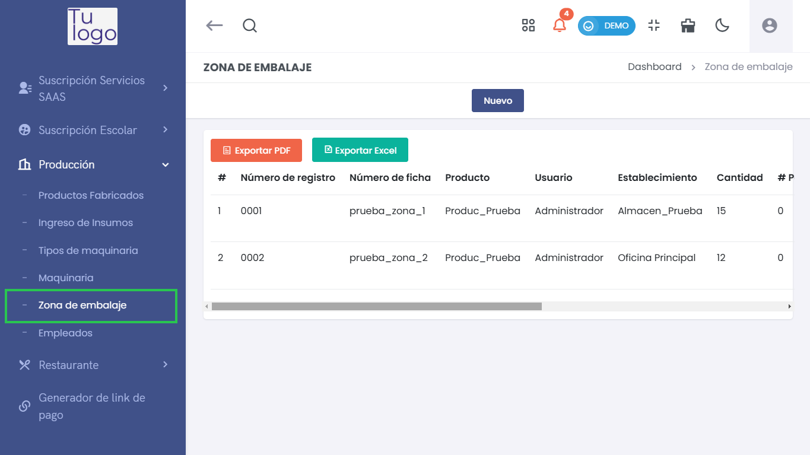
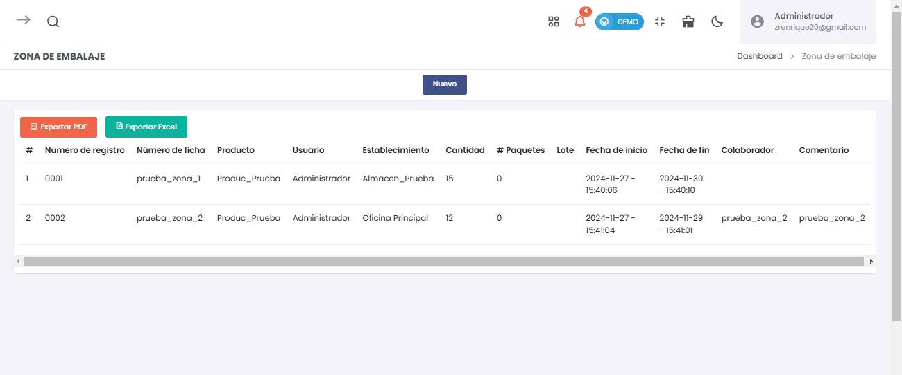
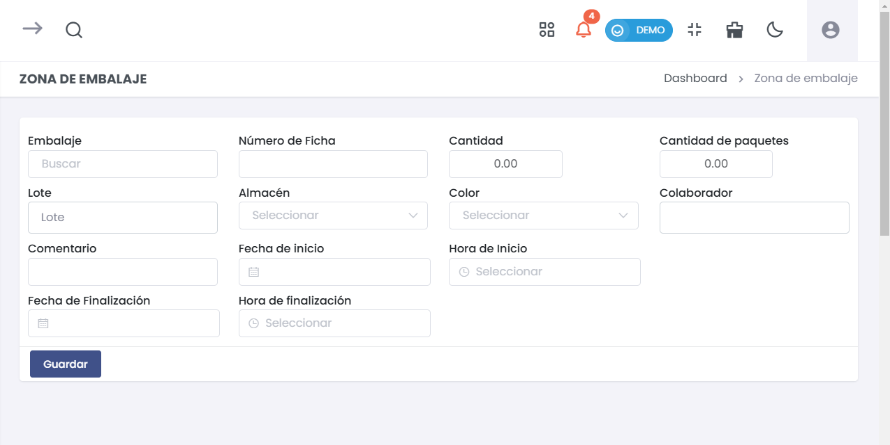

# Zona de Embalaje  

El submódulo de **Zona de Embalaje** permite gestionar y registrar los procesos de embalaje de productos en la empresa. Puedes añadir nuevas entradas, visualizar el historial de embalaje y realizar exportaciones de datos.  

  

---  

## 1. Listado de Embalajes  

Al acceder a la sección de **Zona de Embalaje**, encontrarás un listado que muestra todas las entradas de embalaje registradas.   

### Columnas del Listado:  
- **#**: Número de registro.  
- **Número de Ficha**: Identificación única del proceso de embalaje.  
- **Producto**: Nombre del producto que se está embalando.  
- **Usuario**: Nombre del usuario que registró el embalaje.  
- **Establecimiento**: Nombre del almacén o establecimiento donde se realiza el embalaje.  
- **Cantidad**: Total de unidades embaladas.  
- **# Paquetes**: Cantidad de paquetes creados durante el embalaje.  
- **Lote**: Lote asociado al producto.  
- **Fecha de Inicio**: Fecha y hora en que se inició el proceso de embalaje.  
- **Fecha de Fin**: Fecha y hora en que se completó el proceso.  
- **Colaborador**: Nombre del colaborador asignado.  
- **Comentario**: Notas adicionales sobre el proceso.  

Puedes utilizar los botones de **Exportar PDF** y **Exportar Excel** para generar informes de los registros.    

---  

## 2. Agregar Nuevo Embalaje  

Para añadir un nuevo registro de embalaje, selecciona el botón **Nuevo** en la parte superior de la pantalla. Esto abrirá un formulario para ingresar los detalles del embalaje.  

  

### Elementos del Formulario:  
- **Embalaje**: Selecciona el tipo de embalaje a utilizar.  
- **Número de Ficha**: Ingresa un número de ficha único para identificar el embalaje.  
- **Lote**: Especifica el lote del producto que se está embalando.  
- **Comentario**: Adicionalmente, puedes agregar observaciones sobre el proceso.  
- **Almacén**: Selecciona el almacén correspondiente donde se realizará el embalaje.  
- **Cantidad**: Indica el número total de unidades a embalar.  
- **Cantidad de Paquetes**: Especifica la cantidad de paquetes resultantes.  
- **Color**: Si aplica, selecciona el color del embalaje.  
- **Colaborador**: Indica el nombre del colaborador encargado del proceso.  
- **Fecha de Inicio**: Selecciona la fecha en la que comienza el embalaje.  
- **Fecha de Finalización**: Registra la fecha en la que se concluirá el embalaje.  
- **Hora de Inicio y Finalización**: Selecciona las horas correspondientes.  

##### Botones Disponibles:  
- **Guardar**: Registra la nueva entrada de embalaje en el sistema.  
- **Cancelar**: Cierra el formulario sin guardar los cambios.  