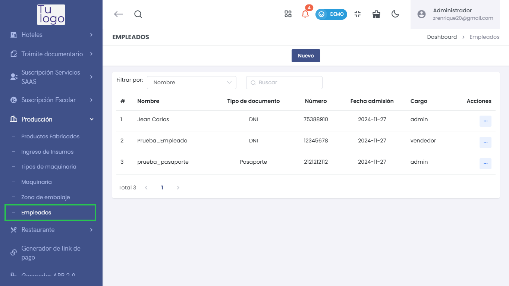
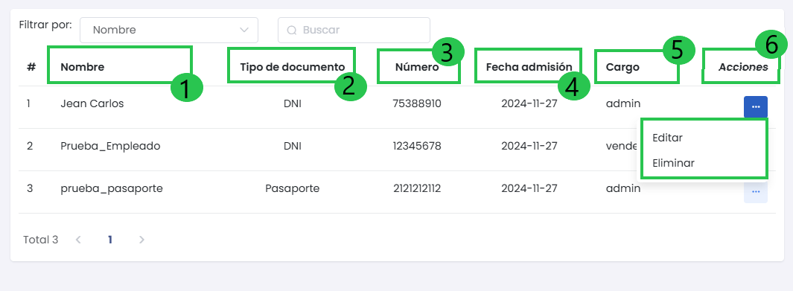
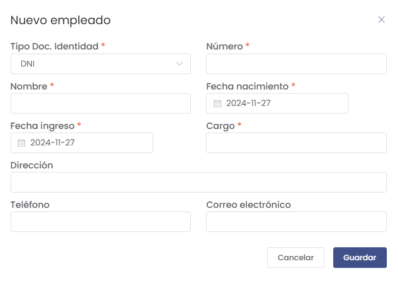

# Empleados  

El submódulo de **Empleados** en el módulo de **Producción** permite gestionar y registrar todos los empleados de la empresa. Puedes agregar nuevos empleados, editar la información existente y llevar un control de su documentación.  

  

---  

## 1. Listado de Empleados  

Al acceder a la sección de **Empleados**, verás un listado con todos los empleados registrados en el sistema.  

 

### Columnas del Listado:  
- **#**: Número de registro.  
- **1. Nombre**: Nombre completo del empleado.  
- **2. Tipo de documento**: Tipo de documento de identificación (DNI, Pasaporte, etc.).  
- **3. Número**: Número del documento de identificación.  
- **4. Fecha de admisión**: Fecha en la que el empleado fue contratado.  
- **5. Cargo**: Posición o cargo que ocupa el empleado.  
- **6. Acciones**: Opciones para editar o eliminar el registro del empleado.  

Puedes utilizar el filtro de búsqueda para encontrar empleados específicos por nombre.  

---  

## 2. Agregar Nuevo Empleado  

Para agregar un nuevo empleado, selecciona el botón **Nuevo** en la parte superior de la pantalla. Esto abrirá un formulario para ingresar los detalles del empleado.  

  

### Elementos del Formulario:  
- **Tipo Doc. Identidad**: Selecciona el tipo de documento (DNI, Pasaporte, etc.).  
- **Número**: Ingresa el número del documento de identidad.  
- **Nombre**: Escribe el nombre completo del empleado.  
- **Fecha de nacimiento**: Especifica la fecha de nacimiento del empleado.  
- **Fecha ingreso**: Indica la fecha en la que el empleado se unió a la empresa.  
- **Cargo**: Selecciona el cargo que ocupará en la empresa.  
- **Dirección**: Proporciona la dirección del empleado.  
- **Teléfono**: Ingresa el número de teléfono.  
- **Correo electrónico**: Introduce el correo electrónico del empleado.  

##### Botones Disponibles:  
- **Cancelar**: Cierra el formulario sin guardar los cambios.  
- **Guardar**: Al hacer clic, se registrará el nuevo empleado en el sistema.  

---  

## 3. Editar Información de un Empleado  

Cada registro en el listado de empleados incluye un botón **Editar** que permite modificar la información del empleado seleccionado. Al hacer clic en este botón, se abrirá el mismo formulario utilizado para agregar un nuevo empleado, pero ya con los datos prellenados.  

---  

## 4. Eliminar un Empleado  

Si necesitas eliminar un empleado, puedes seleccionar la opción **Eliminar** en la columna de acciones. Se te solicitará confirmar la eliminación antes de proceder.  

---  

## 5. Filtrar y Buscar Empleados  

La sección de empleados incluye un campo de búsqueda que permite filtrar la lista de empleados por nombre. Esto facilita la gestión y localización de información específica rápidamente.  
 

