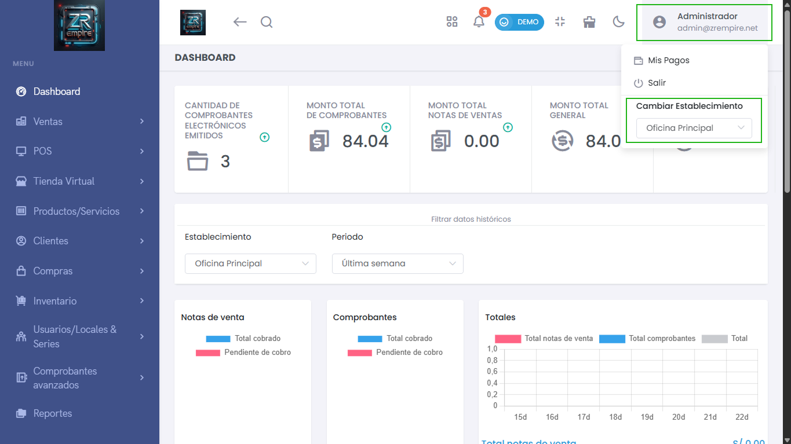
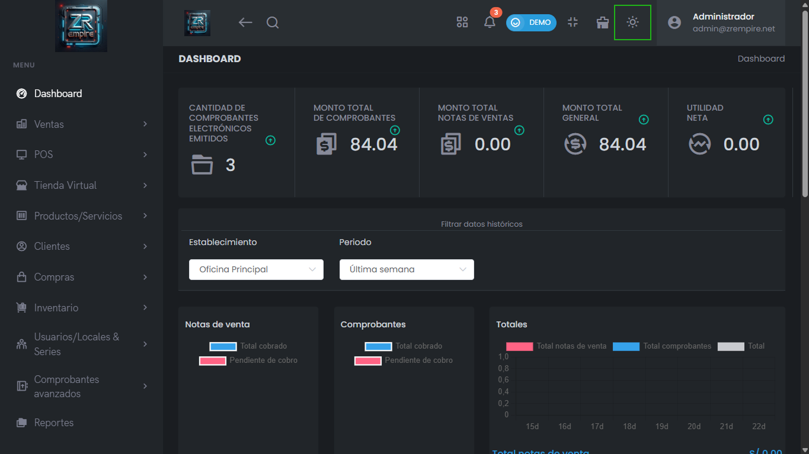
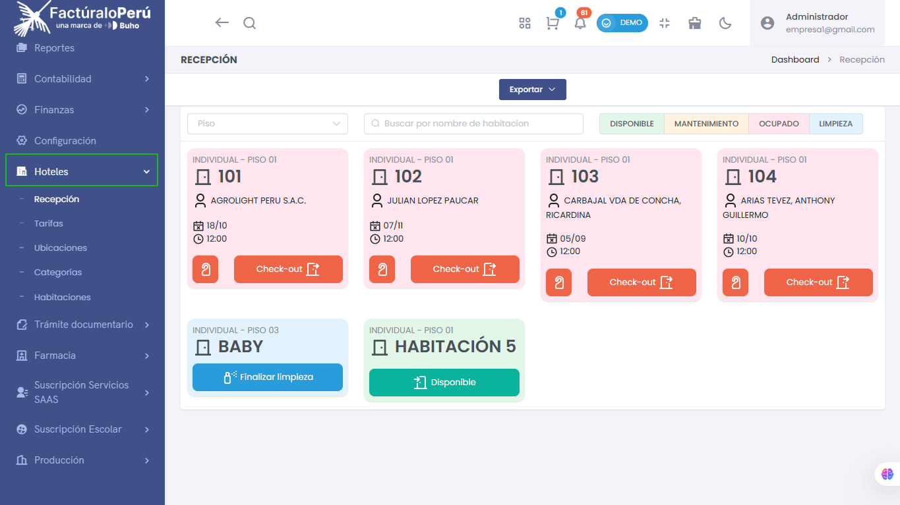
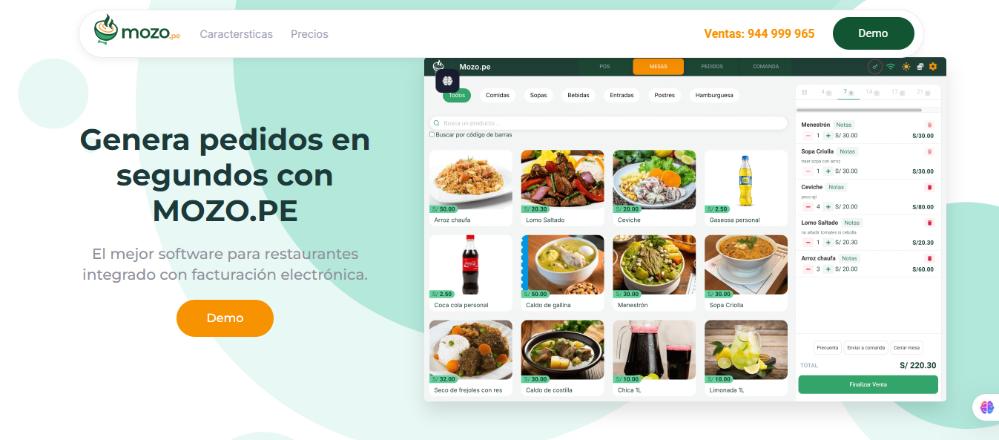
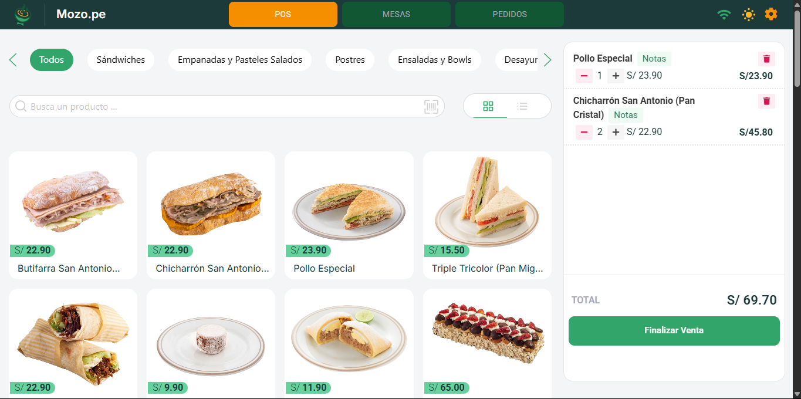

import DocsCard from '/src/components/global/DocsCard';
import DocsCards from '/src/components/global/DocsCards';

# Introducción a la plataforma Pro X

<head>
  <title>Introducción a los módulos de Pro X - Facturalo Perú</title>
  <meta
    name="description"
    content="Conoce los módulos y funcionalidades avanzadas del Sistema de Facturación Pro X para gestionar tu negocio de manera integral y especializada."
  />
</head>

## Visión General

Pro X es la versión más avanzada de nuestra plataforma integral, diseñada para empresas que requieren funcionalidades especializadas y módulos específicos por sector. Con un diseño super intuitivo y amigable, Pro X combina todas las herramientas esenciales de facturación electrónica con módulos especializados para diferentes rubros comerciales.

<DocsCards>
  <DocsCard 
    header="Dashboard"
    href="./dashboard"
  >
    
Resumen general de ventas, compras, productos por agotarse y gestión multi-establecimiento.

  </DocsCard>

  <DocsCard
    header="Ventas"
    href="./esenciales"
  >
    
Módulo completo con cotizaciones, oportunidades de venta, facturas, boletas y venta rápida especializada.

  </DocsCard>

  <DocsCard
    header="Productos"
    href="./esenciales"
  >
    
Gestión avanzada de productos individuales, compuestos (packs) y creación masiva con configuraciones especializadas.

  </DocsCard>

  <DocsCard 
    header="Módulos Especializados" 
    href="./rubros" 
  >
    
Hoteles, Farmacias, Restaurantes, Producción, Suscripciones y Trámite Documentario.

  </DocsCard>
</DocsCards>

## Características Distintivas de Pro X

### Gestión Multi-establecimiento
Pro X permite administrar múltiples tiendas o sucursales desde una sola plataforma, facilitando el control centralizado de operaciones distribuidas geográficamente.

> *Imagen referencial: Panel principal del sistema  Pro X mostrando la gestión multi-establecimiento.*

### Diseño Personalizable
- Modo oscuro disponible para usuarios que prefieren este estilo

> *Imagen referencial: Modo oscuro en Pro X.*

- Diferentes formas de ordenar el sistema según preferencias del usuario
- Interfaz completamente adaptable a las necesidades específicas de cada negocio

### Integración Avanzada con SUNAT
- Buscador rápido de DNI y RUC conectado directamente a SUNAT y RENIEC
- Emisión de comprobantes electrónicos con series personalizadas
- Cumplimiento total con los últimos requerimientos fiscales

## Módulos Principales

### Pre-venta Avanzada
Gestión completa de documentos previos a la venta:
- **Cotizaciones**: Documentos formales para presentar a clientes
- **Oportunidades de venta**: Seguimiento de prospectos comerciales
- **Notas de venta**: Comprobantes internos para control operativo

### Sistema de Ventas Integral
- **Facturación electrónica**: Emisión de facturas y boletas con series propias
- **Venta rápida**: Punto de venta optimizado para transacciones ágiles
- **Módulos especializados**: Configuraciones específicas para grifos y minimarkets

### Caja Chica Inteligente
Sistema avanzado para administrar movimientos y pagos en efectivo:
- Filtrado por vendedor o usuario
- Cada usuario tiene su propia caja independiente
- Reportes disponibles en múltiples formatos
- Control detallado de ingresos y salidas

### Tienda Virtual Integrada
- Landing page básica conectada al facturador
- Gestión de pedidos en línea
- Productos y productos compuestos (packs)
- Integración con pasarelas de pago (Culqi, PayPal)
- Configuración completa de redes sociales y contacto

## Gestión de Productos Avanzada

### Creación Individual y Masiva
- **Formulario detallado**: Nombre, código, precio, stock y configuraciones adicionales
- **Campos especializados**: Código DIGEMID para medicinas, manejo de lotes y series
- **Configuración de IGV**: Inclusión o exclusión según tipo de producto
- **Creación masiva**: Herramientas para importar grandes volúmenes de productos

### Productos Compuestos (Packs)
Funcionalidad única que permite crear conjuntos de productos con precios especiales y gestión automatizada de inventarios.

## Gestión de Clientes y Proveedores

### Base de Datos Centralizada
- Listado completo de clientes con información detallada
- Sistema similar para gestión de proveedores
- Funciones de búsqueda y filtrado avanzadas

### Registro de Compras
- Control completo de compras a proveedores
- Seguimiento de gastos diversos no relacionados con inventario
- Categorización de gastos (alquiler, servicios, planilla, etc.)

## Reportes e Inventarios

### Reporte Kardex Avanzado
Sistema de inventarios con precisión total basado en:
- Movimientos registrados de ingresos y salidas
- Stock inicial y traslados
- Historial completo de ventas y compras
- Reporte sin errores cuando todos los movimientos están registrados

## Gestión de Usuarios y Permisos

### Sistema de Roles Personalizable
- Creación de usuarios para vendedores y diferentes áreas
- Perfiles completamente personalizables por módulo
- Control granular de permisos (agregar pagos, compras, editar precios)
- Gestión independiente de cada perfil de usuario

### Establecimientos Múltiples
- Anexión de diferentes establecimientos
- Código de domicilio fiscal de SUNAT
- Direcciones principales y secundarias
- Gestión centralizada de múltiples ubicaciones

## Comprobantes Avanzados

### Documentos Especializados
- **Retenciones y percepciones**: Cumplimiento fiscal avanzado
- **Liquidaciones de compra**: Para proveedores sin facturación
- **Órdenes de pedido**: Control de solicitudes
- **Guías de remisión actualizadas**: Según últimos requerimientos SUNAT

### Gestión de Transporte
- **Guías remitente y transportista**: Documentos especializados
- **Catálogo de transportistas**: Base de datos completa
- **Registro de conductores y vehículos**: Control total de la cadena logística

## Módulos Especializados por Sector

### Módulo de Contabilidad
- Conexión con Conta Web para contadores
- Sincronización automática con el facturador
- Reportes precisos de libros contables
- Exportación a diferentes formatos contables

### Módulo de Hoteles
- **Recepción digital**: Vista de habitaciones disponibles y ocupadas

- **Configuración de habitaciones**: Personalización por tipo y categoría
- **Check-in y check-out**: Gestión automatizada de huéspedes

### Módulo de Farmacia
- **Lista de productos DIGEMID**: Catálogo oficial actualizado
- **Códigos especializados**: Manejo de medicamentos regulados
- **Control de lotes y vencimientos**: Gestión farmacéutica especializada

### Módulo de Producción
- **Gestión de fábricas**: Control de procesos productivos
- **Formularios de fabricación**: Disminución automática de insumos
- **Aumento de stock**: Productos fabricados
- **Control de maquinaria**: Registro de equipos y empleados
- **Fechas críticas**: Producción, mezcla y vencimiento

### Módulo de Restaurantes
- **Configuración para Mozo.pe**: Plataforma especializada para rubros de Restaurantes

- **Vista optimizada**: Interface adaptada para restaurantes

- **Integración completa**: Conexión directa con el sistema de facturación

### Suscripciones de Servicios
- **Gestión de planes**: Creación de suscripciones mensuales o anuales
- **Control de clientes**: Seguimiento de suscriptores activos
- **Recibos automáticos**: Generación de comprobantes de pago
- **Modalidad escolar**: Versión adaptada con matrículas, grados y secciones

### Trámite Documentario
- **Gestión especializada**: Para empresas de trámites
- **Seguimiento de procesos**: Control de estados y tiempos
- **Documentación**: Manejo integral de expedientes

## Herramientas Adicionales

### Generador de Links de Pago
- **Integración con Yape**: Creación de enlaces de pago
- **Compartir fácil**: Envío directo a clientes
- **Seguimiento**: Control de pagos recibidos

### Aplicación Móvil
- **Disponible en Play Store y App Store**: Acceso desde cualquier dispositivo
- **100% compatible**: Sincronización total con Pro X
- **Funcionalidades completas**: Acceso a módulos principales desde móvil

## Reportes Integrales

### Reportes por Módulo
- **Compras**: Análisis detallado de adquisiciones
- **Ventas**: Reportes completos de facturación
- **Generales**: Informes transversales del negocio
- **Formatos múltiples**: Exportación en PDF y Excel

## Plataformas Conectadas

### Ecosistema Integrado
- **Mozo.pe**: Solución completa para restaurantes
- **VendeYa.pe**: Plataforma de ventas rápidas
- **Aplicación móvil**: Facturación desde cualquier lugar

## Tecnología y Seguridad

### Infraestructura Robusta
- **Almacenamiento en la nube**: Acceso desde cualquier lugar
- **Actualizaciones automáticas**: Cumplimiento continuo con SUNAT
- **Respaldos automáticos**: Protección total de información
- **Seguridad avanzada**: Cifrado y protocolos de seguridad

### Compatibilidad Total
- **Navegadores actualizados**: Chrome, Firefox, Edge, Safari
- **Dispositivos móviles**: Android e iOS
- **Impresoras**: Térmica y láser para comprobantes

---

Pro X representa la evolución completa de nuestro sistema de facturación, diseñado para empresas que requieren funcionalidades avanzadas, gestión multi-establecimiento y módulos especializados por sector. Con más de 15 módulos especializados, Pro X es la solución integral para negocios que buscan eficiencia, cumplimiento fiscal y crecimiento sostenible.