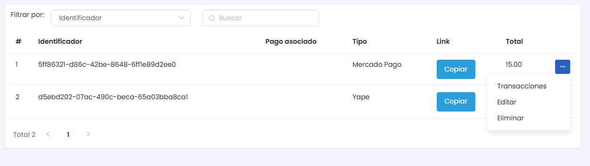
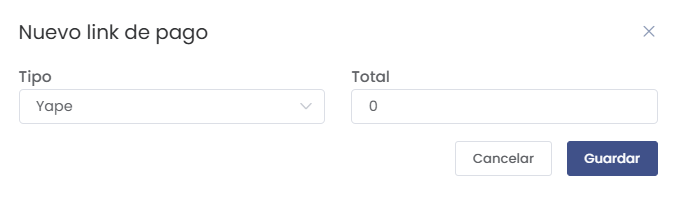

# Generador de Link de Pago

El módulo **Generador de Link de Pago** permite crear links de pago para facilitar el proceso de cobro a los clientes mediante diferentes métodos de pago. Para acceder a este módulo:

1. Dirígete al menú lateral y selecciona **Generador de Link de Pago**.

Esto te llevará a la lista de todos los links de pago registrados en el sistema.

En el listado de **Generador de Link de Pago**, se muestra la siguiente información:
- **Identificador**: Código único del link de pago.
- **Pago asociado**: Descripción del pago asociado al link.
- **Tipo**: Método de pago (por ejemplo, Mercado Pago, Yape).
- **Link**: Botón para copiar el link de pago generado.
- **Total**: Monto total a pagar.
- **Acciones**: Puedes **Ver Transacciones**, **Editar** o **Eliminar** el link de pago.

### Crear un Nuevo Link de Pago

Para crear un nuevo link de pago, selecciona el botón **Nuevo**. Se abrirá un formulario emergente para completar la información necesaria.

En el formulario de **Nuevo Link de Pago**, debes completar los siguientes campos:
- **Tipo**: Selecciona el tipo de pago (por ejemplo, Yape, Mercado Pago).
- **Total**: Ingresa el monto total a pagar.

Una vez completados los campos, selecciona **Guardar** para generar el link de pago.

### Consideraciones sobre la Gestión de Links de Pago

Es importante asegurarse de que los links de pago se generen con la información correcta para facilitar el proceso de cobro a los clientes. Además, se recomienda verificar el estado de los links y actualizarlos o eliminarlos según sea necesario.

Mantén un registro adecuado de los links generados para evitar confusiones y garantizar una buena experiencia para el cliente.

