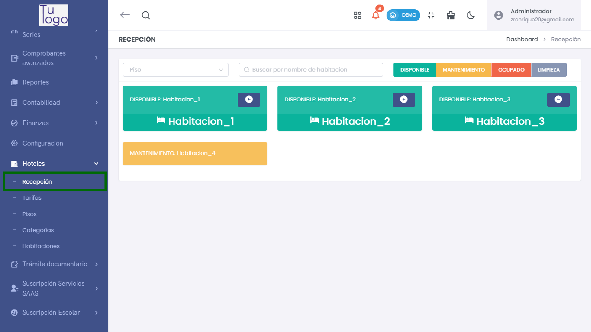
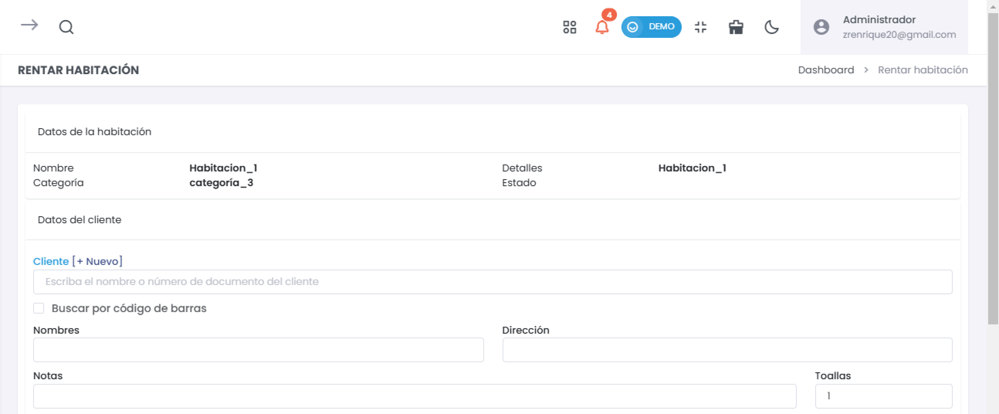
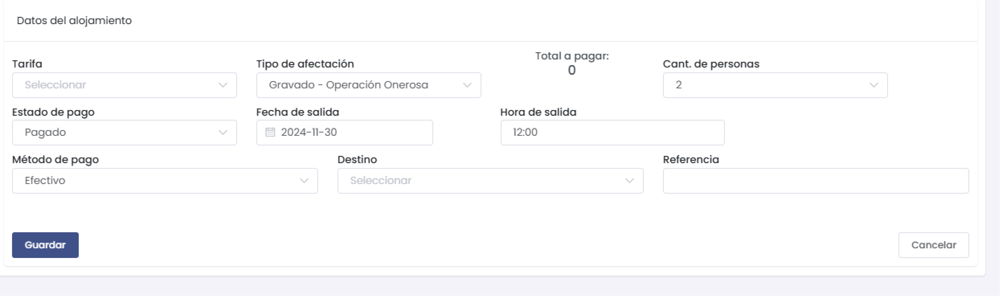
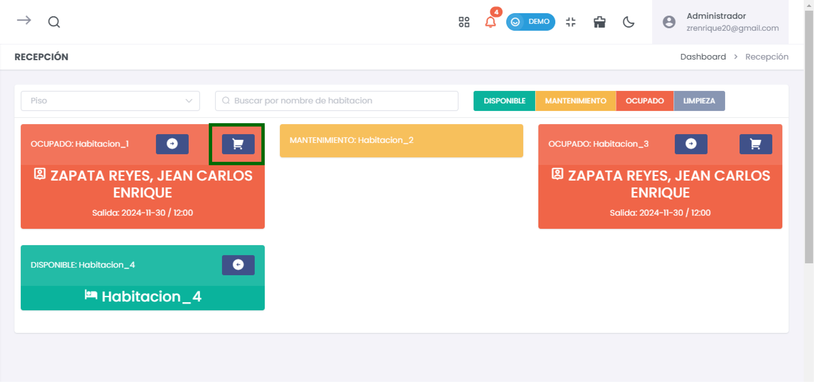
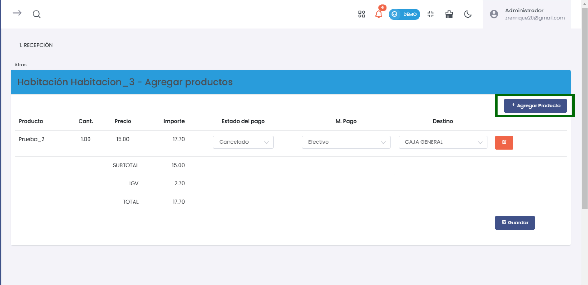
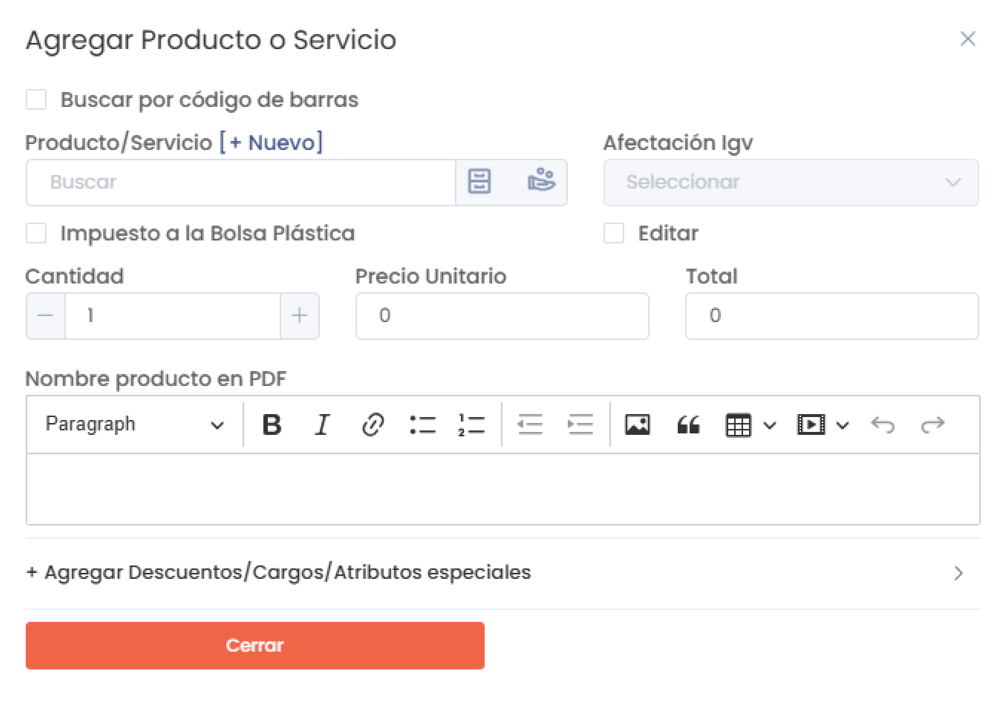
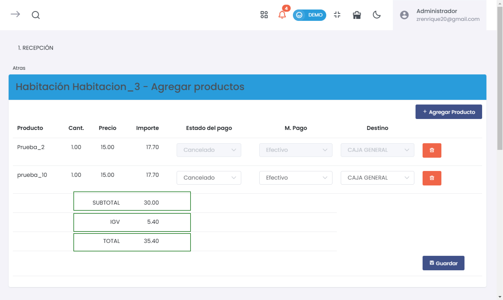
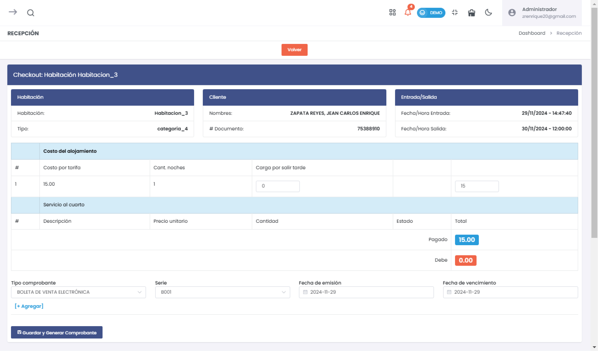
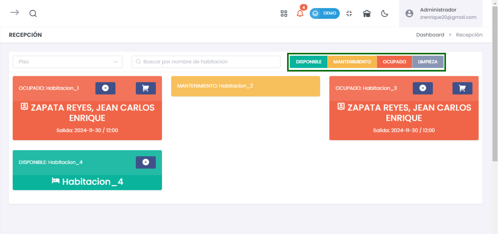

# Recepción  

En este artículo te enseñaremos a gestionar el proceso de **Recepción** en el sistema, incluyendo la gestión de la información del cliente, los datos de alojamiento, y la adición de productos a las habitaciones.  

### 1. Acceder al Módulo de Habitaciones  

Para comenzar, dirígete a **Hoteles** desde el menú principal y selecciona **Recepción**. Esta sección te permitirá gestionar todas las actividades relacionadas con el registro de habitaciones disponibles y ocupadas.  

  

### 2. Información del Cliente  

Antes de gestionar la habitación, es esencial ingresar los datos del cliente.

1. **Escribe el nombre del cliente** en el campo **Cliente**. Puedes buscar clientes existentes o ingresar uno nuevo.  

   - Si el cliente ya está registrado, el sistema puede autocompletar la información. Si no, deberás ingresar manualmente.  

  

2. **Si es un nuevo cliente**, puedes crear un nuevo registro haciendo clic en **[+ Nuevo]**. Completa la siguiente información:  
   - **Nombres**: Nombre completo del cliente.  
   - **Dirección**: Domicilio del cliente.  
   - **Notas**: Cualquier otra información relevante acerca del cliente que debas tener en cuenta, como preferencias o requerimientos especiales.  

   Para mas informacion de como crear un nuevo cliente porfavor visualice la siguiente **[Documentacion](https://fastura.github.io/documentacion/Pro-X/Clientes/Clientes)**

---  

### 3. Datos del Alojamiento  

Luego de ingresar la información del cliente, registra los detalles del alojamiento:  

  

- **Tarifa**: Selecciona la tarifa que corresponde a la habitación ocupada, ya sea estándar, premium, etc.  
- **Estado de pago**: Marca si el pago del alojamiento está **Pagado** o **Pendiente**. Esto ayudará a llevar un control de los ingresos.  
- **Método de pago**: Selecciona el método de pago que utilizará el cliente (por ejemplo, "Efectivo", "Tarjeta de crédito").  
- **Cantidad de personas**: Indica cuántas personas se alojarán en la habitación. Esto es importante para la asignación de servicios y la gestión de la ocupación.  

Una vez que hayas ingresado todos los datos necesarios, haz clic en **Guardar** para proceder.  

---  

### 4. Agregar Productos a la Habitación  

Después de haber registrado al cliente y los datos de su alojamiento, puedes proceder a agregar productos a la habitación:  

#### 4.1. Seleccionar Habitaciones  

Puedes ver la lista de habitaciones disponibles. Al seleccionar una habitación específica, se abrirá un panel para agregar productos.  

---  

#### 4.2. Agregar un Producto  

1. **Haz clic en el botón "Agregar Producto"** dentro de la pestaña de la habitación.  

   Esto iniciará el proceso para añadir productos adicionales que el cliente haya solicitado o consumido en su habitación.  

  

2. **Completa el formulario que aparece**, ingresando la siguiente información:  

   - **Cantidad**: Especifica cuántas unidades del producto se están agregando (por ejemplo, si se han consumido 2 botellas de agua, ingresas "2").  
   - **Precio**: Aquí introducirás el precio unitario del producto.  
   - **Estado del pago**: Selecciona el estado correspondiente (por ejemplo, "Pagado" o "Cancelado").  
   - **Método de pago**: Especifica el método de pago utilizado para adquirir el producto (por ejemplo, "Efectivo", "Tarjeta de crédito", etc.).  

  

**[+ Agregar Producto]** al darle click mostrara el formulario para añadir un nuevo producto ya existengo o la opcion de crear uno nuevo.

  

3. **Después de completar toda la información**, haz clic en **Cerrar** para visualizarlos datos en el sistema.  

---  

#### 4.3. Visualizar Resumen de Costo  

Una vez guardados los productos, verás un resumen en la parte inferior de la pantalla que incluye:  

- **Subtotal**: Costo total de los productos antes de impuestos.  
- **IGV (Impuesto General a las Ventas)**: Impuesto aplicable que se calcula sobre el subtotal.  
- **Total**: Monto total a pagar que incluye el subtotal más el IGV.  

**Después de completar toda la información**, haz clic en **Guardar** para registrar el producto en el sistema.  

---  

### 5. Checkout de la Habitación  

Cuando el cliente esté listo para hacer el checkout, accederás a la sección de **Checkout**. Aquí puedes:  

  

- **Revisar los costos de alojamiento**: Verifica el total a pagar, incluyendo tarifas y productos añadidos.  
- **Ver detalles del cliente**: Asegúrate de que toda la información del cliente esté correcta, incluyendo nombre y número de documento.  

  

---  

### 6. Generar Comprobante  

Para formalizar el proceso de checkout:  

1. **Selecciona el tipo de comprobante** (por ejemplo, "Boleta de venta electrónica" o "Factura").  
2. **Completa todos los campos necesarios**: Asegúrate de ingresar toda la información requerida, incluyendo la **Fecha de emisión**.  

Haz clic en **Guardar y Generar Comprobante** para finalizar el proceso, lo que enviará un registro al sistema y generará el comprobante para el cliente.  

---  

### 7. Visualizar Estado de Habitaciones  

En la pantalla principal de **Recepción**, podrás ver el estado de todas las habitaciones disponibles y ocupadas:  

- **Disponibles**: Habitaciones que están listas para ser alquiladas.  
- **Ocupadas**: Habitaciones que actualmente están alquiladas por clientes.  
- **En Mantenimiento**: Habitaciones que están siendo reparadas o limpiadas y no están disponibles para los clientes.  

  

---  

### Conclusión  

La sección de **Recepción** es fundamental para la gestión efectiva del alojamiento en un hotel. Asegúrate de seguir cada uno de los pasos cuidadosamente para garantizar que la información sea precisa y completa. Utiliza las funcionalidades de registrar al cliente, los datos de alojamiento, y agregar productos para ofrecer una experiencia fluida y eficiente a tus clientes. Esto no solo mejorará la satisfacción del cliente, sino que optimizará las operaciones del hotel.