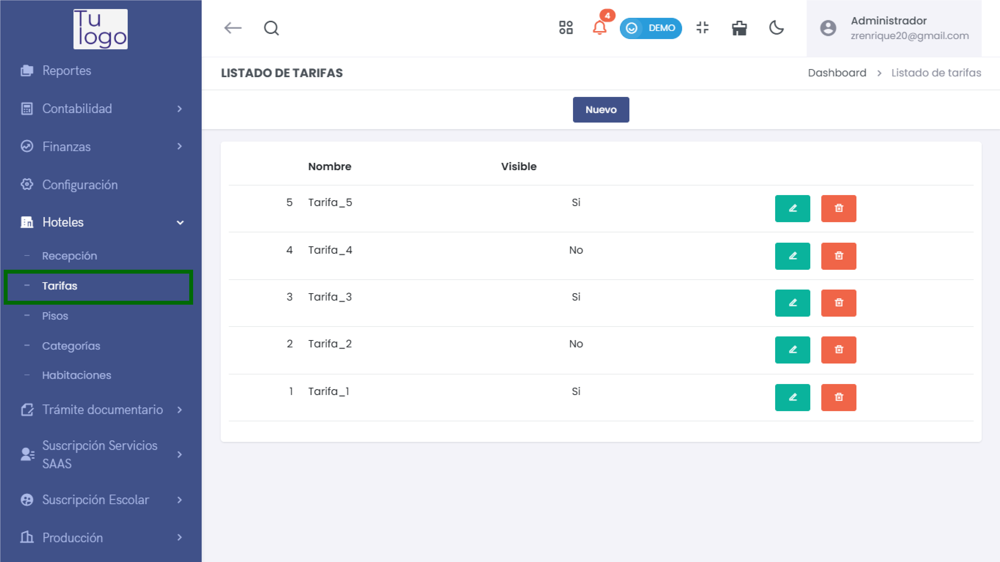
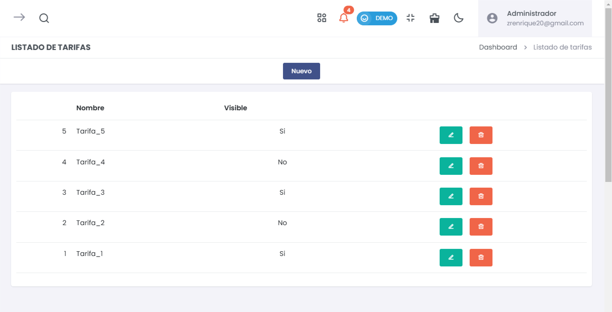
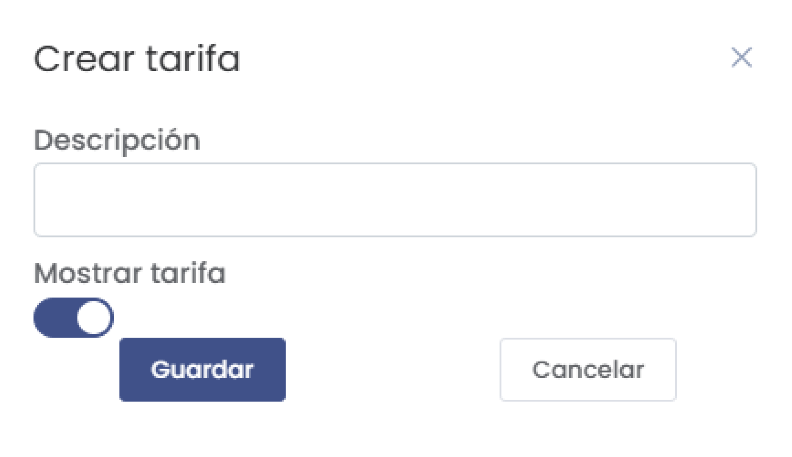
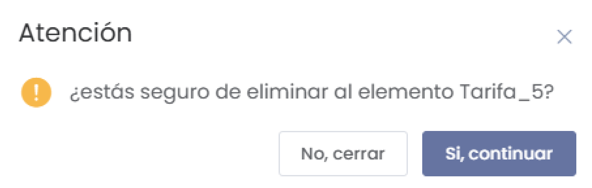

# Tarifas  

El submódulo de **Tarifas** dentro del módulo de **Hoteles** permite gestionar las tarifas disponibles en el sistema. Desde aquí, puedes agregar nuevas tarifas, editar la información existente y eliminar tarifas que ya no sean necesarias.  

## Ingreso al Submódulo de Tarifas  

Para acceder al submódulo de Tarifas, sigue estos pasos:  

1. Desde el **Dashboard**, ve al menú principal ubicado en la parte izquierda de la pantalla.  
2. Despliega la categoría **Hoteles**.  
3. Selecciona la opción **Tarifas** para ingresar al listado de tarifas registradas.  

  

---  

## 1. Listado de Tarifas  

 

Al acceder a la sección de **Tarifas**, verás un listado con todas las tarifas registradas en el sistema.  

### Columnas del Listado:  
- **Nombre**: Nombre de la tarifa.  
- **Visible**: Indicador que muestra si la tarifa es visible en el sistema (Sí/No).  
- **Acciones**: Opciones para editar o eliminar la tarifa.  

Puedes utilizar el campo de búsqueda para encontrar tarifas específicas.  

---  

## 2. Agregar Nueva Tarifa  

Para agregar una nueva tarifa, selecciona el botón **Nuevo** en la parte superior de la pantalla. Esto abrirá un formulario para ingresar los detalles de la tarifa.  

 

### Elementos del Formulario:  
- **Descripción**: Escribe una descripción que identifique la tarifa.  
- **Mostrar tarifa**: Utiliza el interruptor para habilitar o deshabilitar la visibilidad de la tarifa.  

##### Botones Disponibles:  
- **Cancelar**: Cierra el formulario sin guardar los cambios.  
- **Guardar**: Al hacer clic, se registrará la nueva tarifa en el sistema.  

 

---  

## 3. Editar Información de una Tarifa  

Cada registro en el listado de tarifas incluye un botón **Editar** que permite modificar la información de la tarifa seleccionada. Al hacer clic en este botón, se abrirá el mismo formulario utilizado para agregar una nueva tarifa, pero ya con los datos prellenados.  

---  

## 4. Eliminar una Tarifa  

Si necesitas eliminar una tarifa, selecciona la opción **Eliminar** en la columna de acciones. Se te mostrará un mensaje de confianza solicitando confirmación antes de proceder.  

  

### Mensaje de Confirmación:  
Se confirmará la eliminación de la tarifa seleccionada. Para continuar, elige **Sí, continuar** para proceder con la eliminación o **No, cerrar** si decides cancelar.  

