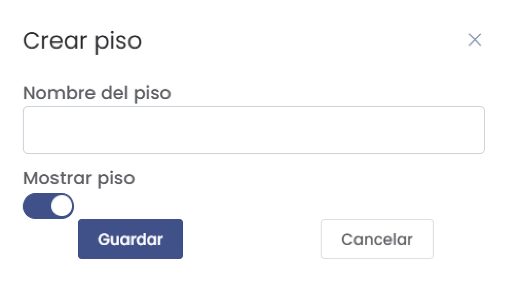

# Agregar Pisos  

En este artículo te enseñaremos a agregar nuevos pisos y gestionar su visibilidad en el sistema. Sigue estos pasos para realizarlo:  

### 1. Acceder al Módulo de Pisos  

Ingresa al submódulo **Pisos** desde el módulo de **Hoteles** . Una vez allí, verás un listado de todos los pisos actuales.  

  

### 2. Crear un Nuevo Piso  

Para agregar un nuevo piso, sigue estos pasos:  

1. Haz clic en el botón **Nuevo** ubicado en la parte superior de la lista.  

  

2. Aparecerá un formulario titulado **Crear Piso**. Completa los siguientes campos:  

   - **Nombre del piso**: Ingresa el nombre del nuevo piso.  
   - **Mostrar piso**: Activa o desactiva el interruptor para determinar si el piso será visible en el sistema.  

  

3. Haz clic en **Guardar** para registrar el nuevo piso o en **Cancelar** para cerrar el formulario sin guardar.  

### 3. Visualización de Pisos  

Una vez creado, el nuevo piso aparecerá en la lista junto con los demás. Aquí podrás ver la información relevante como:  

- **Nombre del piso**  
- **Visible**: Indica si el piso es visible o no.  

Los pisos visibles tendrán una marca de "Sí", mientras que los no visibles mostrarán "No".  

### 4. Editar o Eliminar Pisos  

En la lista de pisos, encontrarás opciones para editar o eliminar cada uno de ellos:  

- **Editar (lápiz)**: Permite modificar el nombre o la visibilidad del piso.  
- **Eliminar (papelera)**: Te solicitará una confirmación antes de proceder a eliminar el piso.  

  

Selecciona la opción adecuada y confirma si decides realizar cambios.  

