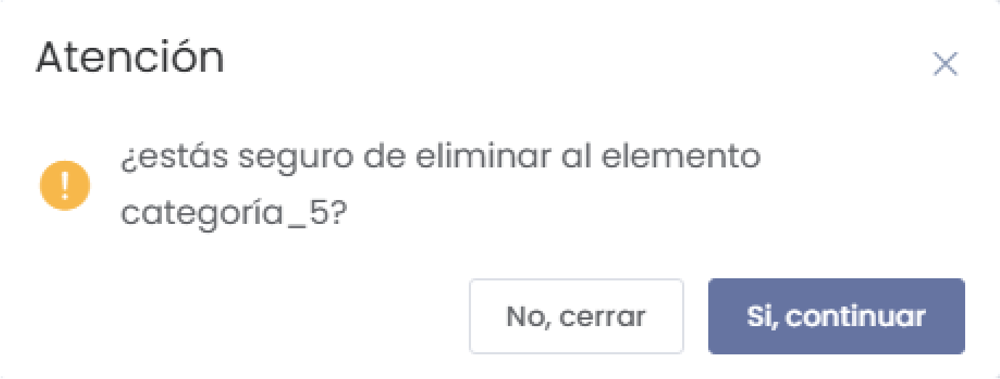

# Categorías  

El submódulo de **Categorías** dentro del módulo de **Hoteles** permite gestionar y clasificar las diferentes categorías dentro del sistema. Puedes agregar nuevas categorías, editar la información existente y gestionar la visibilidad de cada categoría.  

  

---  

## 1. Listado de Categorías  

Al acceder a la sección de **Categorías**, verás un listado con todas las categorías registradas en el sistema.  

 

### Columnas del Listado:  
- **#**: Número de registro.  
- **Nombre**: Nombre de la categoría.  
- **Visible**: Indicador que muestra si la categoría es visible en el sistema (Sí/No).  
- **Acciones**: Opciones para editar o eliminar la categoría.  

Puedes utilizar el campo de búsqueda para encontrar categorías específicas por nombre.  

---  

## 2. Agregar Nueva Categoría  

Para agregar una nueva categoría, selecciona el botón **Nuevo** en la parte superior de la pantalla. Esto abrirá un formulario para ingresar los detalles de la nueva categoría.  

  

### Elementos del Formulario:  
- **Descripción**: Escribe una breve descripción de la categoría.  
- **Mostrar categoría**: Utiliza el interruptor para habilitar o deshabilitar la visibilidad de la categoría.  

##### Botones Disponibles:  
- **Cancelar**: Cierra el formulario sin guardar los cambios.  
- **Guardar**: Al hacer clic, se registrará la nueva categoría en el sistema.  

---  

## 3. Editar Información de una Categoría  

Cada registro en el listado de categorías incluye un botón **Editar** que permite modificar la información de la categoría seleccionada. Al hacer clic en este botón, se abrirá el mismo formulario utilizado para agregar nuevas categorías, pero con los datos prellenados.  

---  

## 4. Eliminar una Categoría  

Si necesitas eliminar una categoría, puedes seleccionar la opción **Eliminar** en la columna de acciones. Se mostrará un mensaje de confirmación antes de proceder.  

  

### Mensaje de Confirmación:  
Estás seguro de eliminar al elemento (nombre de la categoría). Para continuar, selecciona **Sí, continuar** o **No, cerrar** para cancelar la operación.  

---  

