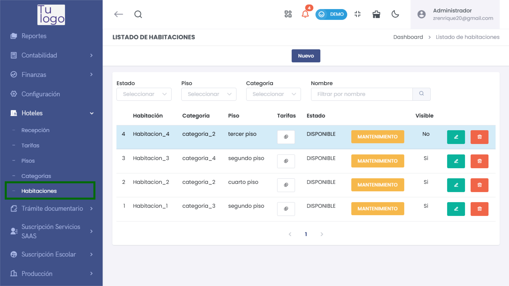
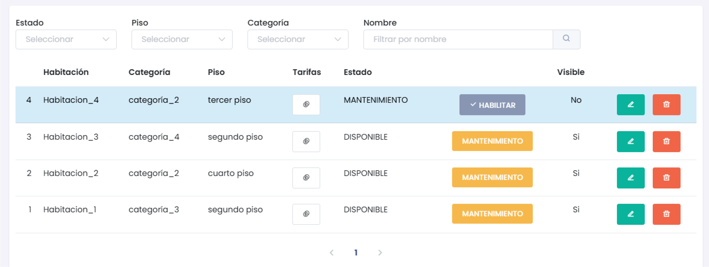
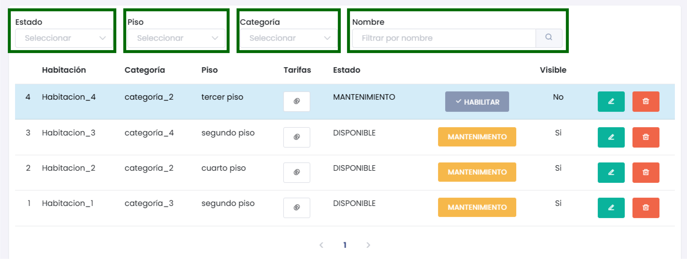
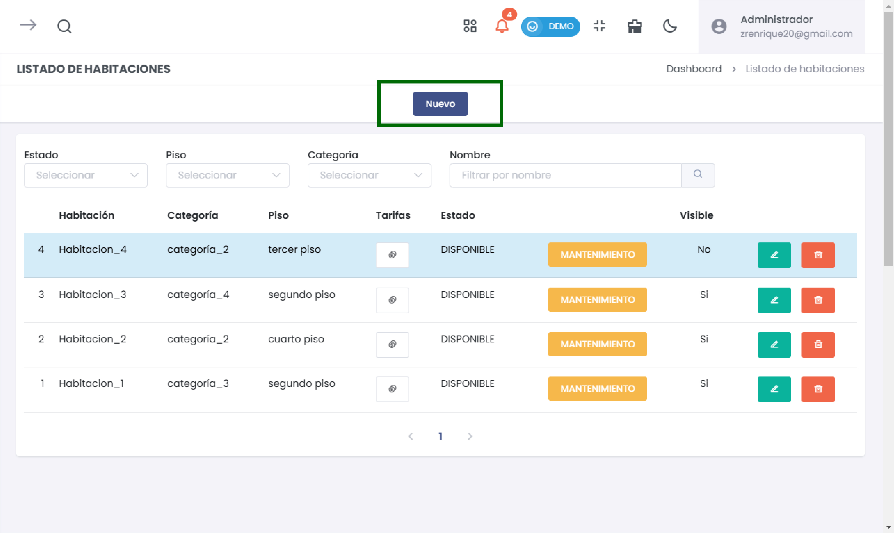
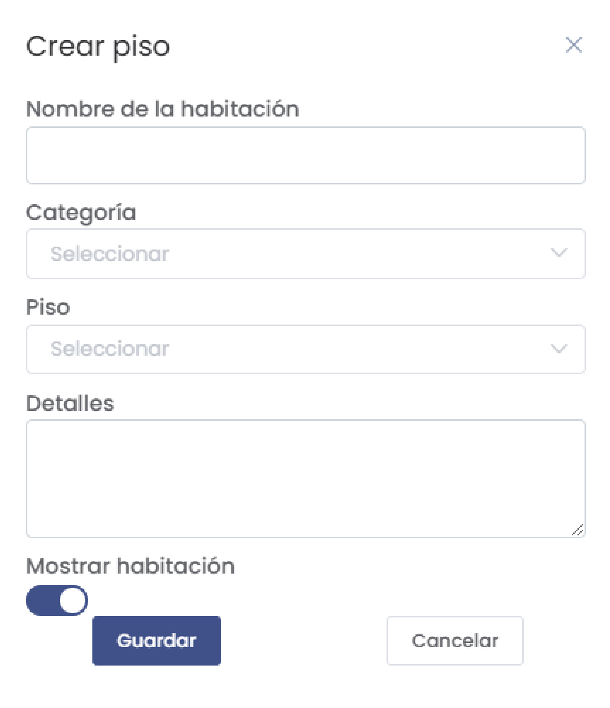

# Habitaciones  

En este artículo se explica cómo gestionar el **Listado de Habitaciones** en el sistema. Podrás agregar nuevas habitaciones, editar y eliminar las existentes, así como ver su estado y disponibilidad.  

### 1. Acceder al Módulo de Habitaciones  

Para acceder al **Listado de Habitaciones**:  

1. Dirígete al menú principal y selecciona **Hoteles**.  
2. Luego elige **Habitaciones**.  

  

### 2. Visualización del Listado  

Una vez dentro, verás una tabla que muestra todos los registros de habitaciones. La tabla incluye las siguientes columnas:  

 

- **Habitación**: Número o código de la habitación.  
- **Categoría**: Categoría a la que pertenece la habitación.  
- **Piso**: Información sobre el piso donde se ubica la habitación.  
- **Tarifas**: Tarifa asignada a la habitación.  
- **Estado**: Estado actual de la habitación (por ejemplo, "Disponible" o "Mantenimiento").  
- **Visible**: Indica si la habitación es visible en el sistema.  

Los registros que están en **mantenimiento** se destacarán en color amarillento para facilitar la identificación.  

### 3. Filtrar Habitaciones  

Puedes filtrar la lista de habitaciones utilizando las opciones de búsqueda disponibles:  

- Selecciona un **Estado** específico.  
- Filtra por **Piso** o **Categoría**.  
- Utiliza el campo de búsqueda para **filtrar por nombre**.  

  

### 4. Agregar una Nueva Habitación  

Para agregar una nueva habitación:  

1. Haz clic en el botón **Nuevo**.  

  

2. Completa el formulario en la ventana emergente **Crear Piso** con la siguiente información:  

   - **Nombre de la habitación**: Ingresa el nombre o número de la habitación.  
   - **Categoría**: Selecciona la categoría correspondiente.  
   - **Piso**: Selecciona el piso donde se ubica la habitación.  
   - **Detalles**: Añade cualquier detalle adicional necesario. 

:::danger Importante
El detalle no puede tener más de 50 caracteres.
::: 
   - **Mostrar habitación**: Activa o desactiva esta opción según sea necesario.  

  

3. Haz clic en **Guardar** para añadir la nueva habitación o en **Cancelar** para cerrar el formulario sin guardar.  

### 5. Editar o Eliminar Habitaciones  

Para editar o eliminar una habitación existente:  

- **Editar (lápiz)**: Haz clic en el ícono de editar para modificar los datos de la habitación seleccionada.  
- **Eliminar (papelera)**: Haz clic en el ícono de eliminar. Aparecerá una ventana de confirmación:  

  

Confirma si deseas eliminar la habitación seleccionando **Sí, continuar** o **No, cerrar** si decides cancelar.  

### 6. Resumen del Estado de Habitaciones  

En el **Listado de Habitaciones**, puedes ver fácilmente el estado de cada habitación:  

- Las habitaciones en **mantenimiento** se marcarán claramente en la tabla, indicando que no están disponibles para uso.  
- Aquellas que están **disponibles** se podrán reservar o gestionar según sea necesario.  

