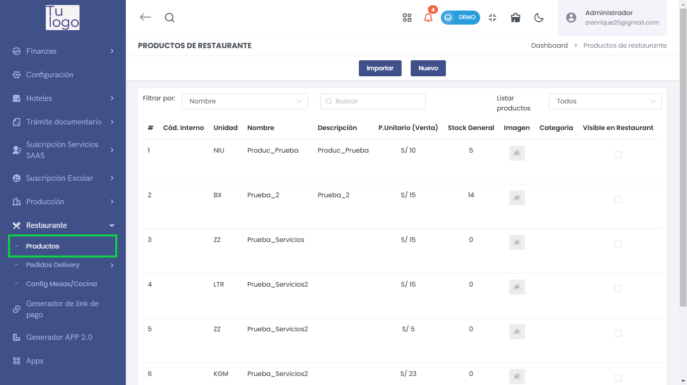
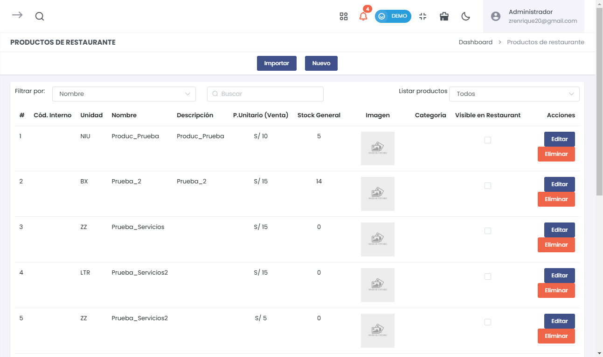
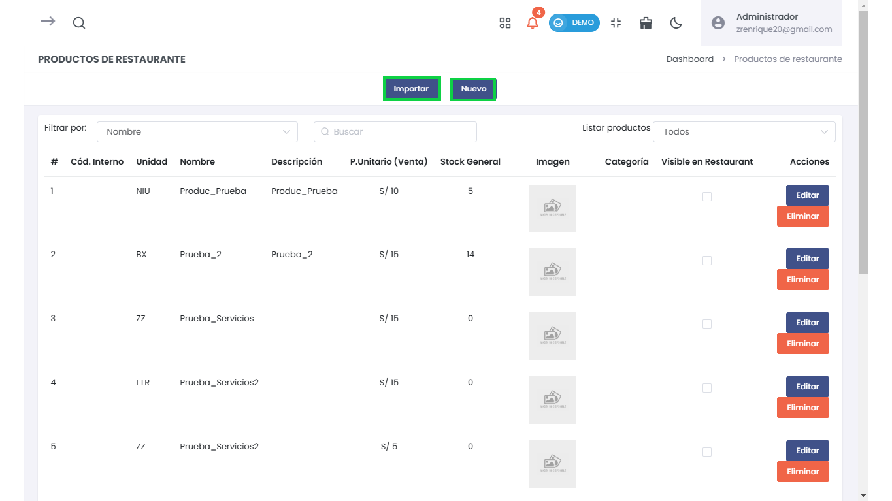
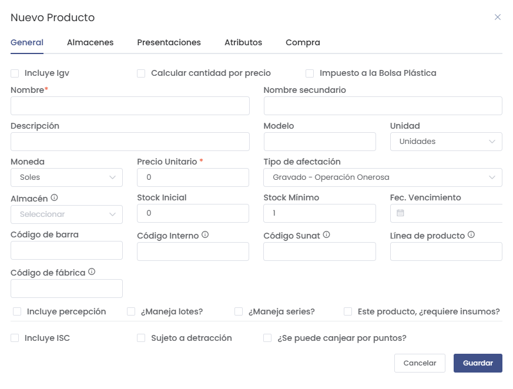
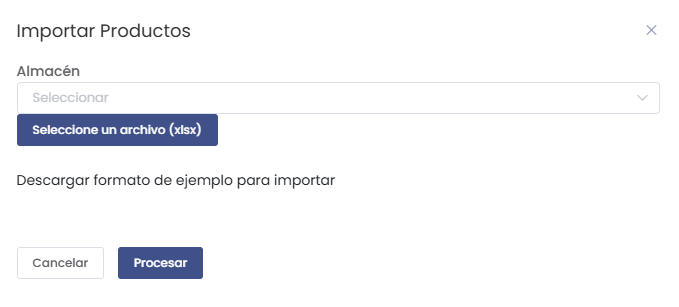

## Productos de Restaurante

Para acceder al módulo de **Productos de Restaurante**, sigue estos pasos:

1. Dirígete al menú lateral y selecciona **Restaurante**.
2. Dentro de **Restaurante**, selecciona la opción **Productos**.

Esto te llevará al listado de todos los productos registrados en el sistema para el restaurante.

En el listado de **Productos de Restaurante**, se muestra la siguiente información:
- **Código Interno**: Código interno del producto.
- **Unidad**: Unidad de medida del producto (por ejemplo, unidades).
- **Nombre**: Nombre del producto.
- **Descripción**: Descripción del producto.
- **Precio Unitario (Venta)**: Precio unitario del producto.
- **Stock General**: Cantidad de stock disponible.
- **Imagen**: Imagen del producto si aplica.
- **Categoría**: Categoría del producto.
- **Visible en Restaurante**: Indica si el producto está visible en el restaurante.

### Crear o Importar Productos

Para crear un nuevo producto, selecciona el botón **Nuevo**. Se abrirá un formulario emergente para completar la información necesaria.

En el formulario de **Nuevo Producto**, debes completar los siguientes campos:
- **Nombre**: Nombre del producto.
- **Descripción**: Descripción del producto.
- **Precio Unitario**: Precio unitario del producto.
- **Unidad**: Unidad de medida del producto.
- **Stock Inicial**: Cantidad de stock inicial.
- **Código de barra**: Código de barra del producto.

Para más información sobre la creación de un producto, verifique el siguiente artículo: [Lista de Productos](https://fastura.github.io/documentacion/Pro-X/Productos-Servicios/Lista%20de%20Productos).

Además, puedes **Importar** productos seleccionando el botón **Importar** y cargando un archivo con el formato correcto.

Selecciona el almacén correspondiente y luego el archivo **.xlsx** que contiene los productos a importar. Selecciona **Procesar** para cargar los datos al sistema.

### Consideraciones sobre la Gestión de Productos

Es importante asegurarse de que todos los productos tengan un **Código Interno** asignado para garantizar la visibilidad en el restaurante y la correcta gestión del inventario.

Verifica siempre la información ingresada para evitar errores en la documentación y la gestión de los productos del restaurante.

