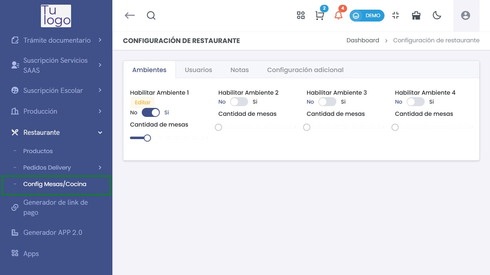
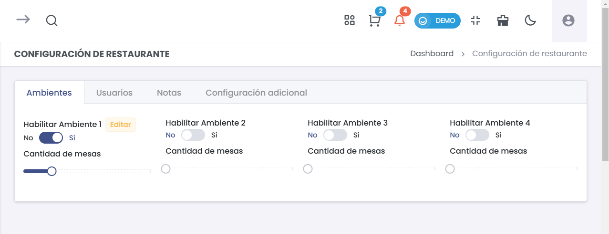
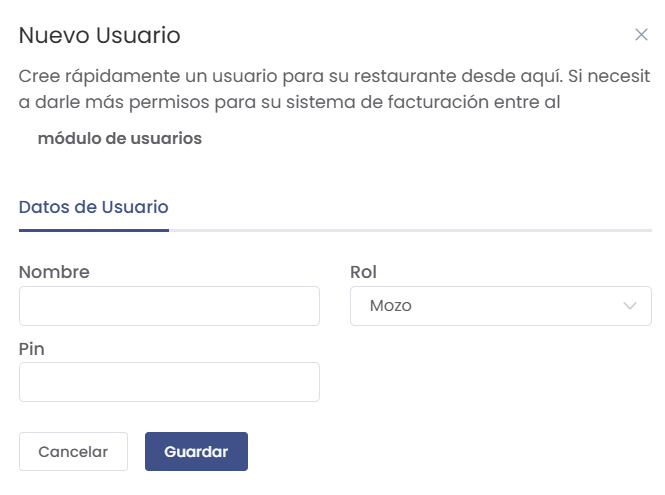
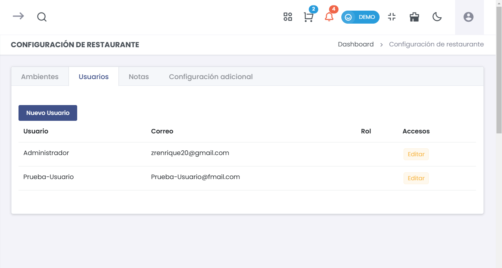
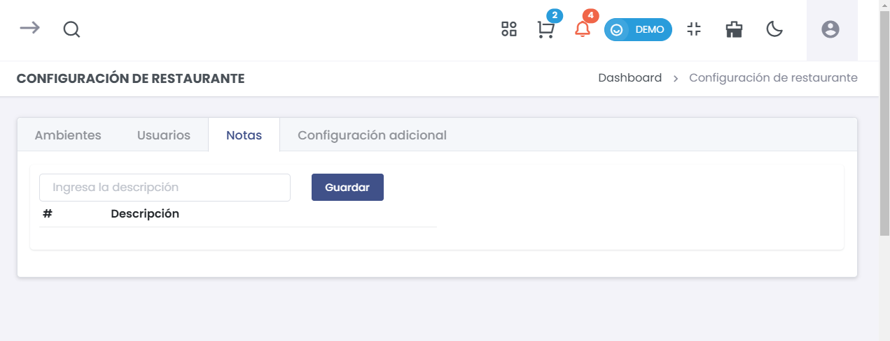
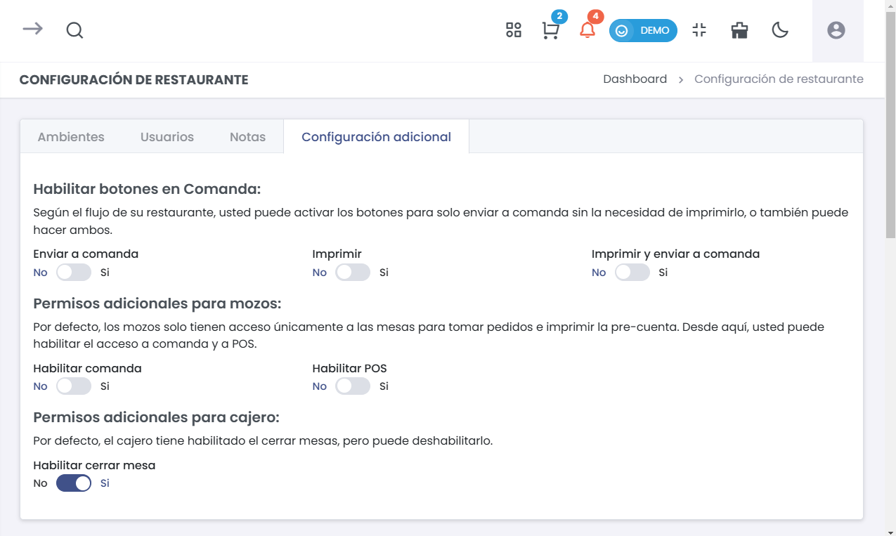

# Configuración de Mesas y Cocina  

Esta sección permite gestionar la configuración de los ambientes y mesas dentro del restaurante, así como la administración de los usuarios. El ingreso al módulo se realiza desde la sección de **Restaurante > Config Mesas/Cocina**.  

## 1. Ambientes  

### Habilitar Ambientes  

- **Habilitar Ambiente 1**:   
  - Activar o desactivar el primer ambiente del restaurante.  
  - **Cantidad de mesas**: Selecciona el número de mesas disponibles.  

- **Habilitar Ambiente 2**:   
  - Activar o desactivar el segundo ambiente.  
  - **Cantidad de mesas**: Selecciona el número de mesas disponibles.  
  

- **Habilitar Ambiente 3**:   
  - Activar o desactivar el tercer ambiente.  
  - **Cantidad de mesas**: Selecciona el número de mesas disponibles.   

- **Habilitar Ambiente 4**:   
  - Activar o desactivar el cuarto ambiente.  
  - **Cantidad de mesas**: Selecciona el número de mesas disponibles.  

## 2. Usuarios  

### Creación de Nuevos Usuarios  

- **Nuevo Usuario**:   
  - Crea un usuario para el restaurante.  
  - **Nombre**: Ingresa el nombre del usuario.  
  - **Rol**: Selecciona el rol del usuario (ej. Mozo).  
  - **Pin**: Asigna un código PIN para el acceso.  

    

### Tabla de Usuarios  

| Usuario          | Correo                      | Rol       | Accesos |  
|------------------|----------------------------|-----------|---------|  
| Administrador    | zrenrique20@gmail.com      | Administrador | Editar |  
| Prueba-Usuario   | Prueba-Usuario@gmail.com   | Mozo      | Editar  |  

   

## 3. Notas  

### Registro de Notas  

- **Descripción de Notas**:   
  - Ingresa cualquier nota relevante sobre la configuración del restaurante.  

    

| #   | Descripción        |  
|-----|--------------------|  
| 1   | Nota importante     |  
| 2   | Revisión semanal     |  

## 4. Configuración Adicional  

### Permisos y Configuración  

- **Habilitar botones en Comanda**:  
  - **Enviar a comanda**: Activa si el botón para enviar directamente a la cocina debe estar habilitado.  
  - **Imprimir**: Activa si el botón de impresión debe estar habilitado.  
  - **Imprimir y enviar a comanda**: Activa si se debe enviar a la cocina y también imprimir.  

  

- **Permisos adicionales para mozos**:  
  - **Habilitar comanda**: Permite a los mozos acceder a la comanda.  
  - **Habilitar POS**: Permite a los mozos utilizar el sistema de POS.  

- **Permisos adicionales para cajero**:  
  - **Habilitar cerrar mesa**: Permite al cajero cerrar las mesas.  

