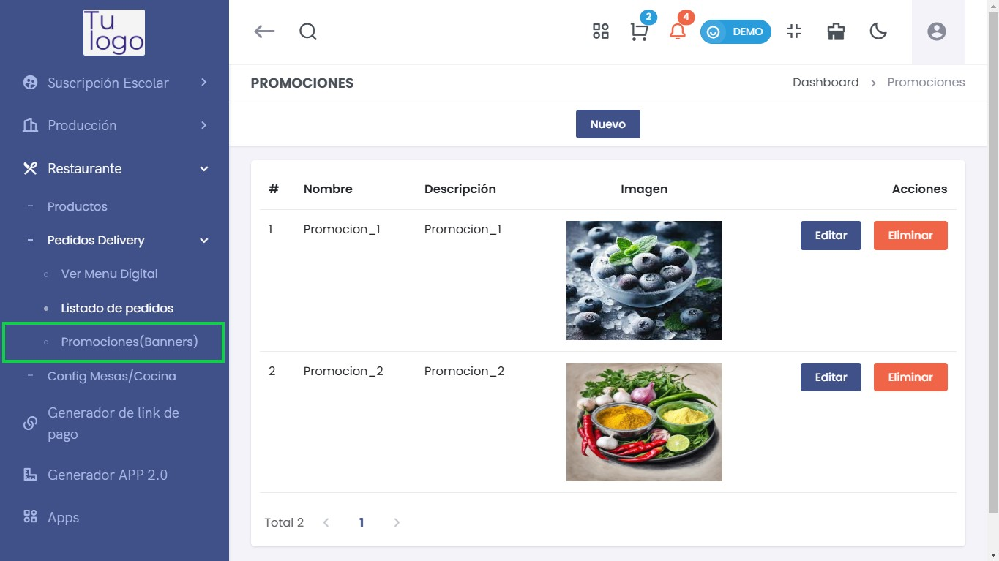
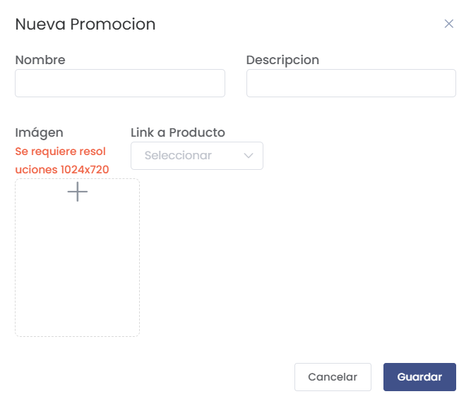
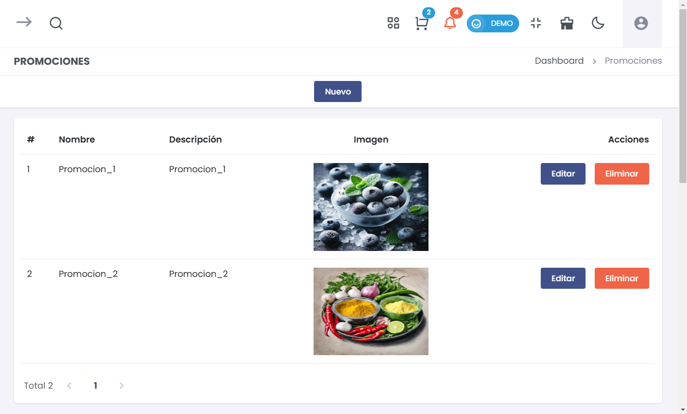

# Promociones (Banners)  

Para gestionar las promociones del restaurante, accede a la sección **Restaurante > Pedidos Delivery > Promociones (Banners)**.  

## 1. Crear Nueva Promoción  

### Pasos para Crear una Nueva Promoción  

1. **Formulario de Nueva Promoción**: Al hacer clic en **Nuevo**, se abrirá un formulario donde podrás ingresar la información de la promoción. 

:::danger IMPORTANTE
 Todos los campos del formulario son **obligatorios**. Asegúrate de completar cada uno de ellos antes de proceder. 
  
:::

   - **Nombre**: Introduce un nombre atractivo para la promoción que pueda captar la atención de los clientes.  

   - **Descripción**: Escribe una breve descripción que explique la promoción, incluyendo detalles que puedan interesar a los clientes.  

   - **Imagen**:   
     - Sube una imagen relevante para la promoción.   
     - **Nota**: Asegúrate de que la imagen tenga una resolución de 1024x720 píxeles para que se visualice correctamente.  

   - **Link a Producto**: Selecciona el producto relacionado con esta promoción desde el menú desplegable.  

2. **Botones de Acción**:  
   - **Cancelar**: Si decides no crear la promoción, haz clic en este botón para cerrar el formulario sin guardar cambios.  
   - **Guardar**: Cuando hayas completado todos los campos, haz clic en este botón para registrar la promoción en el sistema.  

:::danger IMPORTANTE
Para que el producto este visible en el Restaurante, es obligatorio, haberle asignado un **Codigo Interno**, y en el submódulo de **Productos de restaurante** haberlo puesto en estado **Visible**.
:::

## 2. Lista de Promociones  

### Visualización de Promociones  

- Al regresar a la lista de promociones, podrás ver todas las promociones que has creado anteriormente. Cada promoción mostrará su nombre, descripción e imagen asociada.  

### Acciones Disponibles  

- **Editar**:   
  - Selecciona esta opción para modificar los detalles de la promoción.  
  
- **Eliminar**:   
  - Usa esta opción para eliminar una promoción que ya no deseas mostrar.  
