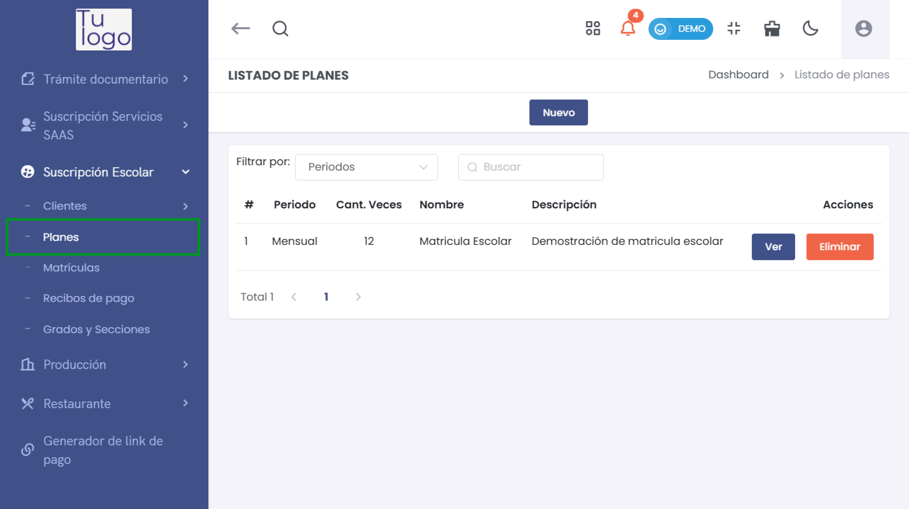
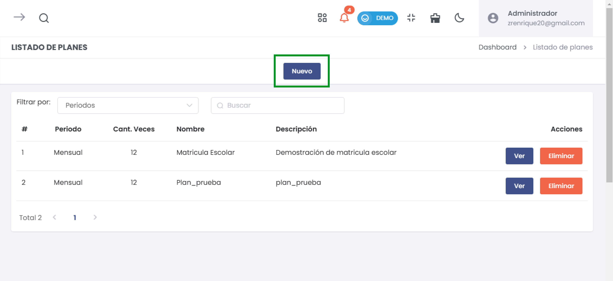
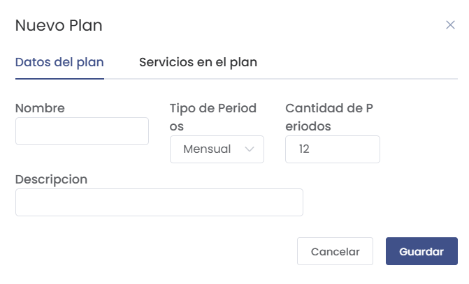
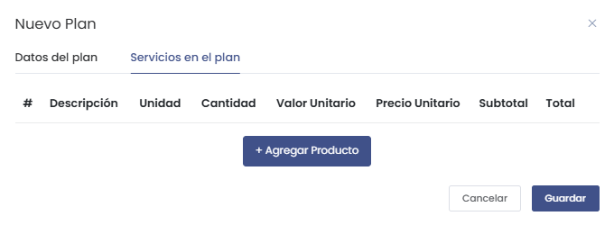
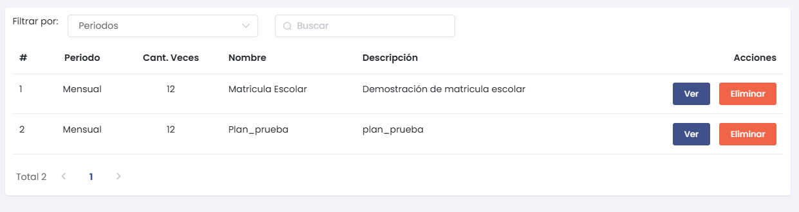
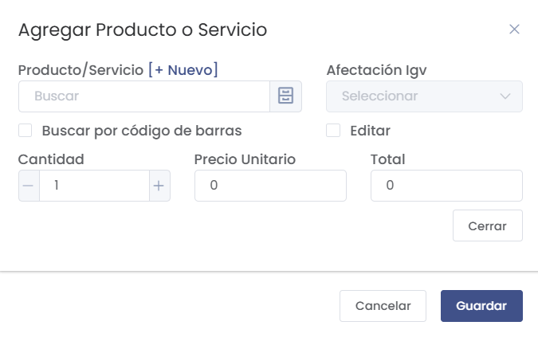

# Planes

En esta sección se detallará cómo configurar los planes de suscripción escolar en la plataforma. Sigue los pasos a continuación para realizar la configuración correcta de cada aspecto.

## Cómo Ingresar al Módulo de Planes

Para acceder al módulo de **Planes**, sigue estos pasos:
1. Dirígete al menú lateral y selecciona **Suscripción Escolar**.
2. Dentro de **Suscripción Escolar**, selecciona la opción **Planes**.

Esto te llevará al listado de todos los planes creados, donde podrás agregar nuevos planes o modificar los existentes.

## Crear un Nuevo Plan de Suscripción

Para crear un nuevo plan de suscripción, selecciona el botón **Nuevo** en la lista de planes. 

Se abrirá un formulario emergente como el siguiente:

### Campos a Completar

- **Nombre**: Ingresa el nombre del plan de suscripción escolar.
- **Tipo de Periodos**: Selecciona la frecuencia del plan (por ejemplo, Mensual, Anual).
- **Cantidad de Periodos**: Establece el número de periodos que abarcará el plan.
- **Descripción**: Agrega una breve descripción del plan para identificarlo fácilmente.

Una vez completados los campos, selecciona el botón **Guardar** para crear el plan.

## Servicios en el Plan

Después de crear el plan, se abrirá la pestaña **Servicios en el plan** donde podrás agregar productos o servicios al plan creado.

Selecciona el botón **Agregar Producto** para añadir productos o servicios a este plan.

## Listado de Planes

Después de crear un plan, puedes visualizarlo en la sección **Listado de Planes**. Aquí podrás ver, editar o eliminar los planes según sea necesario.

En la lista de planes se muestran los siguientes campos:
- **Período**: La frecuencia del plan (Mensual, Anual, etc.).
- **Cant. Veces**: La cantidad de periodos del plan.
- **Nombre**: El nombre del plan.
- **Descripción**: Breve descripción del plan.
- **Acciones**: Puedes **Ver** más detalles del plan o **Eliminar** el plan si ya no es necesario.

## Agregar Producto o Servicio a un Plan

Para agregar un producto o servicio a un plan de suscripción escolar, primero selecciona el botón **Agregar Producto o Servicio**. Se abrirá un formulario emergente como el mostrado a continuación:

### Campos a Completar

- **Producto/Servicio**: Puedes buscar el producto o servicio existente o agregar uno nuevo seleccionando el botón **[+Nuevo]**.
- **Afectación IGV**: Selecciona el tipo de afectación del IGV (Impuesto General a las Ventas) correspondiente al producto o servicio.
- **Buscar por código de barras**: Marca esta casilla si deseas buscar el producto por su código de barras.
- **Cantidad**: Ingresa la cantidad del producto o servicio que deseas agregar al plan.
- **Precio Unitario**: Establece el precio unitario para el producto o servicio.
- **Total**: Este campo calculará automáticamente el valor total en función de la cantidad y el precio unitario.
- **Editar**: Marca esta casilla si deseas poder editar algún valor adicional del producto o servicio.

Una vez completados los campos, selecciona el botón **Guardar** para agregar el producto o servicio al plan de suscripción.

## Cancelar o Cerrar
Si decides no agregar el producto o servicio, puedes cancelar la operación seleccionando el botón **Cancelar** o cerrar el formulario seleccionando el botón **Cerrar**. Esto te devolverá al panel principal.

## Consideraciones
Es importante que completes todos los campos de manera adecuada, ya que esta información es esencial para una correcta gestión de los planes de suscripción escolar.

Asegúrate de verificar la afectación de IGV, ya que puede variar dependiendo del tipo de producto o servicio, y puede afectar el precio final del plan de suscripción.

