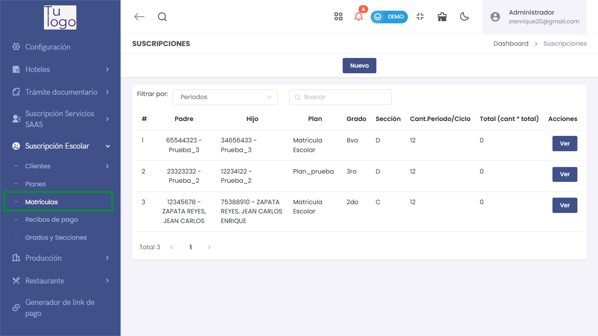
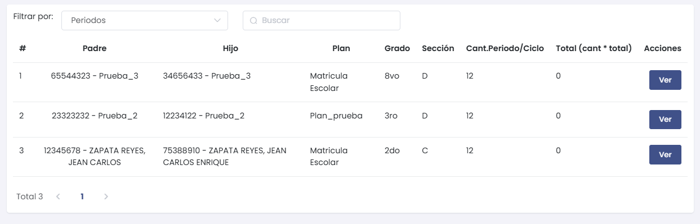
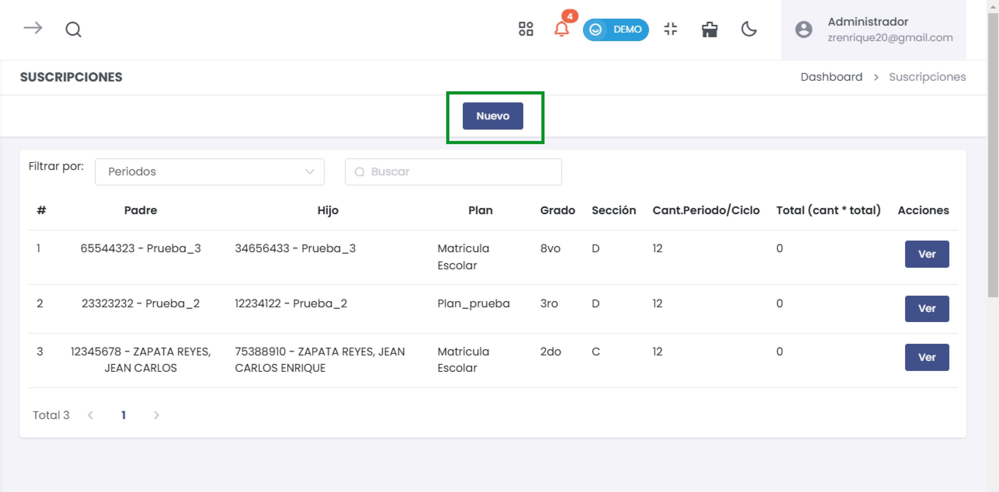
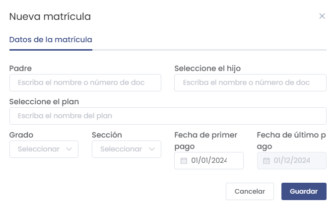

# Matrículas

## Cómo Ingresar al Módulo de Matrículas

Para acceder al módulo de **Matrículas**, sigue estos pasos:
1. Dirígete al menú lateral y selecciona **Suscripción Escolar**.
2. Dentro de **Suscripción Escolar**, selecciona la opción **Matrículas**.

Esto te llevará al listado de todas las matrículas registradas, donde podrás agregar nuevas matrículas o visualizar las existentes.

En el listado de matrículas se muestran los siguientes campos:
- **Padre**: Nombre o identificación del padre del estudiante.
- **Hijo**: Nombre o identificación del estudiante.
- **Plan**: El plan de suscripción asignado al estudiante.
- **Grado** y **Sección**: El grado y sección asignados.
- **Cant. Periodo/Ciclo**: La cantidad de periodos o ciclos.
- **Total**: El monto total calculado.
- **Acciones**: Puedes **Ver** más detalles de la matrícula.

## Crear una Nueva Matrícula

Para crear una nueva matrícula, selecciona el botón **Nuevo** en la lista de matrículas. 

Se abrirá un formulario emergente como el siguiente:

### Campos a Completar

- **Padre**: Escribe el nombre o número de documento del padre del estudiante.
- **Seleccione el hijo**: Escribe el nombre o número de documento del estudiante.
- **Seleccione el plan**: Ingresa el nombre del plan de suscripción que se asignará al estudiante.
- **Grado**: Selecciona el grado al que pertenece el estudiante.
- **Sección**: Selecciona la sección correspondiente.
- **Fecha de primer pago** y **Fecha de último pago**: Establece las fechas correspondientes para los pagos.

Una vez completados los campos, selecciona el botón **Guardar** para registrar la matrícula.

## Cancelar o Cerrar
Si decides no completar la matrícula, puedes cancelar la operación seleccionando el botón **Cancelar** o cerrar el formulario seleccionando el botón **Cerrar**. Esto te devolverá al panel principal.

## Consideraciones sobre Matrículas
Es importante completar todos los campos de manera adecuada, ya que esta información es esencial para una correcta gestión de las matrículas escolares.

Verifica siempre que la información ingresada sea correcta para evitar inconvenientes en el proceso de registro y seguimiento de matrículas.

