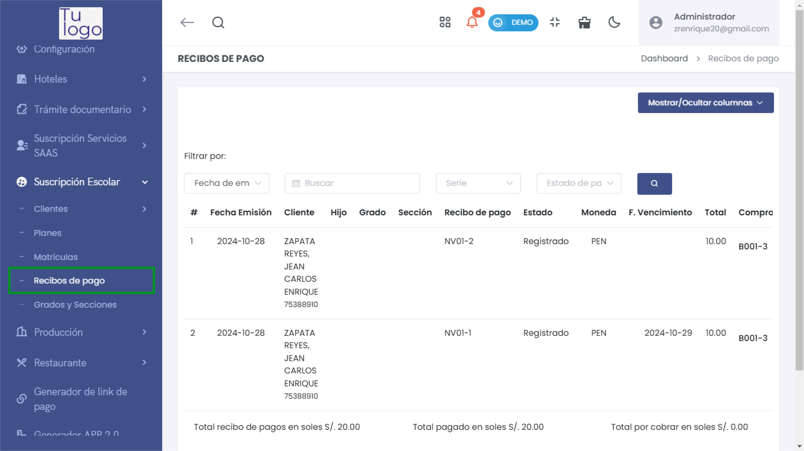
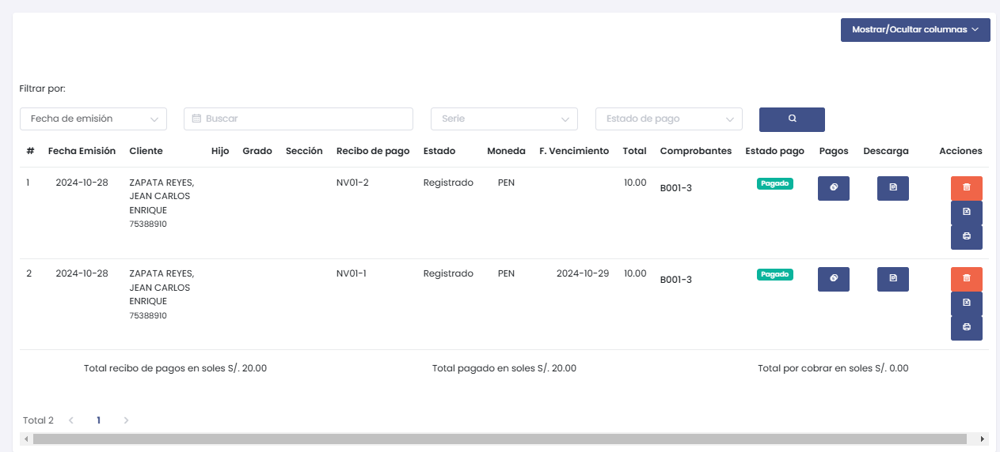
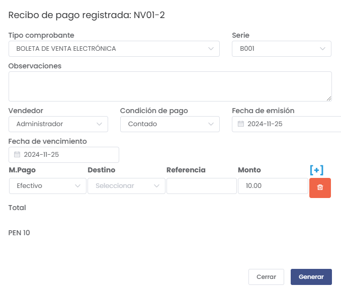
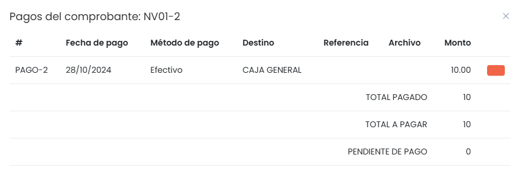

# Recibos de Pago

## Cómo Ingresar al Módulo de Recibos de Pago

Para acceder al módulo de **Recibos de Pago**, sigue estos pasos:
1. Dirígete al menú lateral y selecciona **Suscripción Escolar**.
2. Dentro de **Suscripción Escolar**, selecciona la opción **Recibos de Pago**.

Esto te llevará al listado de todos los recibos de pago generados, donde podrás visualizar detalles y generar nuevos recibos si es necesario.

En el listado de recibos de pago se muestran los siguientes campos:
- **Fecha Emisión**: Fecha en la que se emitió el recibo de pago.
- **Cliente**: Nombre del cliente (padre o tutor).
- **Hijo**: Nombre del estudiante asociado al pago.
- **Grado** y **Sección**: Información académica del estudiante.
- **Recibo de pago**: Identificador del recibo.
- **Estado**: Estado del recibo (por ejemplo, registrado).
- **Moneda**: Moneda del pago (por ejemplo, PEN).
- **F. Vencimiento**: Fecha de vencimiento del pago.
- **Total**: Monto total del recibo.
- **Comprobantes**: Identificador del comprobante asociado.
- **Estado pago**: Estado del pago (por ejemplo, pagado).
- **Acciones**: Puedes **Ver** más detalles del comprobante, **Descargar** el comprobante o **Eliminar** el registro.

## Detalles del Recibo de Pago

Para ver más detalles de un recibo de pago, selecciona el botón **Ver** en la lista de recibos. Esto abrirá una ventana con los detalles completos del recibo.

### Campos a Completar o Revisar

- **Tipo comprobante**: Selecciona el tipo de comprobante (por ejemplo, Boleta de Venta Electrónica).
- **Serie**: Número de serie del comprobante.
- **Observaciones**: Campo opcional para agregar observaciones relacionadas al recibo.
- **Vendedor**: Nombre del vendedor registrado.
- **Condición de pago**: Selecciona la condición del pago (por ejemplo, Contado).
- **Fecha de emisión** y **Fecha de vencimiento**: Establece las fechas correspondientes al recibo.
- **Método de Pago (M.Pago)**: Selecciona el método de pago utilizado (por ejemplo, Efectivo).
- **Destino**: Selecciona el destino del pago.
- **Referencia**: Campo opcional para agregar una referencia.
- **Monto**: Especifica el monto del pago.

Una vez revisados o completados los campos, selecciona el botón **Generar** para finalizar el comprobante.

## Pagos del Comprobante

Puedes revisar los pagos realizados para un comprobante específico seleccionando la opción de **Pagos**. Esto abrirá una ventana con un desglose detallado de los pagos realizados.

En el desglose de pagos se muestran los siguientes campos:
- **Fecha de pago**: La fecha en que se realizó el pago.
- **Método de pago**: Método utilizado para realizar el pago (por ejemplo, Efectivo).
- **Destino**: Destino del pago (por ejemplo, Caja General).
- **Monto**: El monto pagado.
- **Total Pagado**, **Total a Pagar**, **Pendiente de Pago**: Resumen de los montos involucrados en el recibo.

## Cancelar o Cerrar
Si decides no completar el proceso de registro del recibo de pago, puedes cancelar la operación seleccionando el botón **Cerrar**. Esto te devolverá al panel principal.

## Consideraciones sobre Recibos de Pago
Es importante completar todos los campos de manera adecuada y revisar la información antes de generar el recibo de pago, ya que esta información es esencial para la correcta gestión de los pagos.

Verifica siempre que la información ingresada sea correcta para evitar inconvenientes en el proceso de emisión y seguimiento de los recibos de pago.

