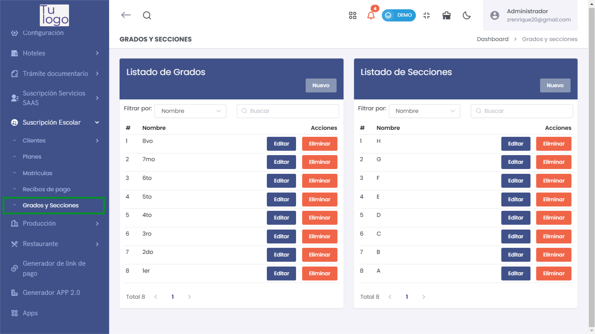
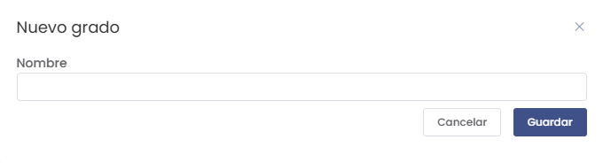
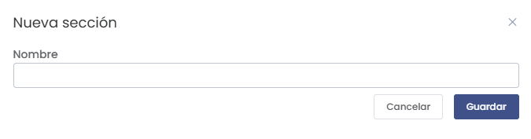

# Grados y Secciones

## Cómo Ingresar al Módulo de Grados y Secciones

Para acceder al módulo de **Grados y Secciones**, sigue estos pasos:
1. Dirígete al menú lateral y selecciona **Suscripción Escolar**.
2. Dentro de **Suscripción Escolar**, selecciona la opción **Grados y Secciones**.

Esto te llevará al listado de todos los grados y secciones registrados, donde podrás agregar nuevos grados o secciones, así como editar o eliminar los existentes.

En la pantalla de **Grados y Secciones** se muestra lo siguiente:
- **Listado de Grados**: Todos los grados registrados en el sistema. Puedes agregar un nuevo grado, editar o eliminar un grado existente.
- **Listado de Secciones**: Todas las secciones registradas. Puedes agregar una nueva sección, editar o eliminar una sección existente.

## Crear un Nuevo Grado

Para crear un nuevo grado, selecciona el botón **Nuevo** en la lista de grados. Se abrirá un formulario emergente como el siguiente:

### Campos a Completar
- **Nombre**: Ingresa el nombre del nuevo grado que deseas registrar (por ejemplo, "5to").

Una vez completado el campo, selecciona el botón **Guardar** para registrar el grado en el sistema.

## Crear una Nueva Sección

Para crear una nueva sección, selecciona el botón **Nuevo** en la lista de secciones. Se abrirá un formulario emergente como el siguiente:

### Campos a Completar
- **Nombre**: Ingresa el nombre de la nueva sección que deseas registrar (por ejemplo, "A", "B").

Una vez completado el campo, selecciona el botón **Guardar** para registrar la sección en el sistema.

## Editar o Eliminar Grados y Secciones

En la lista de **Grados** y **Secciones**, puedes realizar las siguientes acciones:
- **Editar**: Selecciona el botón **Editar** junto al grado o sección que deseas modificar. Esto abrirá un formulario donde podrás realizar los cambios necesarios.
- **Eliminar**: Selecciona el botón **Eliminar** para borrar un grado o sección. Ten en cuenta que esta acción no se puede deshacer.

## Consideraciones sobre Grados y Secciones
Es importante registrar todos los grados y secciones de manera adecuada, ya que esta información es esencial para la correcta organización y gestión académica de los estudiantes en la plataforma.

Verifica siempre que la información ingresada sea correcta para evitar inconvenientes en el proceso de asignación de estudiantes a sus respectivos grados y secciones.

