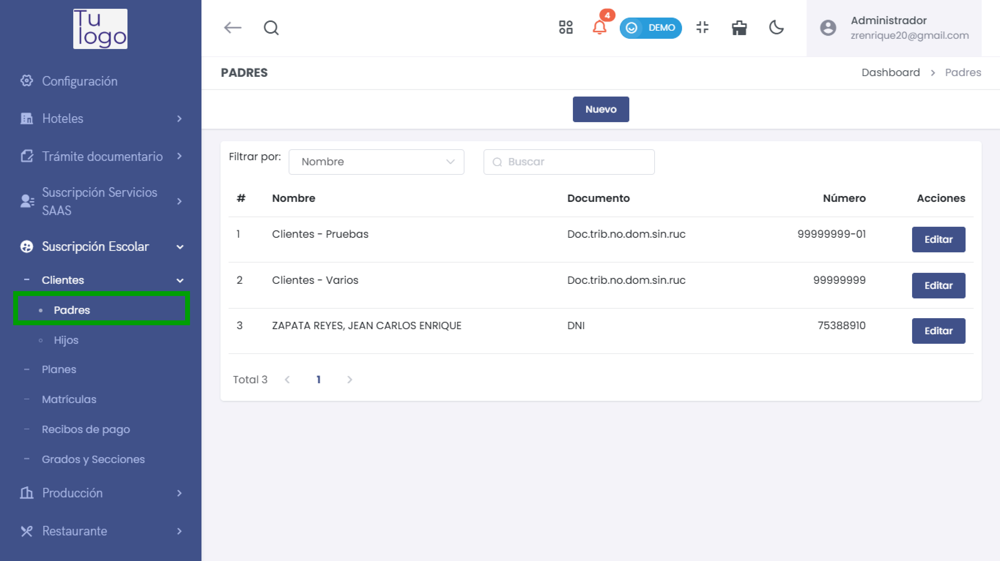
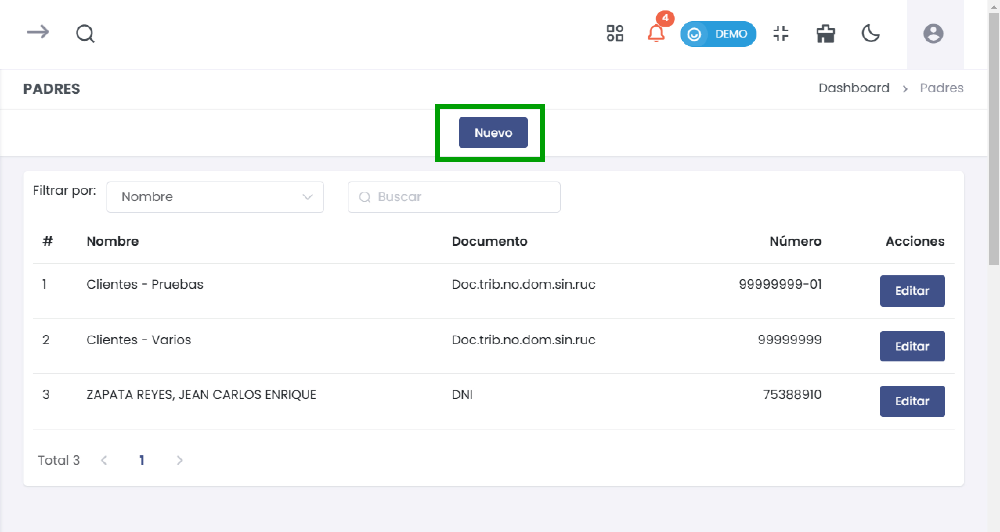
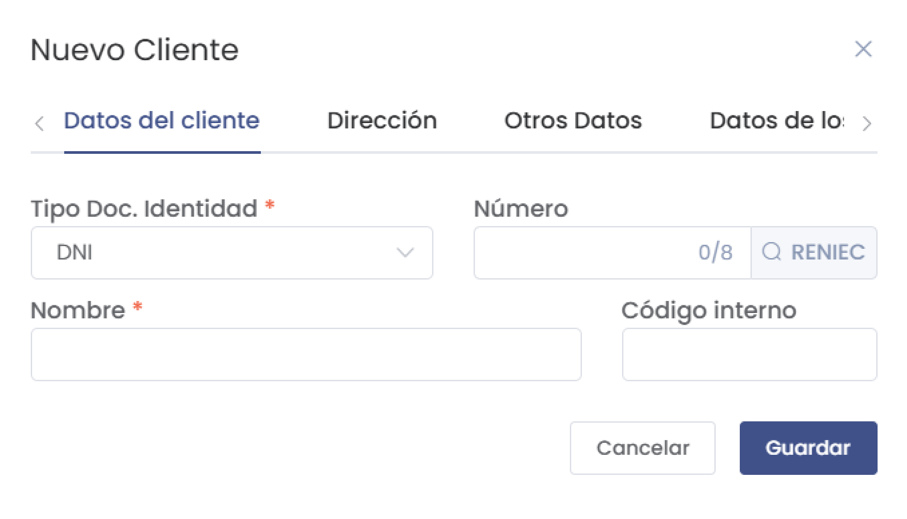
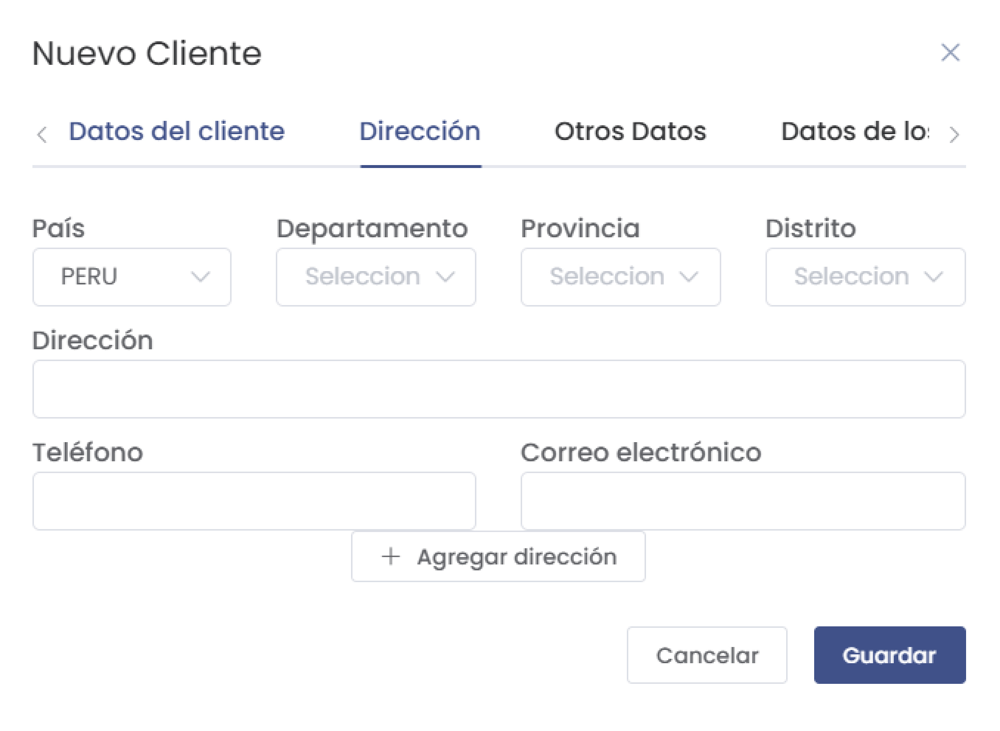
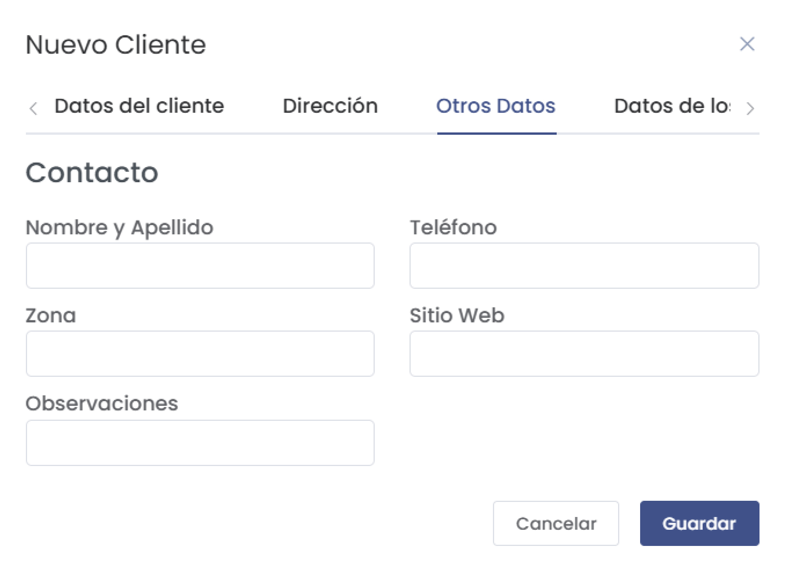
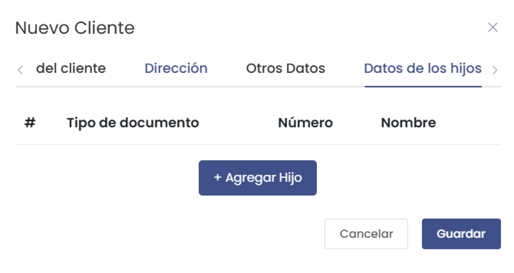
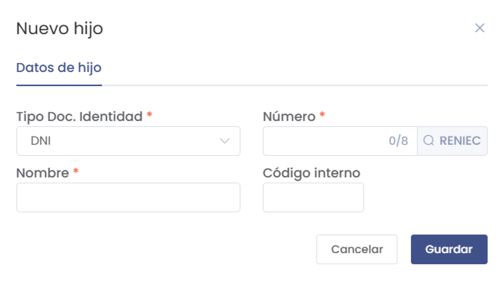
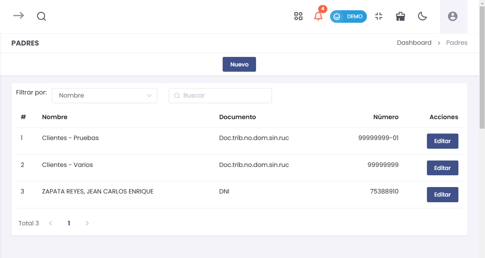

# Padres

Este proceso te permitirá crear un nuevo cliente en el sistema. Sigue los siguientes pasos para realizarlo:

## Paso 1: Acceso al Módulo de Clientes

1. Ingresa al módulo **Suscripción Escolar** en el menú principal ubicado en el lado izquierdo de la pantalla.
2. Selecciona la opción  y luego despliega el menú **Clientes**.
3. Dentro de **Clientes**, selecciona la subcategoría **Padres** para gestionar los clientes en esta sección.

4. Haz clic en el botón **Nuevo** en la parte superior de la lista de clientes para iniciar el proceso de creación de un nuevo cliente.

---

## Paso 2: Completar los Datos del Cliente

Al seleccionar **Nuevo**, se abrirá un formulario con varias pestañas para ingresar los datos del cliente. Completa los campos según la siguiente descripción:

### Pestaña "Datos del Cliente"

En esta sección, deberás ingresar la información principal del cliente.

- **Tipo Doc. Identidad:** Selecciona el tipo de documento de identidad del cliente, como **DNI**.
- **Número:** Ingresa el número del documento de identidad del cliente (máximo 8 caracteres).
- **Nombre:** Introduce el nombre completo del cliente. Este campo es obligatorio.
- **Código Interno:** Si es necesario, asigna un código interno para identificar al cliente dentro del sistema.

Una vez completados estos datos, puedes continuar con las siguientes secciones.

---

### Pestaña "Dirección"

En esta pestaña, ingresa los datos de dirección del cliente.

- **País:** Selecciona el país de residencia del cliente. Por defecto, aparece **Perú**.
- **Departamento:** Elige el departamento de residencia del cliente.
- **Provincia:** Selecciona la provincia correspondiente.
- **Distrito:** Indica el distrito del cliente.
- **Dirección:** Escribe la dirección exacta del cliente.
- **Teléfono:** Agrega el número de teléfono de contacto del cliente.
- **Correo Electrónico:** Ingresa el correo electrónico del cliente.

Si deseas agregar otra dirección, puedes hacer clic en el botón **+ Agregar dirección**.

---

### Pestaña "Otros Datos"

En la sección de **Otros Datos**, completa la información adicional de contacto del cliente.

- **Nombre y Apellido:** Indica el nombre y apellido de la persona de contacto.
- **Teléfono:** Ingresa el número de teléfono adicional.
- **Zona:** Especifica la zona de ubicación del cliente.
- **Sitio Web:** Si aplica, ingresa el sitio web del cliente.
- **Observaciones:** Agrega cualquier observación relevante sobre el cliente.

Esta sección es opcional y permite detallar más información de contacto.

---

### Pestaña "Datos de los Hijos"

Si el cliente tiene hijos que deben ser registrados en el sistema, sigue estos pasos:

1. Haz clic en el botón **+ Agregar Hijo**.

2. Se abrirá un formulario donde deberás ingresar los datos del hijo:

   - **Tipo Doc. Identidad:** Selecciona el tipo de documento de identidad del hijo (por ejemplo, **DNI**).
   - **Número:** Ingresa el número del documento del hijo.
   - **Nombre:** Escribe el nombre completo del hijo.
   - **Código Interno:** Si aplica, asigna un código interno.

3. Al completar estos datos, selecciona **Guardar** para agregar al hijo a la lista.

Puedes repetir este proceso para agregar múltiples hijos.

---

## Paso 3: Confirmación y Guardado

Una vez que hayas completado todos los datos necesarios en las pestañas **Datos del Cliente**, **Dirección**, **Otros Datos**, y **Datos de los Hijos**, haz clic en el botón **Guardar** para registrar al cliente en el sistema.

El cliente aparecerá en la lista de **Padres** junto con sus detalles y opciones de edición.

---

## Administración de Clientes Existentes

Después de crear un cliente, podrás visualizar sus datos en la lista de clientes en la sección de **Padres**.

- **Editar Cliente:** Para modificar la información de un cliente existente, selecciona el botón **Editar** en la columna de **Acciones** junto al nombre del cliente.
- **Inhabilitar Cliente:** Si un cliente ya no requiere acceso o uso del sistema, puedes optar por inhabilitarlo. Esto mantendrá el historial del cliente en el sistema sin permitirle acceso.

---
