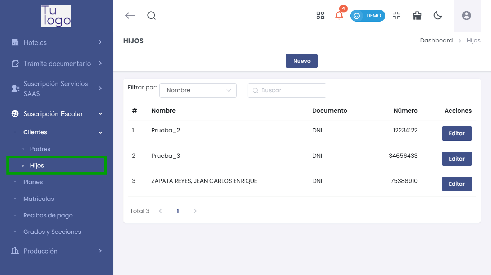
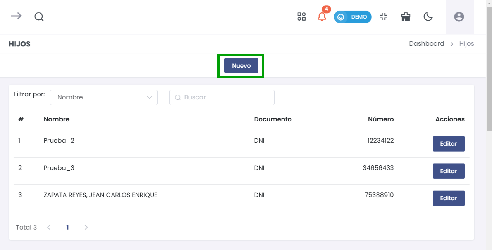
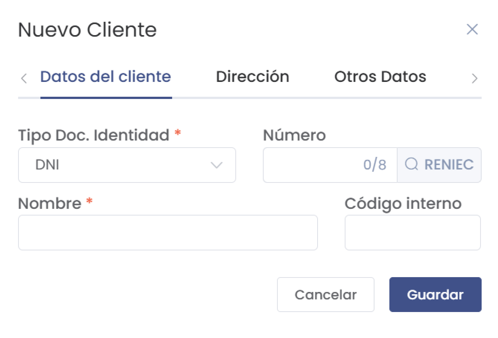
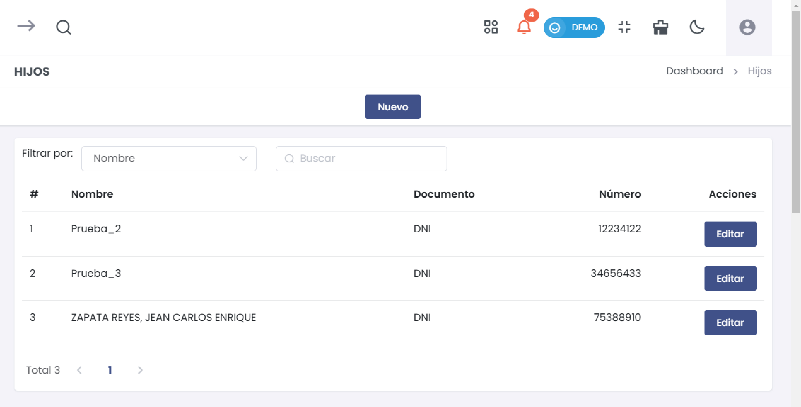

# Hijos

Este proceso te permitirá agregar y gestionar los datos de los hijos de un cliente en el sistema. Sigue los pasos a continuación para realizarlo:

## Paso 1: Acceso al Módulo de Hijos

1. Ingresa al módulo **Suscripción Escolar** en el menú principal ubicado en el lado izquierdo de la pantalla.
2. Selecciona la opción **Clientes** y luego despliega la subcategoría **Hijos** para gestionar la información de los hijos asociados a los clientes.

3. Haz clic en el botón **Nuevo** en la parte superior de la lista de hijos para iniciar el proceso de creación de un nuevo registro de hijo.

---

## Paso 2: Completar los Datos del Hijo

Al seleccionar **Nuevo**, se abrirá un formulario para ingresar los datos del hijo. Completa los campos según la siguiente descripción:

- **Tipo Doc. Identidad:** Selecciona el tipo de documento de identidad del hijo, como **DNI**.
- **Número:** Ingresa el número del documento de identidad del hijo (máximo 8 caracteres).
- **Nombre:** Introduce el nombre completo del hijo. Este campo es obligatorio.
- **Código Interno:** Si es necesario, asigna un código interno para identificar al hijo dentro del sistema.

Al completar estos datos, selecciona **Guardar** para registrar al hijo en el sistema.

---

## Paso 3: Verificación y Listado de Hijos

Después de guardar, el hijo aparecerá en la lista de **Hijos** junto con sus detalles y opciones de edición.

---

## Administración de Hijos Existentes

La lista de **Hijos** permite ver y gestionar la información de cada hijo registrado en el sistema.

- **Editar Hijo:** Para modificar la información de un hijo existente, selecciona el botón **Editar** en la columna de **Acciones** junto al nombre del hijo.

---

