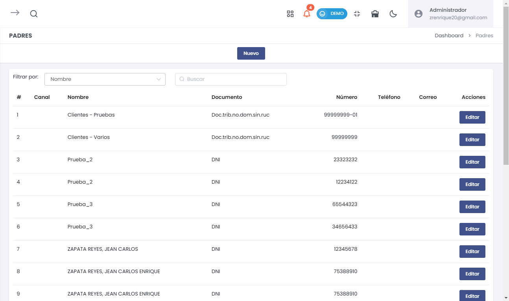
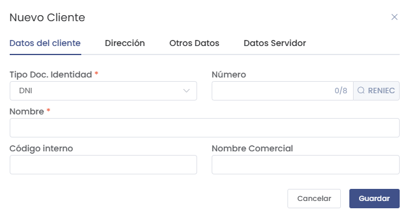
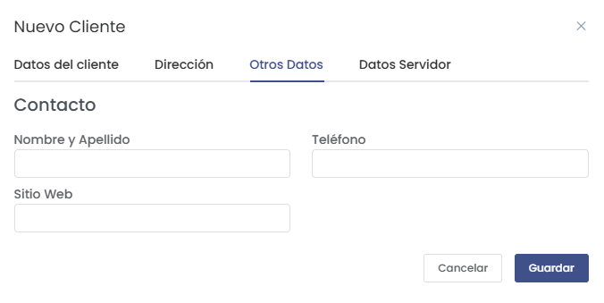
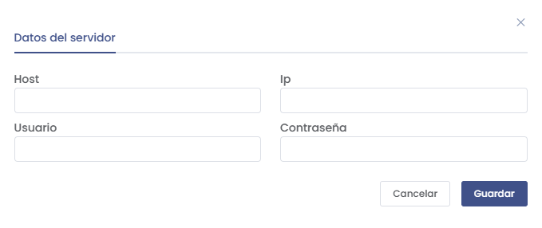

# Clientes

## Cómo Ingresar al Módulo de Clientes

Para acceder al módulo de **Clientes** en la suscripción de servicios SAAS, sigue estos pasos:
1. Dirígete al menú lateral y selecciona **Suscripción Servicios SAAS**.
2. Dentro de **Suscripción Servicios SAAS**, selecciona la opción **Clientes**.

Esto te llevará al listado de todos los clientes registrados, donde podrás agregar nuevos clientes, editar o eliminar los existentes.

En el listado de **Clientes** se muestra la siguiente información:
- **Canal**: Indica el canal del cliente.
- **Nombre**: Nombre del cliente registrado.
- **Documento**: Tipo de documento y número asociado al cliente.
- **Número**: Número de contacto del cliente.
- **Teléfono**: Teléfono adicional si aplica.
- **Correo**: Correo electrónico del cliente.
- **Acciones**: Puedes **Editar** la información del cliente.

## Crear un Nuevo Cliente

Para crear un nuevo cliente, selecciona el botón **Nuevo** en la lista de clientes. Se abrirá un formulario emergente dividido en secciones para completar la información necesaria.

### Datos del Cliente

En la pestaña **Datos del cliente**, debes completar los siguientes campos:
- **Tipo Doc. Identidad**: Selecciona el tipo de documento (por ejemplo, DNI, RUC).
- **Número**: Ingresa el número del documento de identidad.
- **Nombre**: Nombre completo del cliente.
- **Código interno**: Código interno (opcional).
- **Nombre Comercial**: Nombre comercial del cliente si aplica.

Una vez completados los campos, selecciona **Guardar** para continuar con la siguiente sección.

### Dirección del Cliente

En la pestaña **Dirección**, completa los siguientes datos:
- **País**: Selecciona el país (por defecto PERÚ).
- **Departamento, Provincia, Distrito**: Selecciona los valores correspondientes.
- **Dirección**: Ingresa la dirección completa.
- **Teléfono**: Teléfono del cliente.
- **Correo electrónico**: Dirección de correo electrónico del cliente.

Puedes agregar más direcciones seleccionando **Agregar dirección**.

### Otros Datos del Cliente

En la pestaña **Otros Datos**, completa la información de contacto:
- **Nombre y Apellido**: Nombre y apellido del contacto principal.
- **Teléfono**: Número de teléfono del contacto principal.
- **Sitio Web**: Sitio web del cliente si aplica.

### Datos del Servidor del Cliente

En la pestaña **Datos Servidor**, puedes ingresar información técnica relacionada con el servidor del cliente:
- **Usuario Gitlab**: Nombre de usuario de Gitlab.
- **Usuario de Discord**: Nombre de usuario de Discord.
- **Nombre del canal Slack**: Nombre del canal de Slack asignado.
- **Nombre del canal Discord**: Nombre del canal de Discord asignado.

También puedes agregar información adicional del servidor seleccionando **Agregar Servidor**.

**Información Adicional del Servidor**

En la ventana de **Datos del servidor**, debes completar la siguiente información:

1. Host: Dirección del host del servidor.

2. IP: Dirección IP del servidor.

3. Usuario: Nombre de usuario del servidor.

4. Contraseña: Contraseña de acceso al servidor.

Una vez completados estos campos, selecciona Guardar para agregar esta información al cliente.

## Editar Clientes

En la lista de **Clientes**, puedes realizar las siguientes acciones:
- **Editar**: Selecciona el botón **Editar** junto al cliente que deseas modificar. Esto abrirá un formulario donde podrás realizar los cambios necesarios.

## Consideraciones sobre la Gestión de Clientes
Es importante ingresar la información de cada cliente de manera adecuada, ya que esto permitirá un mejor manejo y seguimiento de la relación con los clientes.

Verifica siempre la información ingresada para evitar errores en la documentación y gestión de los datos de los clientes.

