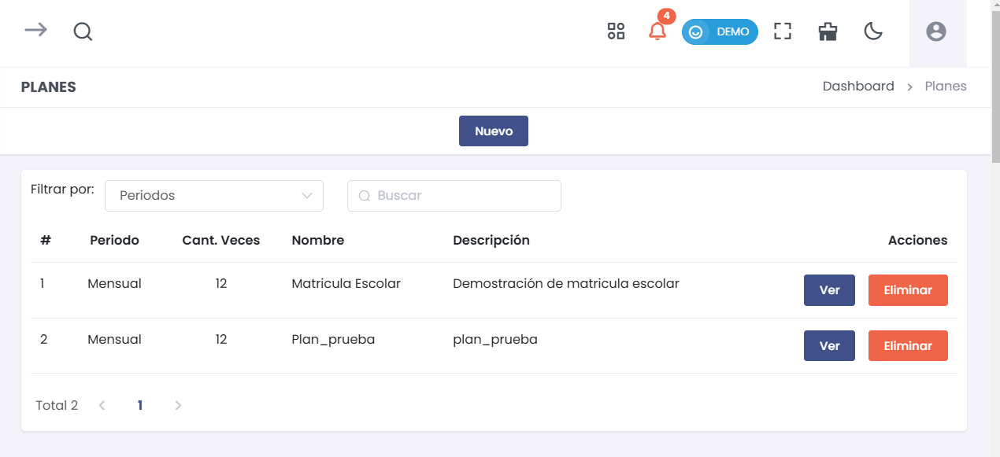
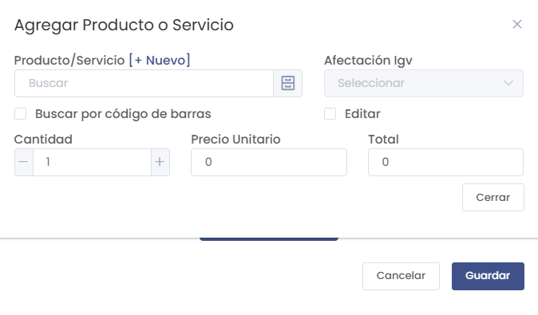

# Planes

## Cómo Ingresar al Módulo de Planes

Para acceder al módulo de **Planes** en la suscripción de servicios SAAS, sigue estos pasos:
1. Dirígete al menú lateral y selecciona **Suscripción Servicios SAAS**.
2. Dentro de **Suscripción Servicios SAAS**, selecciona la opción **Planes**.

Esto te llevará al listado de todos los planes registrados, donde podrás agregar nuevos planes, editar o eliminar los existentes.

En el listado de **Planes** se muestra la siguiente información:
- **Periodo**: La frecuencia del plan (por ejemplo, Mensual, Anual).
- **Cant. Veces**: La cantidad de periodos del plan.
- **Nombre**: Nombre del plan.
- **Descripción**: Breve descripción del plan.
- **Acciones**: Puedes **Ver** más detalles del plan o **Eliminar** el plan si ya no es necesario.

## Crear un Nuevo Plan de Suscripción

Para crear un nuevo plan, selecciona el botón **Nuevo** en la lista de planes. Se abrirá un formulario emergente dividido en dos pestañas para completar la información necesaria.

### Datos del Plan

En la pestaña **Datos del plan**, debes completar los siguientes campos:
- **Nombre**: Ingresa el nombre del plan de suscripción.
- **Tipo de Periodos**: Selecciona la frecuencia del plan (por ejemplo, Mensual, Anual).
- **Cantidad de Periodos**: Establece el número de periodos que abarcará el plan.
- **Descripción**: Agrega una breve descripción del plan para identificarlo fácilmente.

Una vez completados los campos, selecciona **Guardar** para continuar con la siguiente pestaña.

### Servicios en el Plan

En la pestaña **Servicios en el plan**, podrás agregar los productos o servicios que se incluirán en este plan de suscripción.

1. Selecciona el botón **Agregar Producto**.
2. Se abrirá un formulario emergente donde podrás buscar un producto o servicio existente o agregar uno nuevo.

### Campos a Completar al Agregar Producto o Servicio
- **Producto/Servicio**: Puedes buscar el producto o servicio existente o agregar uno nuevo seleccionando el botón **[+Nuevo]**.
- **Afectación IGV**: Selecciona el tipo de afectación del IGV (Impuesto General a las Ventas) correspondiente al producto o servicio.
- **Buscar por código de barras**: Marca esta casilla si deseas buscar el producto por su código de barras.
- **Cantidad**: Ingresa la cantidad de productos o servicios que deseas agregar al plan.
- **Precio Unitario**: Establece el precio unitario para el producto o servicio.
- **Total**: Este campo calculará automáticamente el valor total en función de la cantidad y el precio unitario.
- **Editar**: Marca esta casilla si deseas poder editar algún valor adicional del producto o servicio.

Una vez completados los campos, selecciona **Guardar** para agregar el producto o servicio al plan de suscripción.

### Finalizar la Creación del Plan

Después de agregar todos los productos y servicios necesarios, selecciona **Guardar** en la pestaña **Servicios en el plan** para completar la creación del nuevo plan de suscripción.

## Editar o Eliminar Planes

En la lista de **Planes**, puedes realizar las siguientes acciones:
- **Ver**: Selecciona el botón **Ver** para visualizar los detalles de un plan específico.
- **Eliminar**: Selecciona el botón **Eliminar** para eliminar un plan. Asegúrate de verificar antes de eliminar un plan, ya que esta acción no se puede deshacer.

## Consideraciones sobre la Gestión de Planes
Es importante ingresar la información de cada plan de manera adecuada para garantizar una correcta gestión de las suscripciones de los clientes. Asegúrate de que los productos o servicios agregados a cada plan reflejen correctamente lo que se ofrece, y verifica siempre la afectación de IGV, ya que puede afectar el precio final del plan.

Mantén actualizados los planes para reflejar cambios en precios, periodos u ofertas que puedas tener, lo cual ayudará a evitar errores en la facturación y en la gestión de suscripciones.

