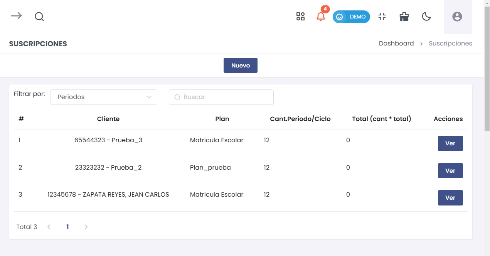

# Suscripciones

## Cómo Ingresar al Módulo de Suscripciones

Para acceder al módulo de **Suscripciones** en la suscripción de servicios SAAS, sigue estos pasos:
1. Dirígete al menú lateral y selecciona **Suscripción Servicios SAAS**.
2. Dentro de **Suscripción Servicios SAAS**, selecciona la opción **Suscripciones**.

Esto te llevará al listado de todas las suscripciones registradas, donde podrás agregar nuevas suscripciones, ver detalles o realizar cambios en las existentes.

En el listado de **Suscripciones** se muestra la siguiente información:
- **Cliente**: Nombre del cliente suscrito.
- **Plan**: Nombre del plan asociado a la suscripción.
- **Cant.Periodo/Ciclo**: Cantidad de ciclos del plan.
- **Total**: Total a pagar por el cliente.
- **Acciones**: Puedes seleccionar **Ver** para consultar detalles de la suscripción.

## Crear una Nueva Suscripción

Para crear una nueva suscripción, selecciona el botón **Nuevo** en la lista de suscripciones. Se abrirá un formulario emergente donde deberás completar la información necesaria.

### Datos de la Suscripción

En la pestaña **Datos de la suscripción**, debes completar los siguientes campos:
- **Cliente**: Escribe el nombre o número de documento del cliente.
- **Seleccione el plan**: Ingresa el nombre del plan al que el cliente se va a suscribir.
- **Fecha de primer pago**: Selecciona la fecha del primer pago.
- **Fecha de último pago**: Selecciona la fecha del último pago asociado a la suscripción.

Una vez completados los campos, selecciona **Guardar** para crear la suscripción.

## Editar o Ver Suscripciones

En la lista de **Suscripciones**, puedes realizar las siguientes acciones:
- **Ver**: Selecciona el botón **Ver** junto a la suscripción que deseas consultar para ver detalles adicionales.

## Consideraciones sobre la Gestión de Suscripciones

Es importante mantener actualizada la información de las suscripciones, ya que esto permitirá un mejor seguimiento de los servicios contratados por los clientes.

Verifica siempre la información ingresada para evitar errores y asegurar una correcta gestión de los datos de las suscripciones.

