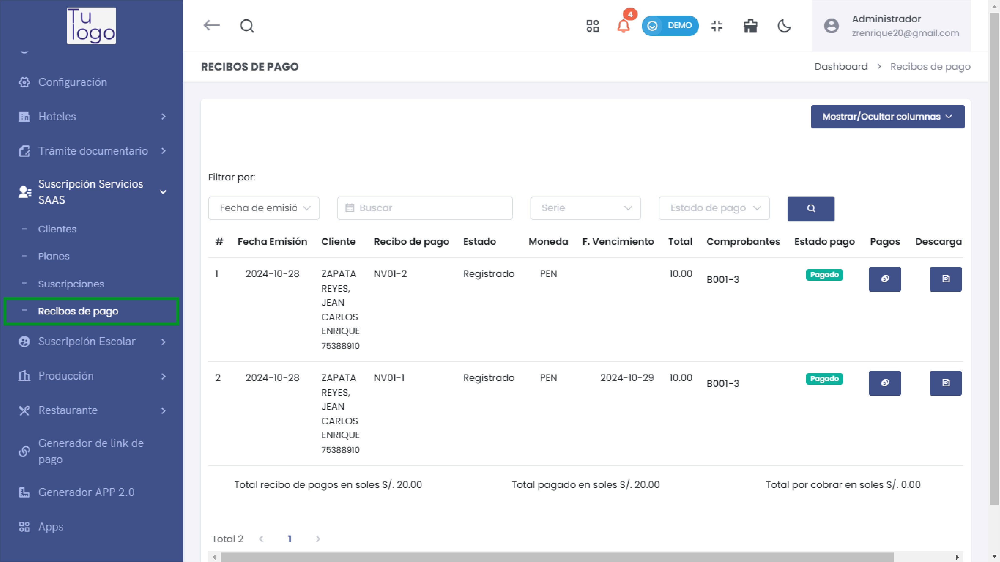
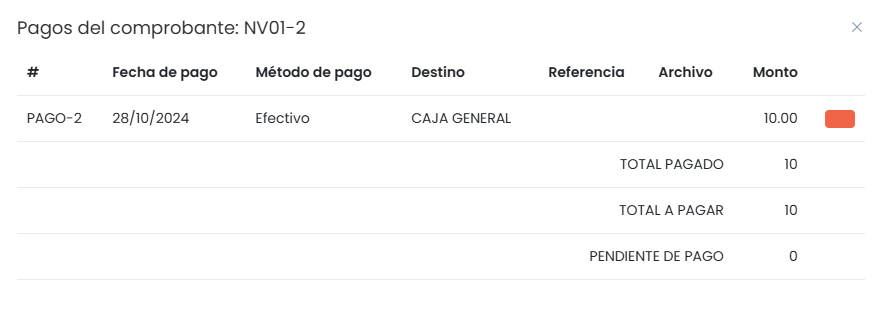

# Recibos de Pago

## Recibos de Pago

El módulo **Recibos de Pago** permite gestionar los pagos realizados por los clientes para diferentes planes y servicios. Para acceder a este módulo:

1. Dirígete al menú lateral y selecciona **Suscripción Servicios SAAS**.
2. Dentro de **Suscripción Servicios SAAS**, selecciona la opción **Recibos de pago**.

Esto te llevará a la lista de recibos de pago registrados en el sistema.

En el listado de **Recibos de Pago** se muestra la siguiente información:
- **Fecha Emisión**: Fecha en que se emitió el recibo.
- **Cliente**: Nombre del cliente que realizó el pago.
- **Recibo de pago**: Código del recibo emitido.
- **Estado**: Estado del recibo (por ejemplo, Registrado).
- **Moneda**: Tipo de moneda en la que se realizó el pago.
- **F. Vencimiento**: Fecha de vencimiento del recibo.
- **Total**: Monto total del pago registrado.
- **Comprobantes**: Número de comprobante asociado.
- **Estado pago**: Estado actual del pago (por ejemplo, Pagado).
- **Pagos**: Información adicional de pagos parciales o totales.
- **Descarga**: Posibilidad de descargar el recibo en PDF u otros formatos.
- **Acciones**: Puedes **Ver** o **Eliminar** el recibo.

### Registro de un Nuevo Recibo de Pago

Para registrar un nuevo recibo de pago, selecciona el botón **Nuevo** en la lista de recibos de pago. Se abrirá un formulario emergente para completar la información necesaria.

En el formulario de **Recibo de Pago Registrada**, debes completar los siguientes campos:
- **Tipo comprobante**: Selecciona el tipo de comprobante (por ejemplo, Boleta de venta electrónica).
- **Serie**: Serie del comprobante.
- **Observaciones**: Campo opcional para ingresar observaciones adicionales.
- **Vendedor**: Nombre del vendedor encargado.
- **Condición de pago**: Condiciones acordadas para el pago (por ejemplo, Contado).
- **Fecha de emisión**: Fecha en la que se emite el comprobante.
- **Fecha de vencimiento**: Fecha límite para el pago.
- **M.Pago**: Método de pago utilizado (por ejemplo, Efectivo).
- **Destino**: Selecciona el destino del pago (por ejemplo, Caja general).
- **Referencia**: Referencia adicional del pago.
- **Monto**: Monto pagado.

Una vez completados los campos, selecciona **Generar** para registrar el recibo de pago.

### Detalles del Comprobante

Después de registrar un recibo de pago, puedes ver los detalles del comprobante relacionado.

En la sección de **Pagos del Comprobante**, se muestra lo siguiente:
- **#**: Número de pago registrado.
- **Fecha de pago**: Fecha en la que se realizó el pago.
- **Método de pago**: Método utilizado para el pago (por ejemplo, Efectivo).
- **Destino**: Lugar al que se destinó el pago (por ejemplo, Caja general).
- **Referencia**: Referencia adicional si aplica.
- **Archivo**: Documento asociado al pago si se ha subido uno.
- **Monto**: Monto pagado.

Además, se muestra un resumen del **Total Pagado**, **Total a Pagar** y **Pendiente de Pago**.

## Consideraciones sobre la Gestión de Recibos de Pago

Es fundamental mantener un registro adecuado y actualizado de los recibos de pago para garantizar una gestión eficiente de los ingresos. Asegúrate de verificar la información antes de generar un nuevo recibo y de actualizar el estado del pago cuando sea necesario.

Verifica siempre la información ingresada para evitar errores en la documentación y la gestión de los pagos realizados por los clientes.

