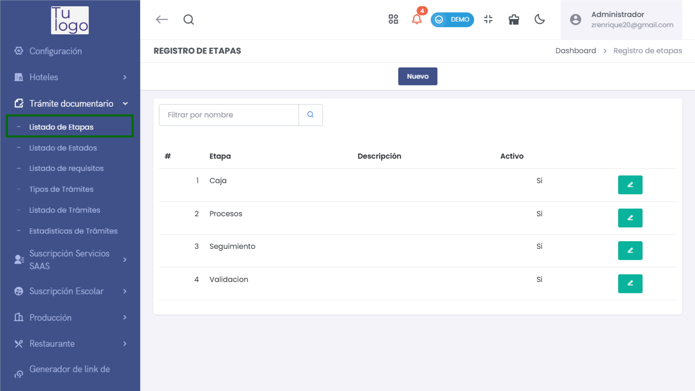
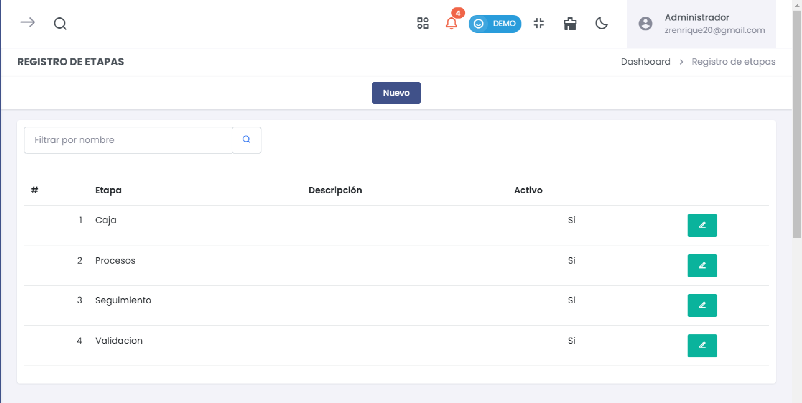
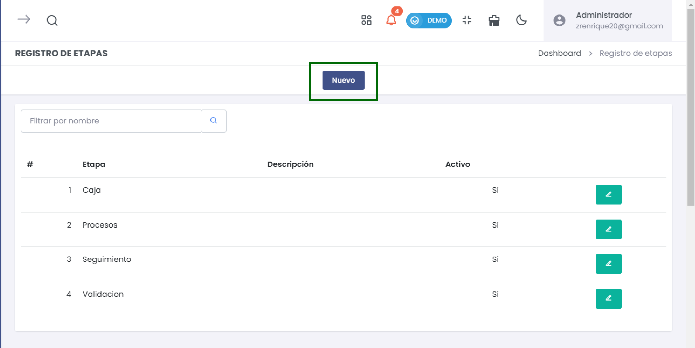
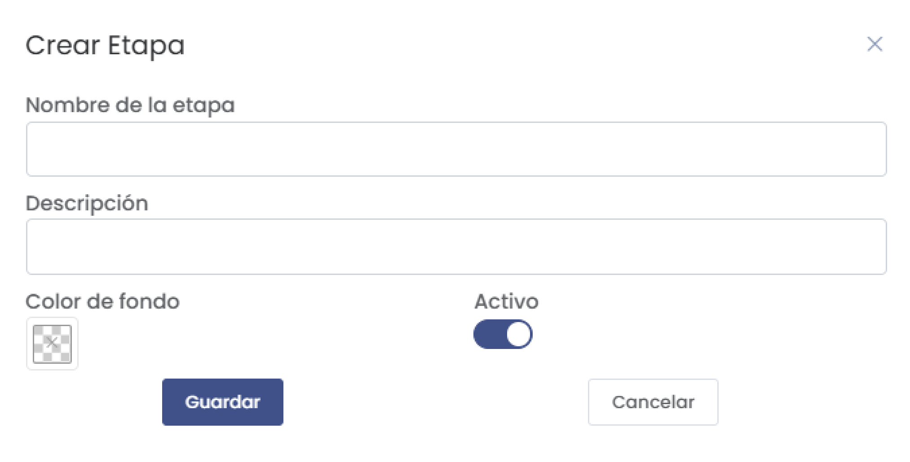

# Etapas  

El submódulo de **Listado Etapas** dentro del módulo **Tramite Documentario**permite gestionar y registrar todas las etapas dentro del sistema. Puedes agregar nuevas etapas, editar información existente y visualizar el registro completo de las mismas.  

  

---  

## 1. Listado de Etapas  

Al acceder a la sección de **Registro de Etapas**, verás un listado con todas las etapas registradas en el sistema.  

  

### Columnas del Listado:  
- **#**: Número de registro.  
- **Etapa**: Nombre de la etapa.  
- **Descripción**: Breve descripción de la etapa.  
- **Activo**: Indicador que muestra si la etapa está activa o no.  
- **Acciones**: Opciones para editar o eliminar la etapa.  

Puedes utilizar el filtro de búsqueda para encontrar etapas específicas por nombre.  

---  

## 2. Agregar Nueva Etapa  

Para agregar una nueva etapa, selecciona el botón **Nuevo** en la parte superior de la pantalla. 

  

Esto abrirá un formulario para ingresar los detalles de la etapa.  

  

### Elementos del Formulario:  
- **Nombre de la etapa**: Introduce el nombre que deseas asignar a la nueva etapa.  
- **Descripción**: Escribe una breve descripción que clarifique el propósito de la etapa.  
- **Color de fondo**: Selecciona un color que represente visualmente la etapa.  
- **Activo**: Utiliza el interruptor para activar o desactivar la etapa.  

##### Botones Disponibles:  
- **Cancelar**: Cierra el formulario sin guardar los cambios.  
- **Guardar**: Al hacer clic, se registrará la nueva etapa en el sistema.  

---  

## 3. Editar Información de una Etapa  

Cada registro en el listado de etapas incluye un botón **Editar** que permite modificar la información de la etapa seleccionada. Al hacer clic en este botón, se abrirá el mismo formulario utilizado para agregar una nueva etapa, pero con los datos prellenados.  
