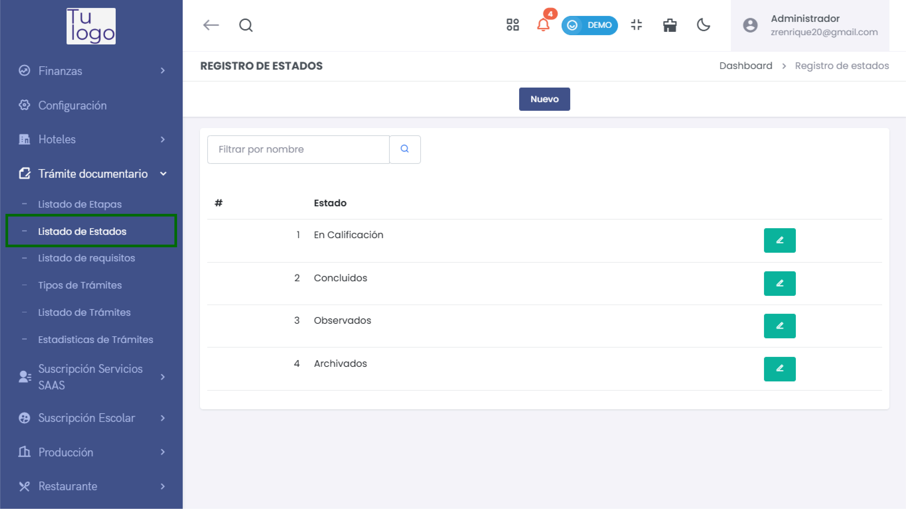
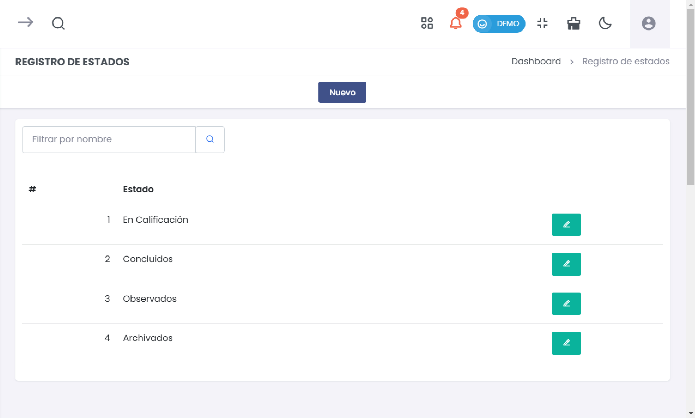
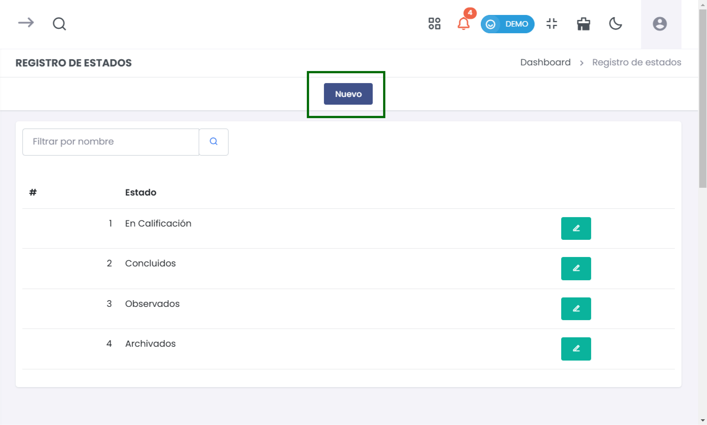
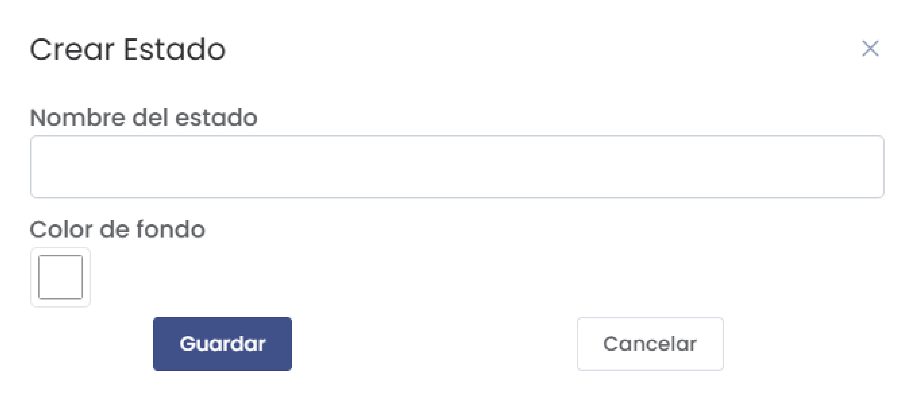

# Listado de Estados  

El módulo de **Listado de Estados** permite gestionar los diferentes estados que pueden tener los trámites documentales. A continuación, se describe cómo acceder a este módulo, ver el listado de estados existentes y crear nuevos estados.  

### 1. Acceder al Módulo  

Para ingresar al **Listado de Estados**, sigue estos pasos:  

1. Desde el menú principal de la aplicación, busca la sección **Trámite Documentario**.  
2. Haz clic en **Listado de Estados**.  

  

### 2. Visualización del Listado de Estados  

Una vez dentro del módulo de **Listado de Estados**, verás una tabla que muestra todos los estados registrados. Algunos de los estados que podrías encontrar son:  

- **En Calificación**  
- **Concluidos**  
- **Observados**  
- **Archivados**  

La tabla incluye las siguientes características:  

- **Filtro de búsqueda**: Puedes usar el campo de búsqueda para filtrar los estados por nombre.  
- **Botón Nuevo**: Permite crear un nuevo estado.  

  

### 3. Crear un Nuevo Estado  

Para añadir un nuevo estado, sigue estos pasos:  

1. Haz clic en el botón **Nuevo** ubicado en la parte superior de la tabla.  

  

2. Se abrirá un formulario titulado **Crear Estado**. Completa los siguientes campos:  

   - **Nombre del estado**: Ingresa el nombre que deseas asignar al nuevo estado.  
   - **Color de fondo**: Elige un color que se utilizará para representar el estado en la interfaz.  

  

3. Después de completar los campos requeridos, haz clic en **Guardar** para registrar el nuevo estado.  

4. Si decides no continuar con la creación, puedes hacer clic en **Cancelar** para cerrar el formulario sin realizar cambios.  

### 4. Edición de Estados  

En la lista de estados, también podrás ver dos íconos de edición (lápiz) junto a cada estado. Estos íconos permiten:  

- **Editar**: Modificar el nombre o color de fondo del estado.  
