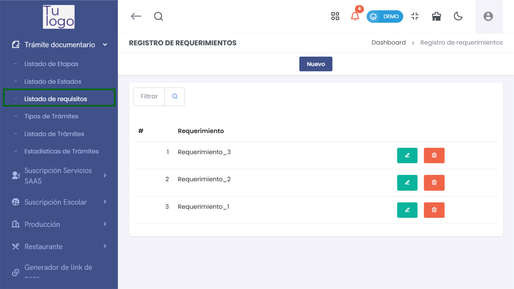
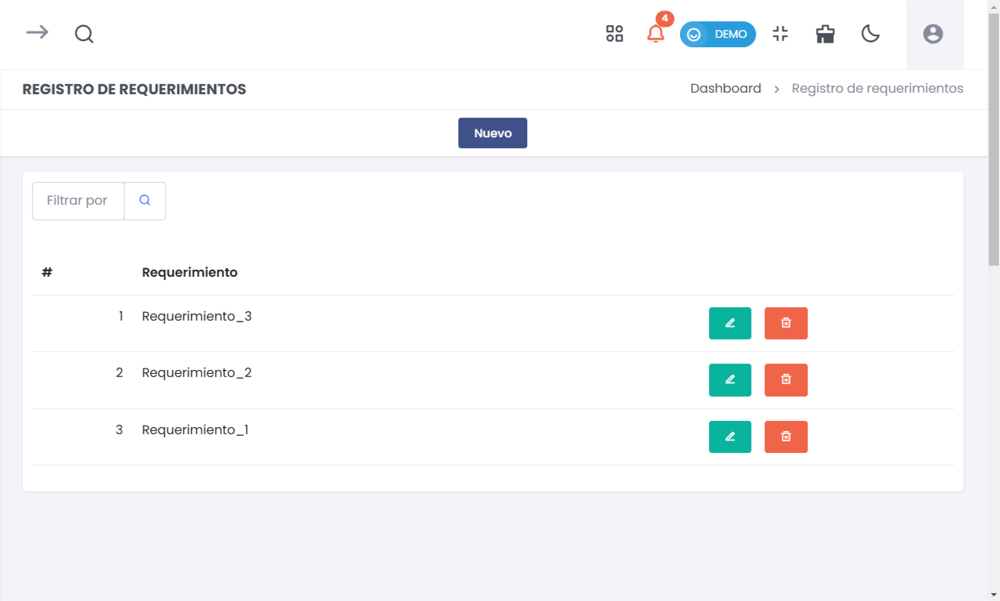
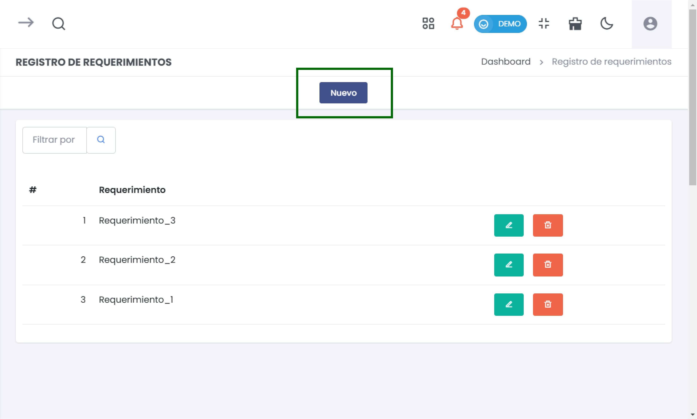
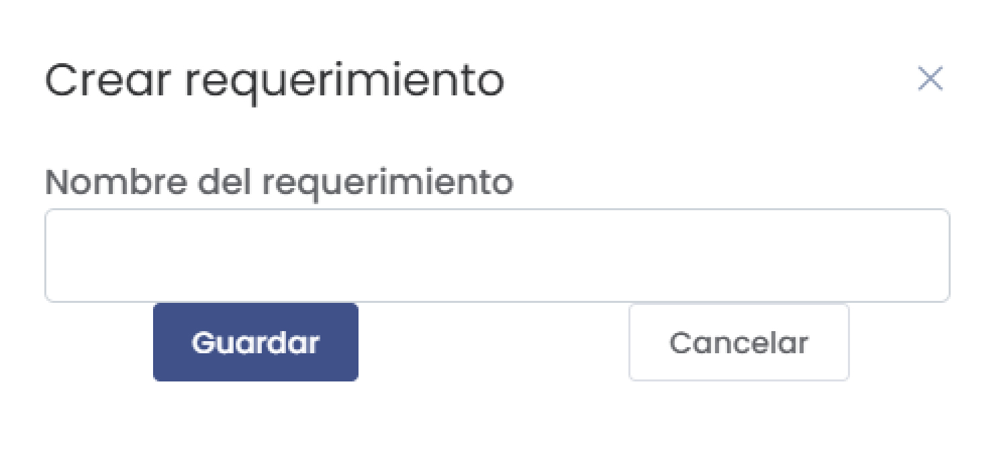
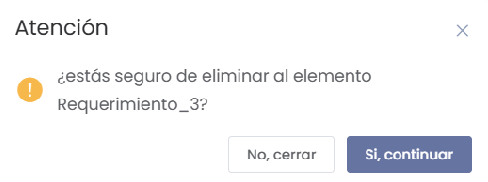

# Registro de Requerimientos  

El módulo de **Registro de Requerimientos** permite gestionar los requisitos necesarios para el trámite documental. A continuación, se describen los pasos para acceder al módulo, crear nuevos requerimientos, visualizar el listado y eliminar requerimientos.  

### 1. Acceder al Módulo  

Para ingresar al **Registro de Requerimientos**, sigue estos pasos:  

1. Desde el menú principal de la aplicación, navega a la sección **Trámite Documentario**.  
2. Selecciona **Listado de Requisitos**.  

  

### 2. Visualización del Listado de Requerimientos  

En el módulo de **Registro de Requerimientos**, verás una tabla que muestra todos los requerimientos registrados. Aquí podrás ver los nombres de cada requerimiento y sus acciones disponibles.  

  

#### Características de la Tabla:  

- **Filtro de búsqueda**: Utiliza el campo de búsqueda para encontrar requerimientos específicos.  
- **Botón Nuevo**: Permite crear un nuevo requerimiento.  

### 3. Crear un Nuevo Requerimiento  

Para añadir un nuevo requerimiento, sigue estos pasos:  

1. Haz clic en el botón **Nuevo** ubicado en la parte superior de la tabla.  

  

2. Se abrirá un formulario llamado **Crear Requerimiento**. Completa el campo necesario:  

   - **Nombre del requerimiento**: Introduce un nombre descriptivo para el nuevo requerimiento.  

  

3. Haz clic en **Guardar** para registrar el nuevo requerimiento, o selecciona **Cancelar** para cerrar el formulario sin guardar.  

### 4. Edición y Eliminación de Requerimientos  

Al lado de cada requerimiento en la lista, verás dos íconos de acción:  

- **Editar (lápiz)**: Permite modificar el nombre del requerimiento existente.  
- **Eliminar (papelera)**: Permite eliminar el requerimiento. Cuando seleccionas esta opción, se abrirá una ventana de confirmación.  

  

#### Confirmación de Eliminación  

En la ventana de confirmación, se mostrará un mensaje indicando si estás seguro de eliminar el requerimiento. Para proceder, haz clic en **Sí, continuar**. Si decides no eliminarlo, selecciona **No, cerrar**.  

