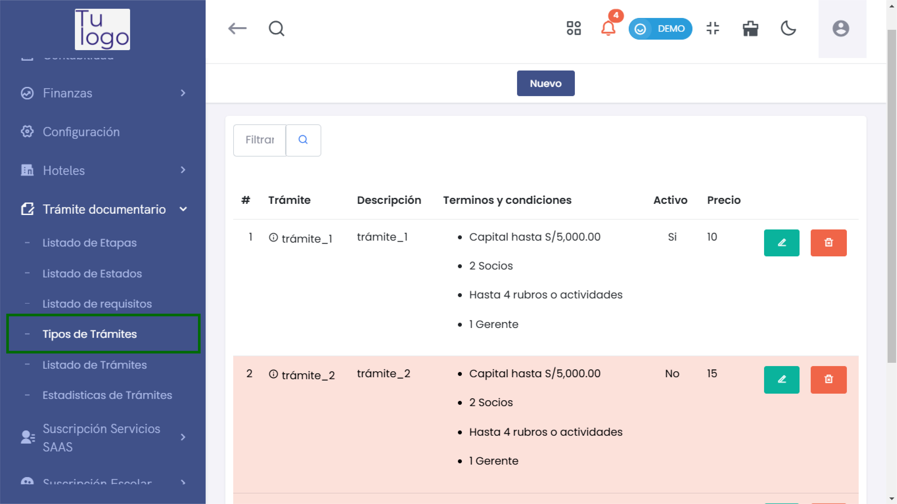
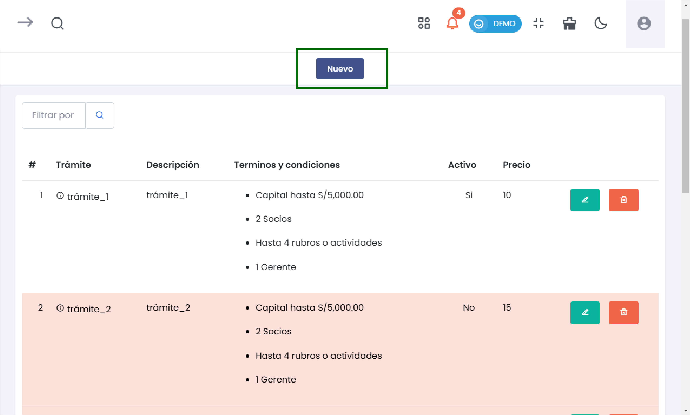
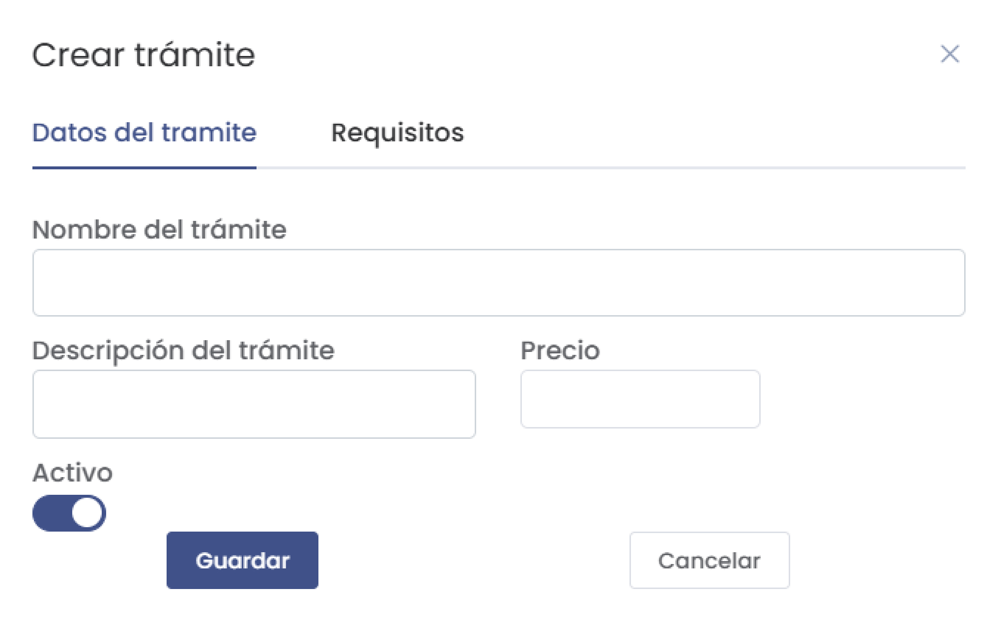
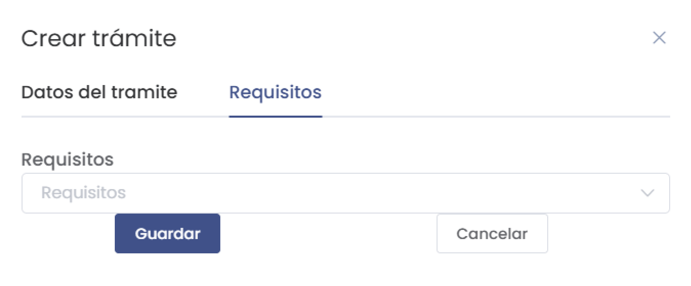
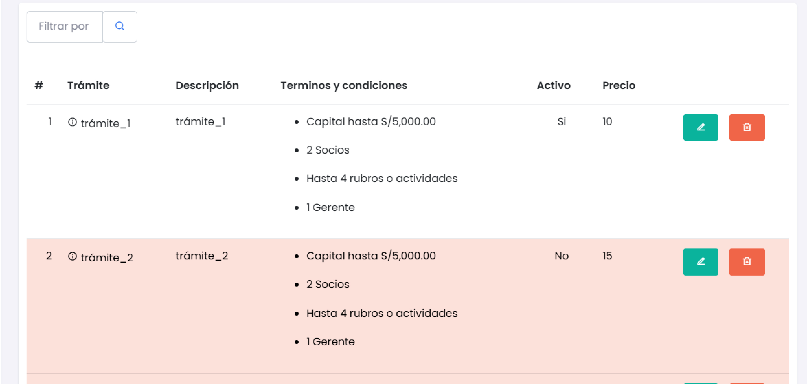
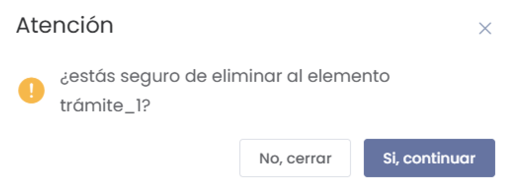

# Tipos de Trámites  

En esta sección, los usuarios pueden gestionar los diferentes tipos de trámites documentales. A continuación, se presentan las instrucciones para crear nuevos trámites, así como información importante usando las imágenes proporcionadas.  

### 1. Acceder al Módulo de Tipos de Trámites  

Para ingresar al módulo de **Tipos de Trámites**, sigue estos pasos:  

1. Desde el menú principal, selecciona **Trámite Documentario**.  
2. Luego, haz clic en **Tipos de Trámites**.  

  

### 2. Crear un Nuevo Trámite  

1. Una vez en el listado de trámites, haz clic en el botón **Nuevo**.  

  

2. Se abrirá un formulario titulado **Crear Trámite** donde debes completar la siguiente información:  

   - **Nombre del trámite**: Ingresa un nombre descriptivo.  
   - **Descripción del trámite**: Proporciona detalles sobre el trámite.  
   - **Precio**: Indica el costo asociado al trámite.  
   - **Activo**: Activa o desactiva el trámite usando el toggle.  

  

  Por ultimo tendra que seleccionar un requerimiento.

   

3. Haz clic en **Guardar** para añadir el nuevo trámite al sistema.  

### 3. Visualización del Listado de Trámites  

En el listado de trámites, podrás ver la información de cada trámite registrado. Los registros inactivos aparecerán en **rojo** para destacarse visualmente.  

  

#### Características del Listado:  

- **Descripción**: Información sobre el trámite.  
- **Estado Activo/Inactivo**: Indica si el trámite está activo o no. Los inactivos son resaltados en rojo.  
- **Acciones**: Puedes editar o eliminar trámites utilizando los íconos correspondientes.  

### 4. Confirmación de Eliminación  

Si decides eliminar un trámite, aparecerá una ventana de confirmación:  

  

En esta ventana, se te preguntará si estás seguro de eliminar el trámite. Puedes elegir entre:  

- **Sí, continuar**: Para confirmar la eliminación.  
- **No, cerrar**: Para cancelar el proceso.  

