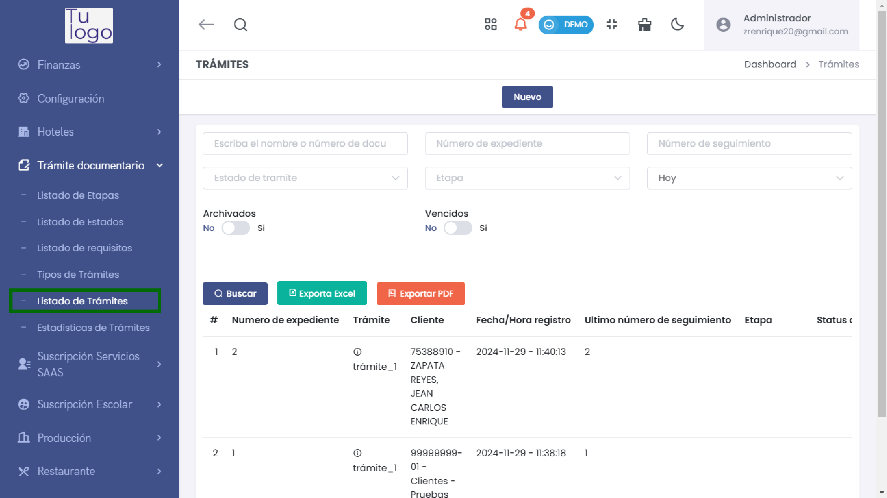
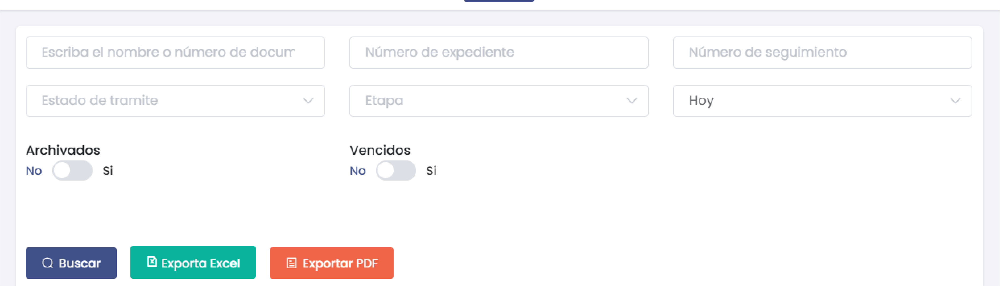
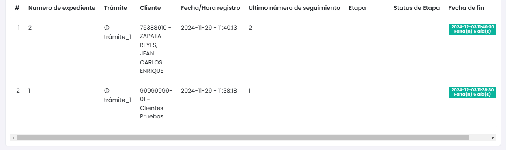
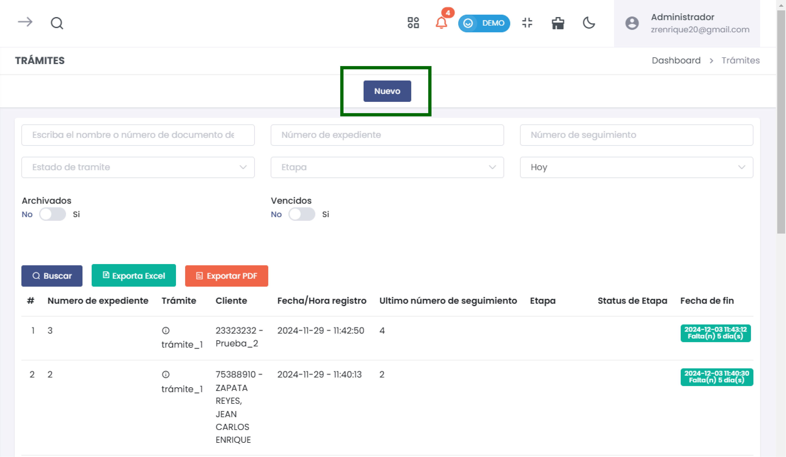
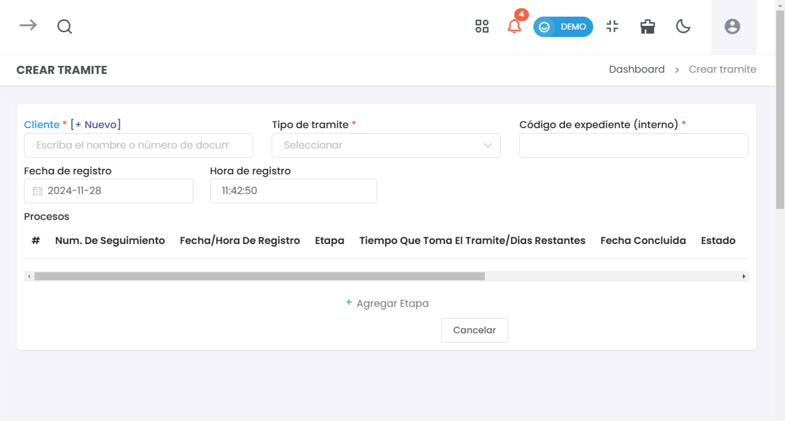
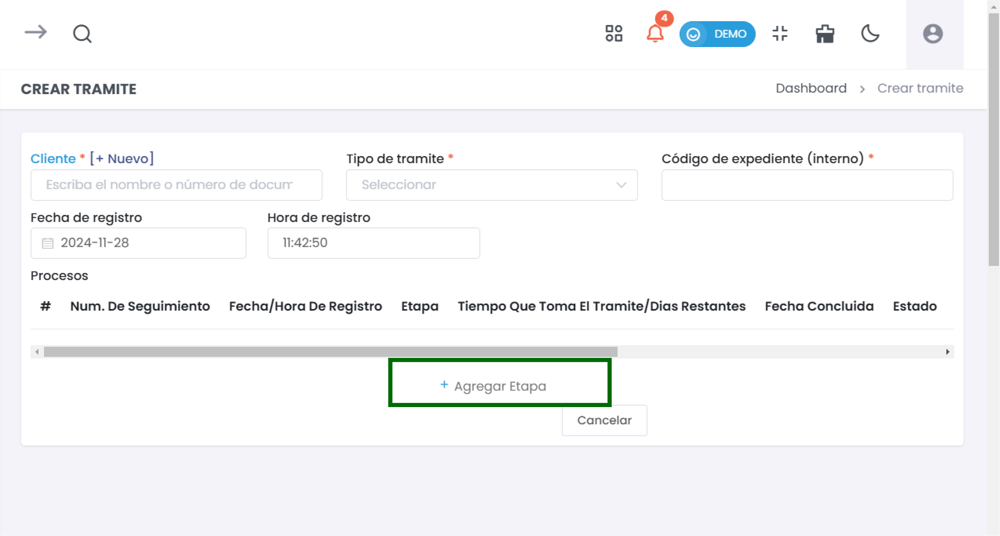
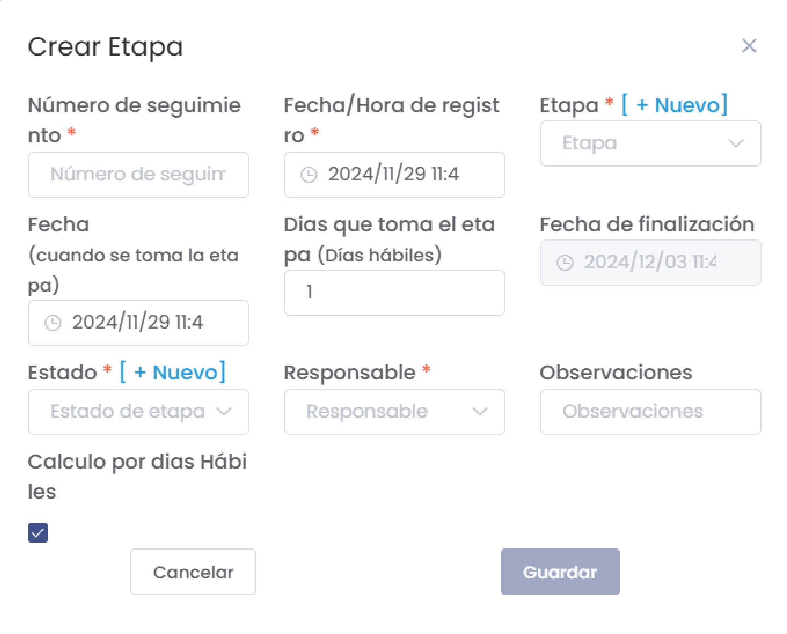

# Listado de Trámites  

La sección de **Listado de Trámites** permite gestionar y visualizar todos los trámites documentales registrados en el sistema. A continuación se explican las funcionalidades disponibles y los pasos para buscar, agregar y administrar trámites.  

### 1. Acceso al Módulo  

Para acceder al **Listado de Trámites**:  

1. Desde el menú principal, dirígete a **Trámite Documentario**.  
2. Selecciona **Listado de Trámites**.  

  

### 2. Búsqueda de Trámites  

En la parte superior de la página, encontrarás varios campos que te permitirán filtrar la búsqueda de trámites:  

- **Escriba el nombre o número de documento**: Busca trámites por el nombre del cliente o el número de documento.  
- **Número de expediente**: Filtra por el número de expediente asociado.  
- **Estado de trámite**: Selecciona el estado del trámite para filtrar (Activo, Inactivo, etc.).  
- **Etapa**: Especifica la etapa actual del trámite.  
- **Número de seguimiento**: Introduce el número de seguimiento si es necesario.  
- **Fecha**: Selecciona la fecha para filtrar trámites registrados en un día específico.  

A continuación, puedes decidir si deseas incluir trámites **Archivados** o **Vencidos** utilizando los interruptores correspondientes.  

  

### 3. Visualización de Resultados  

Después de realizar una búsqueda, aparecerá un listado que muestra los trámites que cumplen con los criterios establecidos. En la tabla podrás ver las siguientes columnas:  

- **Número de expediente**: Identificación única del trámite.  
- **Trámite**: Nombre del trámite.  
- **Cliente**: Nombre del cliente asociado al trámite.  
- **Fecha/Hora registro**: Fecha y hora en que se registró el trámite.  
- **Último número de seguimiento**: Número de seguimiento más reciente.  
- **Etapa**: Etapa actual del trámite.  
- **Estado de etapa**: Muestra el estado de la etapa actual y la fecha de finalización.  
  

  

### 4. Agregar un Nuevo Trámite  

Para crear un nuevo trámite:  

1. Haz clic en el botón **Nuevo**.  

  

2. Se abrirá un formulario que te solicitará información sobre el trámite, como:  

   - **Cliente**: Selecciona un cliente existente o crea uno nuevo.  
   - **Tipo de trámite**: Selecciona el tipo de trámite asociado.  
   - **Código de expediente**: Ingresa un código de expediente interno.  
   - **Fecha y hora de registro**: La fecha y la hora en que se está creando el trámite.  

  

3. Completa todos los campos necesarios y haz clic en **Guardar**.  

### 5. Crear Nueva Etapa  

Si necesitas agregar una nueva etapa dentro de un trámite existente, selecciona el trámite y haz clic en **Agregar Etapa**.  

  

Completa el formulario para **Crear Etapa** que incluye:  

- **Número de seguimiento**  
- **Fecha de registro**  
- **Días que toma la etapa**  
- **Estado**  
- **Responsable**  
- **Observaciones**  

  

Haz clic en **Guardar** para registrar la nueva etapa.  

