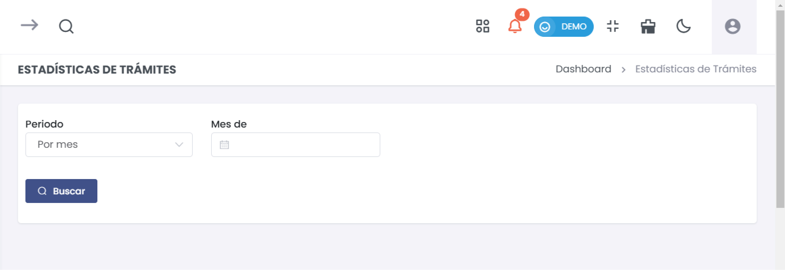

# Estadísticas de Trámites  

La sección de **Estadísticas de Trámites** proporciona un resumen detallado de los trámites documentales en un período específico. A continuación, se detalla cómo acceder a esta funcionalidad, realizar búsquedas y leer los resultados.  

### 1. Acceso al Módulo  

Para acceder a **Estadísticas de Trámites**:  

1. Desde el menú principal, selecciona **Trámite Documentario**.  
2. Luego, elige **Estadísticas de Trámites**.  

  

### 2. Configuración de Búsqueda  

En la parte superior de la página, encontrarás los siguientes campos para configurar tu búsqueda:  

- **Período**: Selecciona el marco temporal para tus estadísticas. Puedes optar por "Por mes", "Por trimestre", etc.  
- **Mes de**: Ingresa el mes y año de interés. Este campo es crucial para filtrar los trámites por el periodo deseado.  

  

### 3. Realizar la Búsqueda  

Después de configurar los filtros:  

1. Haz clic en el botón **Buscar**.  

  

Esto generará las estadísticas correspondientes al período y mes seleccionados.  

### 4. Resultados de la Búsqueda  

Una vez realizada la búsqueda, los resultados se mostrarán en la parte inferior de la pantalla. Los resultados incluirán:  

- **Total de Trámites**: Número total de trámites registrados en el mes.  
- **Completados**: Número de trámites que se han completado en el mismo mes.  
- **En Proceso**: Número de trámites que aún están en curso.  
- **Porcentaje tramitado**: El porcentaje de trámites completados respecto al total.  

Por ejemplo:  

  

### 5. Exportar Estadísticas  

Si deseas guardar un registro de las estadísticas generadas, puedes exportarlas en formato PDF. Para ello, haz clic en el botón **Exportar PDF** que se encuentra al lado del botón de buscar.  

