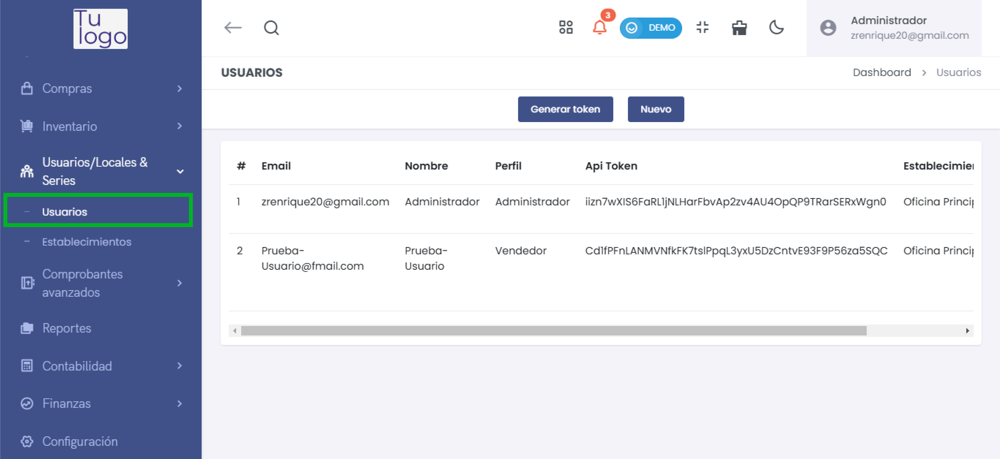
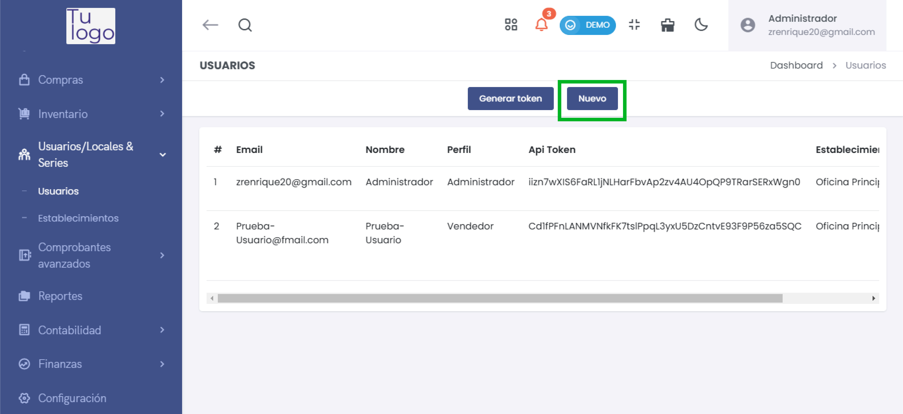
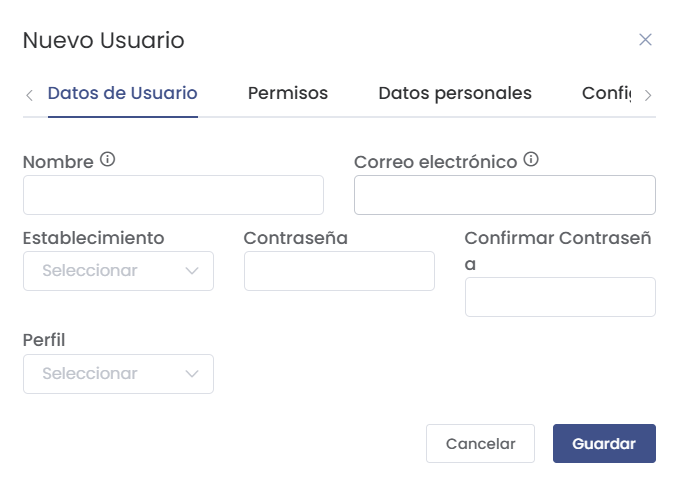
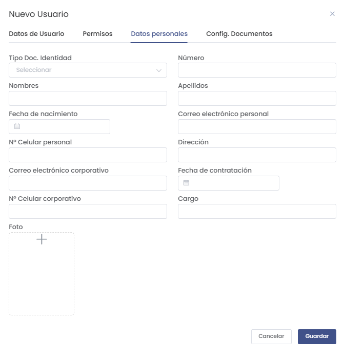
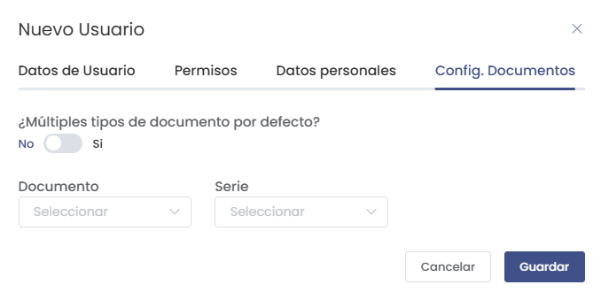
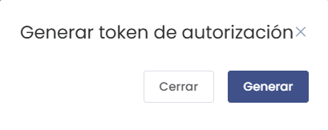

# Gestión de Usuarios

En esta sección aprenderás a administrar las cuentas de los usuarios, configurar permisos, generar tokens de autenticación y asociar perfiles específicos a establecimientos.

---

## Acceso a la Gestión de Usuarios

1. **Ubicación en el Menú**:
   - Navega a **Usuarios/Locales & Series** > **Usuarios** desde el menú lateral.

   

---

## Opciones en la Vista de Usuarios

- **Email**: Dirección de correo del usuario.
- **Nombre**: Nombre del usuario registrado.
- **Perfil**: Rol asignado al usuario (Ej.: Administrador, Vendedor).
- **API Token**: Token único para integraciones API.
- **Establecimiento**: Sede asignada al usuario.

Cada usuario tiene opciones adicionales:
- **Editar**: Permite modificar los datos del usuario.
- **Eliminar**: Borra el usuario del sistema.

---

## Crear Nuevo Usuario

1. **Haz clic en "Nuevo"** en la parte superior de la pantalla para añadir un nuevo usuario.

   

2. **Datos del Usuario**:
   - Completa los campos:
     - **Nombre**: Nombre completo del usuario.
     - **Correo electrónico**: Email del usuario.
     - **Contraseña**: Establece una contraseña segura.
     - **Perfil**: Selecciona el perfil (Ej.: Administrador, Vendedor).
     - **Establecimiento**: Asocia al usuario con una sede específica.

   

3. **Permisos**:
   - Configura los permisos específicos según el rol. 
   - Puedes definir qué acciones podrá realizar cada usuario.

4. **Datos Personales**:
   - Información adicional:
     - **Tipo de documento** y **Número**.
     - **Fecha de nacimiento** y **Dirección**.
     - **Teléfonos personales y corporativos**.
     - **Correo electrónico personal y corporativo**.
     - **Fecha de contratación** y **Cargo**.
     - **Foto**: Puedes añadir una imagen del usuario.

   

5. **Configuración de Documentos**:
   - Define si el usuario gestionará múltiples tipos de documentos por defecto.
   - Selecciona las series disponibles para este usuario.

   

6. **Guardar los Datos**:
   - Haz clic en **Guardar** para finalizar la creación del usuario.

---

## Generar Token de Autorización

1. En la lista de usuarios, selecciona el usuario deseado.
2. **Haz clic en "Generar Token"**.

   

3. Confirma la generación del token. Este se utilizará para autenticación en integraciones API.

---

## Editar y Eliminar Usuarios

- **Editar**:
  - Permite modificar cualquier información del usuario desde el formulario de edición.

- **Eliminar**:
  - Borra el usuario del sistema. Esta opción debe usarse con cuidado, ya que los datos se eliminarán permanentemente.

---

## Configuración Adicional

- **Perfiles**: 
  - Define los roles de cada usuario para controlar qué pueden hacer dentro del sistema.

- **Establecimientos**: 
  - Asocia cada usuario a una sede específica para garantizar que solo accedan a los datos correspondientes.

---

## Conclusión

La sección de gestión de usuarios facilita la administración centralizada de las cuentas de usuario y sus permisos. Con estos pasos podrás:

- **Crear y configurar usuarios fácilmente.**
- **Asignar roles y permisos específicos según el perfil del usuario.**
- **Generar tokens de autorización** para integrar con otros sistemas.
- **Gestionar el acceso a establecimientos específicos** para garantizar una gestión segura y organizada.

Esta guía cubre cada aspecto necesario para gestionar usuarios de forma eficiente en tu plataforma.
