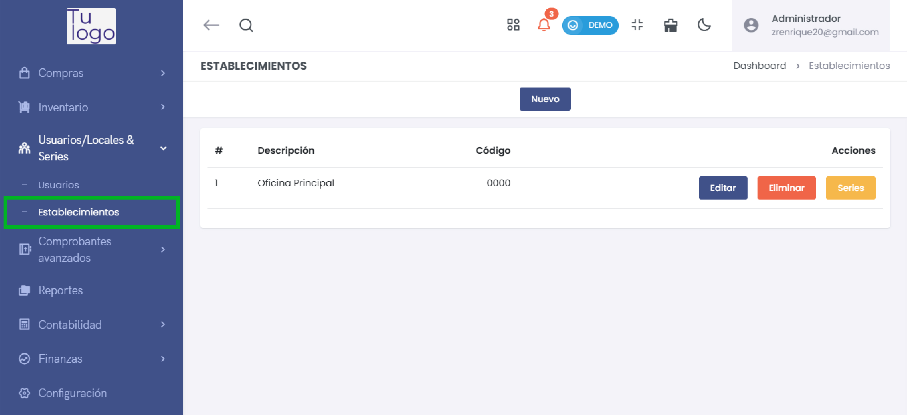
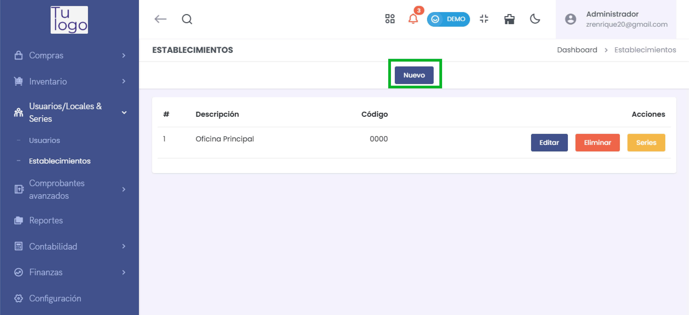
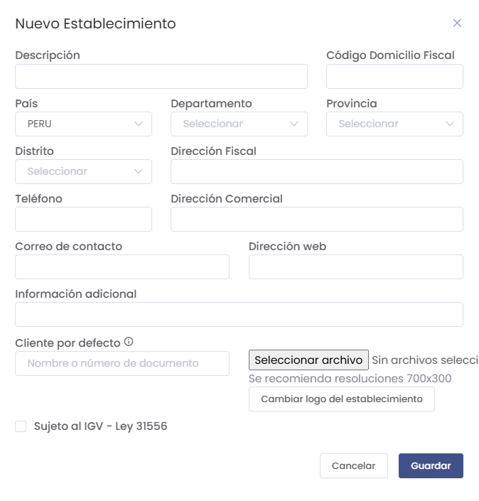
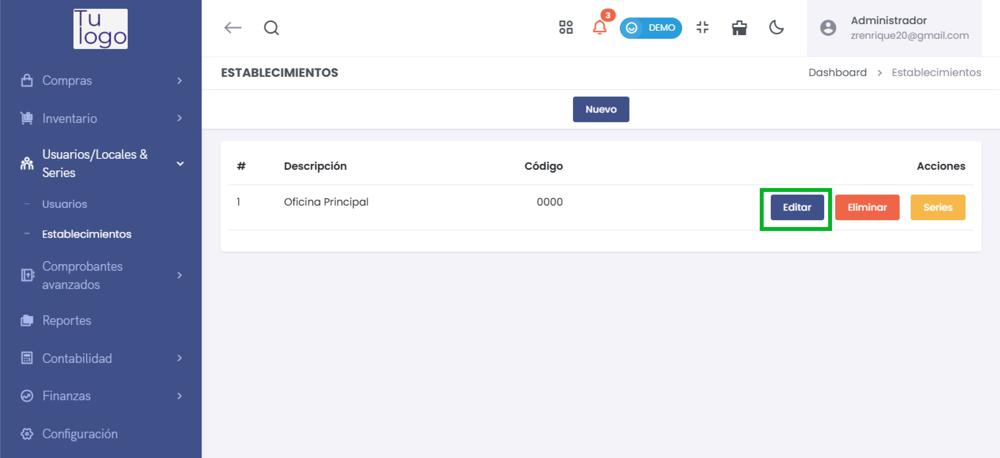
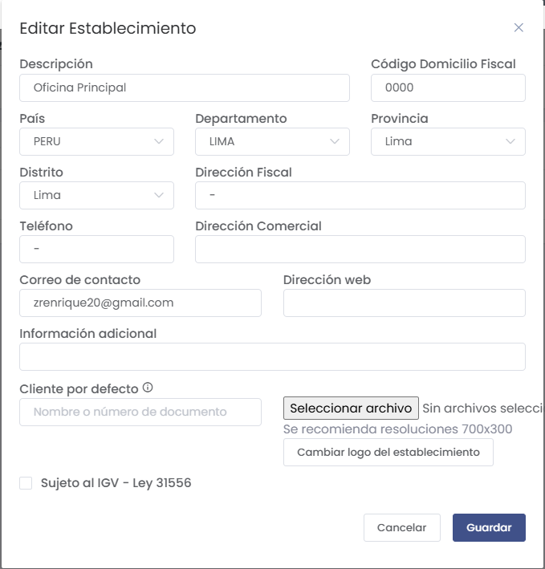
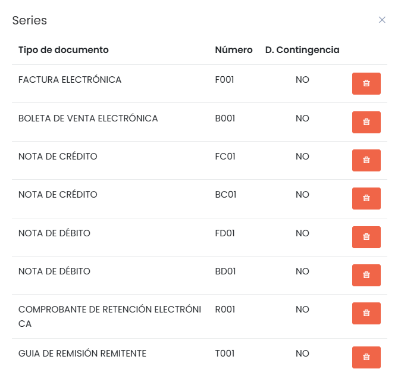
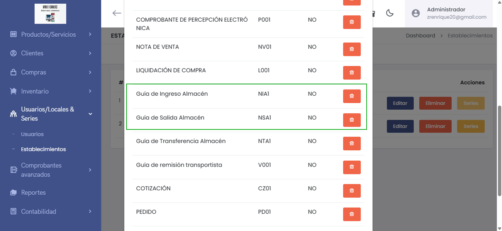

# Establecimientos

En esta sección se explican los pasos para gestionar los **Establecimientos** dentro del sistema, detallando cómo crear, editar, eliminar y administrar las series de documentos asociadas.

---

## Acceso a Establecimientos

1. **Ubicación en el menú**:
   - Navega a **Usuarios/Locales & Series** > **Establecimientos**.

---

## Opciones Disponibles

### 1. Listado de Establecimientos
En esta pantalla se muestran los establecimientos registrados junto con su **descripción** y **código**.

- **Editar**: Permite modificar los datos del establecimiento.
- **Eliminar**: Elimina el establecimiento del sistema.
- **Series**: Muestra y administra las series de documentos asociadas al establecimiento.

---

## Crear un Nuevo Establecimiento

1. **Haz clic en "Nuevo"** en la pantalla principal.

2. **Completa los campos requeridos**:

- **Descripción**: Nombre del establecimiento.
- **Código Domicilio Fiscal**: Código único para identificar el domicilio fiscal.
- **País, Departamento, Provincia y Distrito**: Datos de ubicación geográfica.
- **Dirección Fiscal y Comercial**: Ingresar las direcciones correspondientes.
- **Teléfono**: Número de contacto.
- **Correo de contacto**: Email del establecimiento.
- **Cliente por defecto**: Puedes seleccionar un cliente predeterminado para el establecimiento.
- **Logo del establecimiento**: Sube un archivo con el logotipo, se recomienda una resolución de **700x300**.
- **Sujeto al IGV (Ley 31556)**: Marca esta opción si aplica IGV.

3. **Guardar**: Presiona el botón **Guardar** para registrar el establecimiento.

---

## Editar un Establecimiento

1. **Haz clic en "Editar"** en la lista de establecimientos.

2. **Modifica los datos necesarios** y presiona **Guardar** para aplicar los cambios.

---

## Administrar Series de Documentos

1. **Haz clic en "Series"** en la lista de establecimientos.

2. **Agregar o eliminar series** según sea necesario. Las series disponibles incluyen:
   - **Factura Electrónica (F001)**
   - **Boleta de Venta Electrónica (B001)**
   - **Nota de Crédito (FC01 / BC01)**
   - **Nota de Débito (FD01 / BD01)**
   - **Guía de Remisión Remitente (T001)**
   - **Comprobante de Retención Electrónica (R001)**

Cada serie puede ser eliminada haciendo clic en el icono de **basura** correspondiente.

:::danger IMPORTANTE:
IMPORTANTE: Es Importante agregar lkas series de entrada y salida.

:::

---

## Observaciones Importantes

- **Validación de datos**: Asegúrate de ingresar correctamente los campos requeridos para evitar errores al guardar.
- **Asociación correcta**: Es importante que cada establecimiento tenga series asignadas según las necesidades operativas.
- **Logo**: El sistema sugiere un tamaño específico para el logotipo con el fin de mantener una presentación uniforme.

---

## Conclusión

La sección de **Establecimientos** es fundamental para organizar las operaciones de la empresa en diferentes ubicaciones. Permite:

- **Registrar datos clave** de cada establecimiento.
- **Administrar las series de documentos** para cada local.
- **Asignar clientes por defecto y gestionar logos** específicos.

Con esta guía podrás gestionar de manera efectiva los establecimientos y su documentación dentro del sistema.
