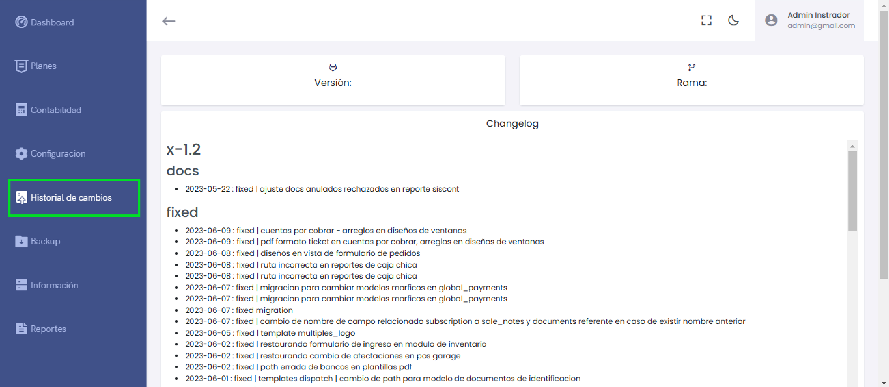

# Historial de Cambios 

Esta sección muestra los cambios, correcciones y mejoras implementadas en cada versión del sistema, proporcionando un registro detallado para seguimiento.

---

## Versión: x-1.2  
**Fecha:** 2023-05-22  
### docs
- **fixed:** Ajuste de documentos anulados y rechazados en reporte Siscont.

---

### Cambios Fixed

#### 2023-06-09
- **fixed:** Cuentas por cobrar – Arreglos en diseños de ventanas.
- **fixed:** PDF formato ticket en cuentas por cobrar, arreglos en diseños de ventanas.

#### 2023-06-08
- **fixed:** Diseños en vista de formulario de pedidos.
- **fixed:** Ruta incorrecta en reportes de caja chica.

#### 2023-06-07
- **fixed:** Migración para cambiar modelos mórficos en `global_payments`.
- **fixed:** Cambio de nombre de campo relacionado con `sale_notes` y documentos referentes.
- **fixed:** Restaurando formulario de ingreso en módulo de inventario.
- **fixed:** Migración de afectaciones en `pos garage`.

#### 2023-06-05
- **fixed:** Restaurando comando de afectaciones en `pos garage`.
- **fixed:** Templates dispatch y ajuste de path para modelo de documentos de identificación.

---

## Uso del Historial de Cambios

El historial de cambios proporciona:
1. **Transparencia:** Muestra las mejoras y arreglos aplicados en cada actualización.
2. **Seguimiento:** Facilita a los administradores la comprensión de las correcciones aplicadas.
3. **Diagnóstico:** Ayuda a identificar rápidamente si se ha solucionado un problema específico.

### Recomendaciones:
- Revisa el changelog regularmente para estar al tanto de nuevas actualizaciones.
- Si algún problema persiste, verifica en la sección correspondiente si ya ha sido tratado.

---

**Nota:** Esta funcionalidad es útil para los equipos técnicos y de soporte, permitiendo una gestión eficiente de los cambios realizados en el sistema.
