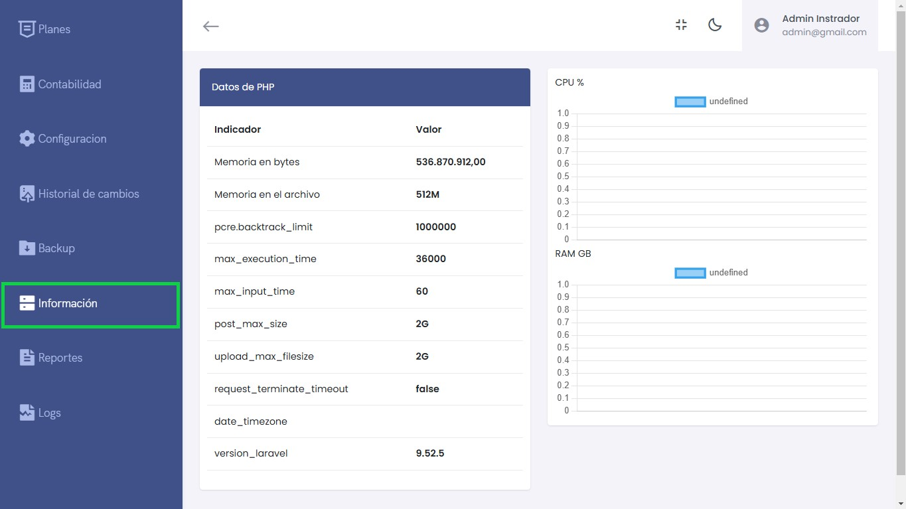

# Información del Sistema

Esta sección proporciona una visión detallada de los parámetros clave del entorno de PHP y del rendimiento del servidor en tiempo real, permitiendo a los administradores supervisar y gestionar de manera eficiente los recursos del sistema.

---

## Indicadores del Entorno PHP

| **Indicador**                | **Valor**           |
|------------------------------|---------------------|
| Memoria en bytes             | 536.870.912,00      |
| Memoria en el archivo        | 512M                |
| pcre.backtrack_limit         | 1000000             |
| max_execution_time           | 36000               |
| max_input_time               | 60                  |
| post_max_size                | 2G                  |
| upload_max_filesize          | 2G                  |
| request_terminate_timeout   | false               |
| date_timezone                | (definido por PHP)  |
| version_laravel              | 9.52.5              |

---

## Monitor de Recursos del Servidor

- **CPU %:** Visualiza en tiempo real el uso de CPU.
- **RAM GB:** Monitorea el uso de memoria RAM del sistema.  
  **Nota:** En la imagen, el estado del monitoreo aparece como `undefined`. Verifica la configuración del monitor para asegurar que los datos se registren correctamente.

---

## Uso y Supervisión

1. **Verificación de Parámetros PHP:**  
   Estos valores permiten identificar las configuraciones predeterminadas del entorno PHP, como límites de memoria y tiempos de ejecución, útiles para optimizar aplicaciones basadas en Laravel.

2. **Monitorización del Sistema:**  
   La visualización del uso de CPU y memoria RAM permite una supervisión en tiempo real, asegurando que el sistema funcione dentro de parámetros seguros y eficientes.

---

## Recomendaciones

- **Ajustes del Sistema:**  
  Si los valores de memoria o tiempos de ejecución no son suficientes para la aplicación, realiza ajustes en los archivos de configuración de PHP (`php.ini`).

- **Supervisión Constante:**  
  Asegúrate de que los gráficos de CPU y RAM estén configurados correctamente para registrar el uso del sistema en tiempo real.

---

Esta sección permite una gestión eficiente del entorno de ejecución, garantizando que los recursos estén optimizados para las aplicaciones que corren en el servidor.
