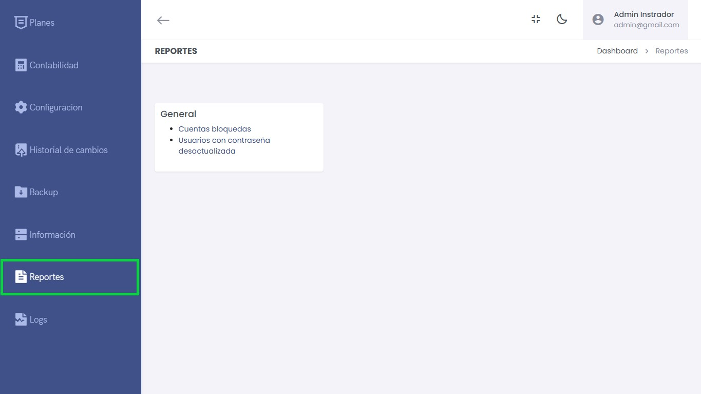
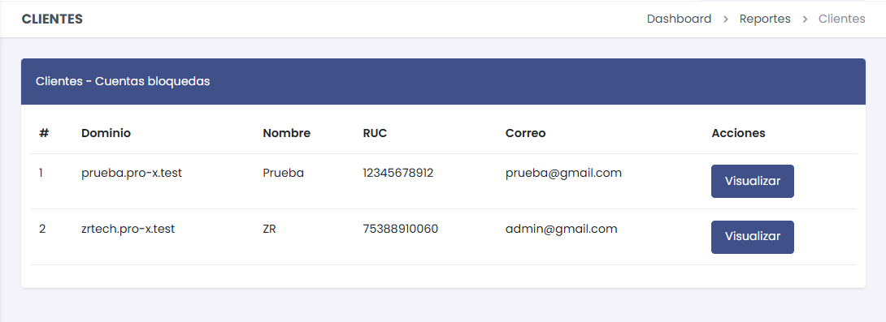
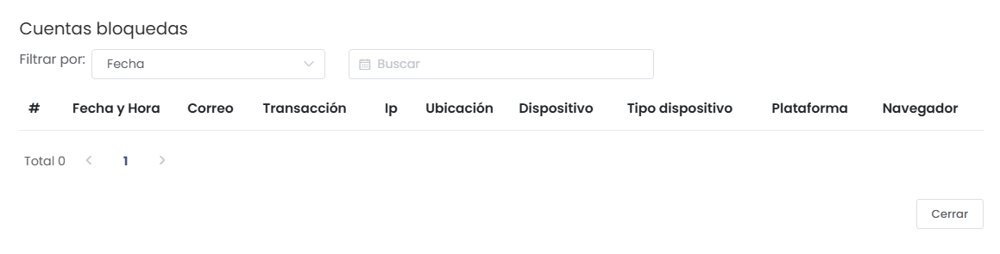
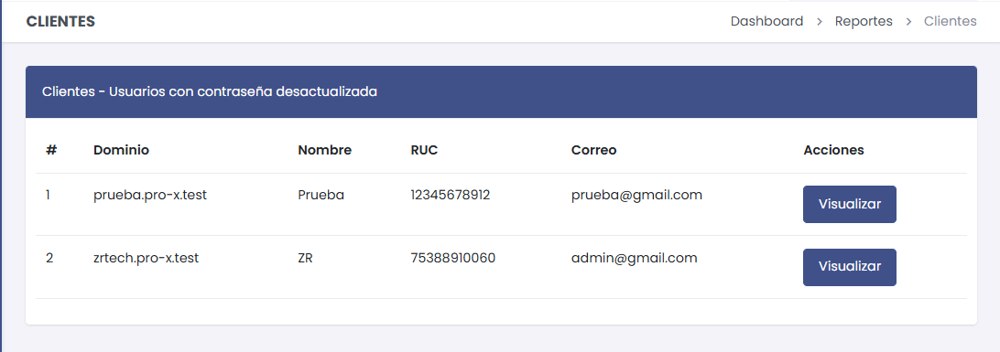
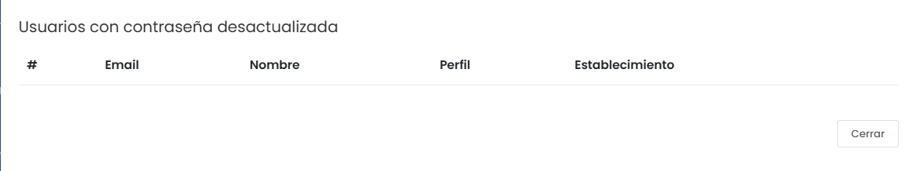

# Reportes

En la sección de **Reportes** se muestra un conjunto de informes clave relacionados con las cuentas y los usuarios del sistema, permitiendo un seguimiento detallado de estados críticos como cuentas bloqueadas o contraseñas desactualizadas.

## General

### Opciones Generales:
- **Cuentas Bloqueadas:** Reporte que muestra las cuentas que han sido bloqueadas.
- **Usuarios con Contraseña Desactualizada:** Muestra los usuarios cuyo acceso requiere la actualización de sus credenciales.

---

## Cuentas Bloqueadas

Este reporte muestra los clientes con cuentas bloqueadas, junto con detalles relevantes como:
- **Dominio:** URL del cliente.
- **Nombre:** Razón social de la empresa.
- **RUC:** Número de identificación tributaria.
- **Correo:** Dirección de correo asociada al cliente.

### Filtrar Cuentas Bloqueadas

Este panel permite filtrar las cuentas bloqueadas por diferentes criterios:
- **Fecha y Hora:** Ordena los eventos según su registro cronológico.
- **Correo:** Filtra por correo del usuario.
- **Transacción:** Registra las transacciones relevantes.
- **IP y Ubicación:** Muestra la dirección IP y la ubicación del dispositivo.
- **Dispositivo:** Indica el tipo y plataforma del dispositivo utilizado.
- **Navegador:** Especifica el navegador utilizado para acceder al sistema.

---

## Usuarios con Contraseña Desactualizada

Este reporte muestra los usuarios cuyo acceso al sistema requiere la actualización de su contraseña. 
- **Dominio:** Dirección del cliente en el sistema.
- **Nombre:** Razón social del cliente.
- **RUC:** Identificación fiscal del cliente.
- **Correo:** Correo del usuario.
  
### Visualización Detallada de Usuarios

El reporte también permite una vista más detallada de los usuarios con los siguientes campos:
- **Email:** Dirección de correo del usuario.
- **Nombre:** Nombre completo del usuario.
- **Perfil:** Rol o perfil asignado dentro del sistema.
- **Establecimiento:** Identificación del establecimiento al que pertenece el usuario.

---

## Funcionalidades Adicionales

- **Visualizar:** Cada entrada en los reportes tiene un botón de **Visualizar**, que permite acceder a detalles específicos de la cuenta o usuario correspondiente.

---

## Recomendaciones

- **Cuentas Bloqueadas:** Se recomienda revisar periódicamente las cuentas bloqueadas para identificar posibles accesos indebidos o problemas de autenticación.
- **Contraseñas Desactualizadas:** Mantener las contraseñas actualizadas garantiza la seguridad del sistema y evita accesos no autorizados.

---

Este sistema de reportes permite una gestión eficiente y segura de los accesos y cuentas dentro de la plataforma, ofreciendo a los administradores una herramienta clara y funcional para supervisar los estados críticos.
