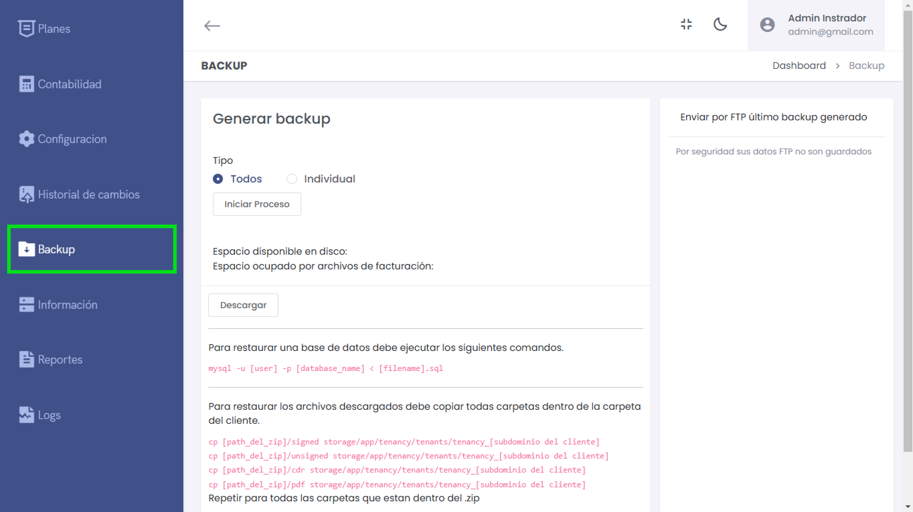

# Backup Información

En esta sección se gestionan las copias de seguridad del sistema, permitiendo tanto la generación como la restauración de los datos de forma segura.



---

## Generar Backup

El sistema permite elegir entre dos opciones de backup:
1. **Todos:** Realiza un respaldo completo de todos los datos del sistema.
2. **Individual:** Permite seleccionar y generar un backup específico para un cliente o módulo.

### Pasos para Generar un Backup:
1. Selecciona el tipo de backup (**Todos** o **Individual**).
2. Haz clic en **Iniciar Proceso** para comenzar la generación del backup.

---

### Información Adicional
- **Espacio disponible en disco:** Muestra la capacidad libre en el sistema.
- **Espacio ocupado por archivos de facturación:** Indica cuánto espacio ocupan los archivos de facturación.

---

## Descargar Backup

Una vez generado el backup, se puede descargar haciendo clic en el botón **Descargar**.

---

## Restauración de Datos

Para restaurar la base de datos y archivos del backup generado, sigue los comandos y pasos detallados.

### Restaurar Base de Datos:
```bash
mysql -u [user] -p [database_name] < [filename].sql

