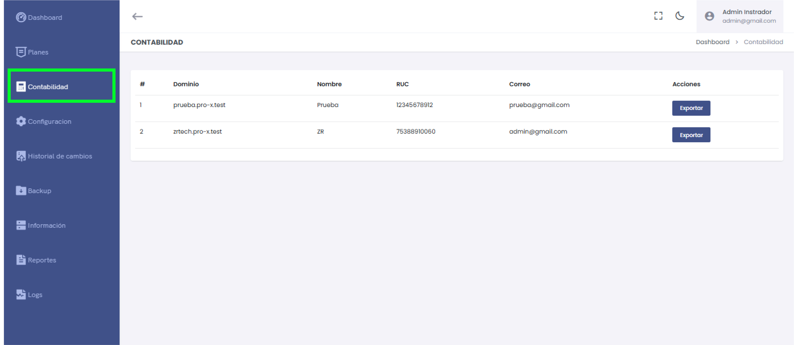
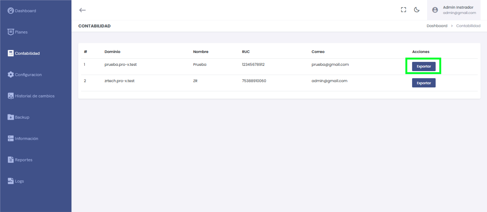
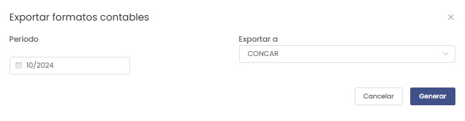
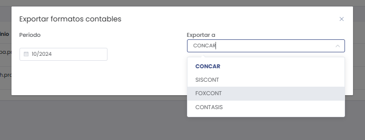

# Contabilidad

En esta sección se gestionan los registros contables de los clientes y se permite la exportación de formatos contables en función de un período seleccionado. A continuación, se detallan las funcionalidades disponibles.

## Listado de Clientes con Información Contable

En el **Listado de Contabilidad** se muestra la información relevante de cada cliente registrada en el sistema.

### Información mostrada:
1. **#**: Número de registro del cliente.
2. **Dominio:** Dominio asociado al cliente.
3. **Nombre:** Razón social del cliente.
4. **RUC:** Número único de contribuyente del cliente.
5. **Correo:** Dirección de correo electrónico del cliente.
6. **Acciones:**  
   - **Exportar:** Permite iniciar el proceso de exportación de los formatos contables para el cliente seleccionado.

---

## Exportación de Formatos Contables

Al hacer clic en el botón **Exportar**, se abre un modal con las opciones para seleccionar el **período** y el **sistema contable** al que se exportarán los datos.

### Opciones disponibles:
1. **Período:**  
   - Selecciona el período (mes y año) para el cual deseas generar los formatos contables.  
   **Ejemplo:** 10/2024.

2. **Exportar a:**  
   - Selecciona el sistema contable al que se exportarán los datos.  
   **Ejemplo:** CONCAR.

   

3. **Botones de Acción:**  
   - **Cancelar:** Cierra el modal sin generar el archivo.
   - **Generar:** Inicia el proceso de exportación, generando un archivo **Excel** con los datos contables.

---

## Generación del Archivo

- El archivo generado es un **Excel** que contiene la información contable estructurada para ser importada directamente en el sistema contable seleccionado.
- El formato exportado es compatible con sistemas como **CONCAR**, facilitando la integración de los datos entre plataformas.

---

### Recomendación

:::info
Se recomienda verificar los datos del cliente antes de la exportación para evitar inconsistencias en el archivo generado. Además, asegúrate de que el período seleccionado corresponda al mes contable que deseas registrar en el sistema externo.
:::

---

Esta sección de **Contabilidad** permite gestionar y exportar fácilmente los registros contables de los clientes, asegurando una integración fluida con sistemas contables externos.
