# Dashboard 

Accede al **Dashboard** y desplázate hacia la parte inferior de la página para encontrar el **Listado de clientes**. Allí podrás visualizar los datos relevantes de cada cliente y gestionar las configuraciones correspondientes de manera eficiente. Esta sección centraliza la información clave, facilitando tanto el seguimiento del estado del cliente como la personalización de sus opciones según las necesidades específicas.

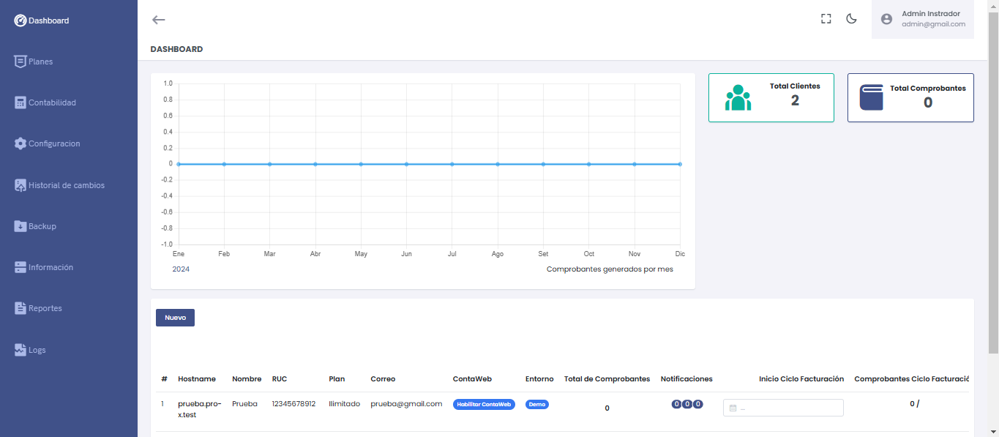

## Secciones detalladas

### Información del Cliente
1. **Hostname:** Nombre del link de acceso para la empresa.
2. **Nombre:** Razón social de la empresa.
3. **RUC:** Número de contribuyente.
4. **Plan:** El plan afiliado que escogió el cliente.
5. **Correo:** El correo del cliente.
6. **ContaWeb:** Enlace para habilitar o deshabilitar el módulo **ContaWeb** para la empresa. Para más información sobre la configuración de ContaWeb, consulta el siguiente **[video](https://www.youtube.com/watch?v=SjVFLZfJUow)**.

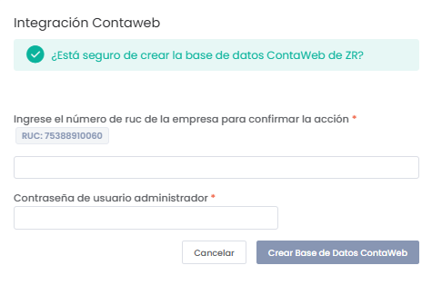

7. **Entornos:** DEMO (entorno de prueba) o PRODUCCIÓN (entorno funcional).
8. **Total de Comprobantes:** Total de comprobantes desde el inicio del sistema.
9. **Notificaciones:** Alertas de comprobantes no enviados, pendientes de anulación y con errores de envío.

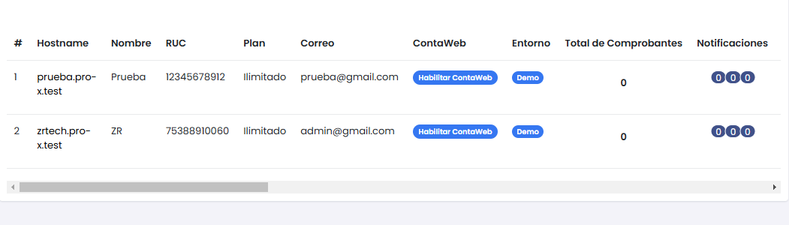

---

## Ciclo de Facturación

10. **Inicio Ciclo Facturación:**  
   Permite definir la fecha de inicio del ciclo.

11. **Comprobantes Ciclo de Facturación:**  
   Número de comprobantes generados en el mes.

12. **Usuarios:**  
   Número de usuarios creados / número de usuarios permitidos.

13. **Fecha Creación:**  
   Fecha y hora exacta de creación del cliente.

14. **Consultas API Perú (mes):**  
   Número de consultas realizadas al API (RUC y DNI).

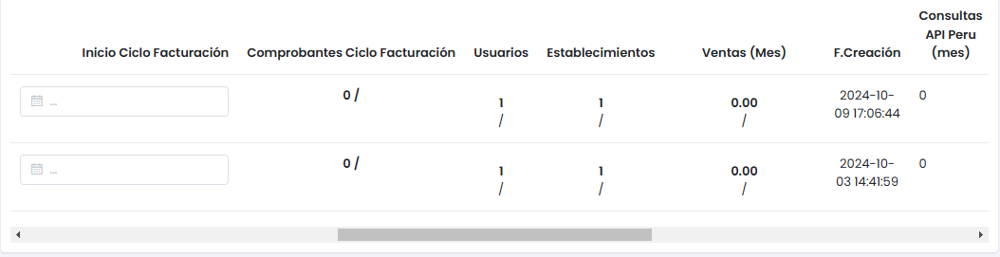

---

## Gestión de Documentos y Limitaciones

15. **Cant. Notas de Venta:**  
   Total de notas de venta emitidas en el mes.

16. **Total (Comprobantes y Notas de Venta):**  
   Suma del total de comprobantes y notas de venta.

17. **Bloquear Cuenta:**  
   Permite bloquear el acceso del cliente al sistema.

18. **Limitar Documentos:**  
   Aplica restricciones si el plan tiene un límite de documentos.

19. **Limitar Usuarios:**  
   Activa límites en la creación de usuarios, según el plan del cliente.

20. **Limitar Establecimientos:**  
   Restringe la cantidad de establecimientos que el cliente puede registrar, en función del plan contratado. Si esta opción está activa, solo podrá añadir establecimientos dentro del límite permitido.

21. **Limitar Ventas (Mes):**  
   Establece un tope en el número de ventas mensuales que el cliente puede realizar. Esta restricción se aplica según el plan seleccionado, permitiendo controlar la cantidad de transacciones dentro del ciclo mensual.

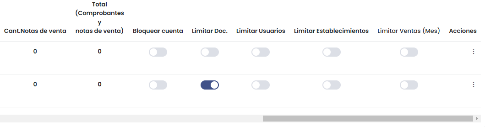

---

## Acciones

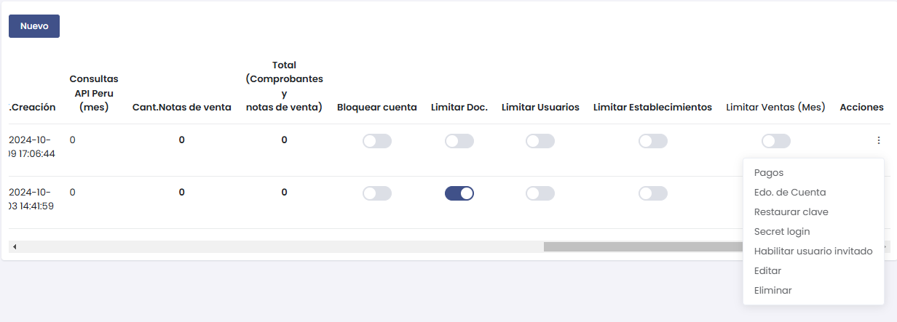

- **Pagos:**  
   Permite programar o registrar pagos del cliente.

- **Estado de Cuenta (Edo. de Cuenta):**  
   Visualiza el estado de cuenta del cliente para verificar si existen deudas pendientes o pagos realizados.

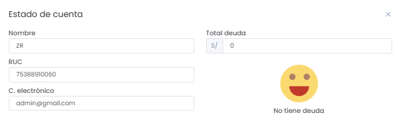

- **Restaurar Clave:**  
   Restaura la clave de acceso del cliente reemplazándola por su número de RUC.

- **Secret Login:**  
   Esta opción permite al administrador acceder directamente a la cuenta del cliente sin necesidad de utilizar las credenciales de correo y contraseña. Es útil para soporte técnico o auditorías rápidas.

- **Habilitar Usuario Invitado:**  
   Permite activar un usuario temporal con permisos limitados que se haya autoregistrado previamente en el sistema. Para más información sobre esta funcionalidad y su configuración, consulta la **documentación específica**.  

   > **Nota:** Es necesario haber configurado previamente el **correo a nivel servidor** para habilitar esta función correctamente. Esto garantiza que el sistema pueda enviar las notificaciones y confirmaciones correspondientes al usuario.

- **Editar:**  
   Opción para editar el plan, módulos y entorno del sistema del cliente, pero no permite modificar datos sensibles.

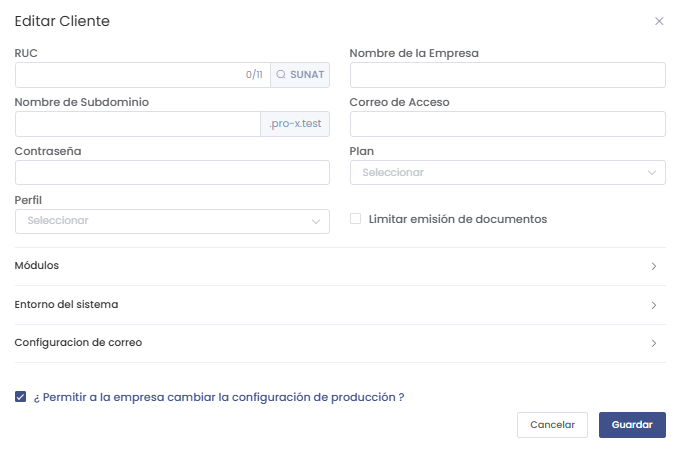

- **Eliminar:**  
   Elimina al cliente del sistema junto con sus registros y configuraciones.

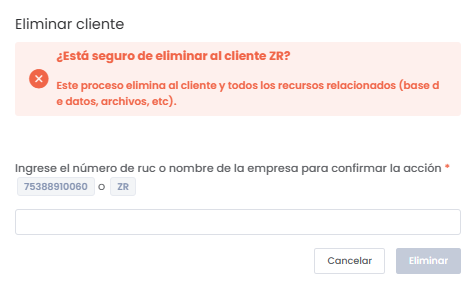

---

## Programación de Pagos del Cliente

El sistema permite programar pagos específicos para cada cliente, configurando la fecha, método de pago, tarjeta, referencia y monto.

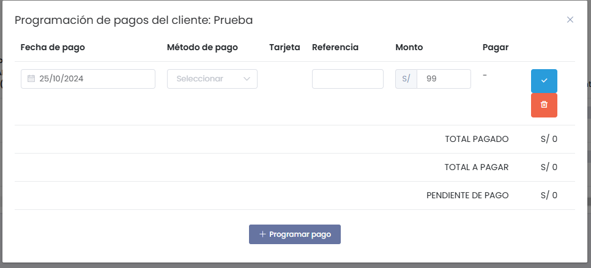

### Campos Disponibles:
1. **Fecha de Pago:**  
   Permite seleccionar la fecha en la que se desea programar el pago.

2. **Método de Pago:**  
   Desplegable para elegir el método de pago preferido.  
   **Opciones:** Efectivo, Tarjeta de crédito, Transferencia, etc.

3. **Tarjeta:**  
   Si se selecciona **Tarjeta de Crédito o Tarjeta de Débito**, se habilita este campo.  
   **Opciones:** Visa, Mastercard.

4. **Referencia:**  
   Campo opcional para ingresar una referencia interna que permita identificar el pago.

5. **Monto:**  
   El monto que el cliente debe pagar.

6. **Pagar:**  
   Botón para confirmar o cancelar el pago.  
   - **Icono azul:** Confirma el pago.  
   - **Icono rojo:** Elimina el pago programado.

### Resumen de Pagos:
- **Total Pagado:** Suma total de los pagos realizados.
- **Total a Pagar:** Monto total programado para ser pagado.
- **Pendiente de Pago:** Diferencia entre el total a pagar y el total pagado.

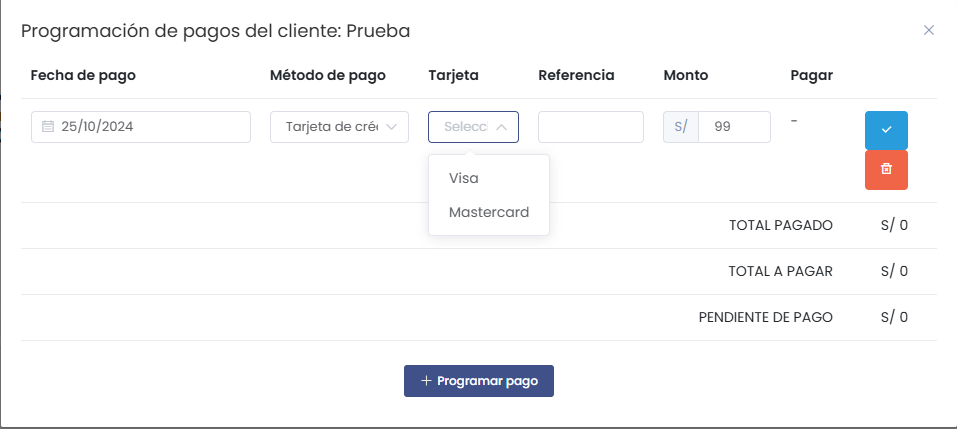

### Ejemplo de Uso:
- **Fecha:** 25/10/2024.  
- **Método:** Tarjeta de Crédito.  
- **Tarjeta:** Visa.  
- **Monto:** S/ 99.  
- **Acción:** Confirmar pago utilizando el ícono azul.

### Botón de Acción:
- **+ Programar Pago:**  
   Permite añadir un nuevo registro de pago al listado.

---

:::info
Esta funcionalidad es útil para gestionar los pagos de los clientes, asegurando un registro claro de los montos pagados y pendientes. Además, la opción de referencias ayuda a realizar un seguimiento detallado de cada transacción.
:::
