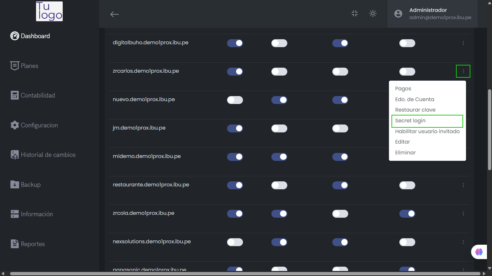

# Secret Login

La herramienta **Secret Login** en el facturador Pro X está diseñada para facilitar el soporte técnico a tus clientes, permitiéndote acceder a sus cuentas sin necesidad de solicitar sus credenciales.

---

## ¿Qué es Secret Login?

Secret Login es una funcionalidad exclusiva para administradores y personal autorizado que permite ingresar directamente al sistema de un cliente con solo un clic, sin requerir el correo ni la contraseña del usuario.{}

---

## ¿Cómo funciona?

1. Ingresa al **Panel de Administración** de Pro X.
2. Ubica la opción **Secret Login** junto al cliente al que deseas acceder.
3. Haz clic en el botón **Secret Login**.
4. Accederás automáticamente al sistema del cliente seleccionado, sin necesidad de ingresar datos de acceso.

---

:::tip Nota
Esta herramienta es ideal para brindar soporte inmediato, realizar configuraciones o resolver incidencias sin demoras.
:::

---

## Acciones Disponibles

- **Acceso instantáneo:** Ingresa al sistema del cliente en segundos.
- **Soporte eficiente:** Resuelve problemas y brinda ayuda sin pedir credenciales.
- **Seguridad:** Solo personal autorizado puede utilizar esta función.

---

:::danger Importante
El uso de Secret Login debe ser responsable y exclusivo para fines de soporte. Toda acción realizada bajo este acceso queda registrada para auditoría.
:::

---

¿Tienes dudas o necesitas ayuda con esta funcionalidad?  
Contáctanos para recibir soporte personalizado.

---
