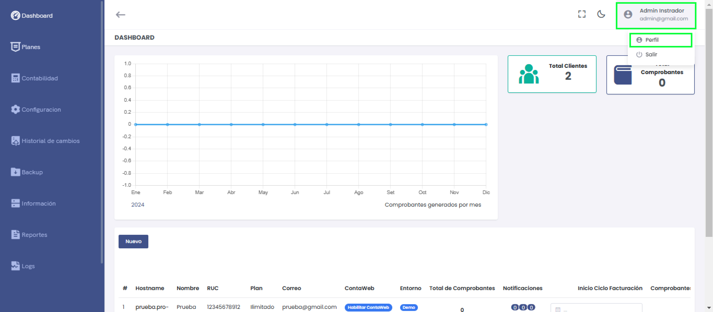
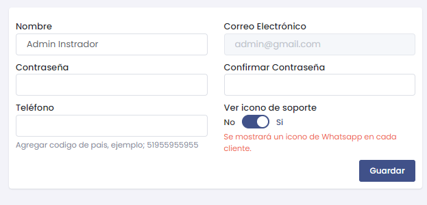

# Gestión de Cuenta

En el **Dashboard**, ubicar el **Admin Instrador** en la sección superior derecha.

Debera ingresar al módulo de **Admin Instrador** y luego selecciona la subcategoría **Perfil**.

* **Perfil:** Es la sección donde el usuario puede gestionar su información personal, modificar sus datos de acceso, y actualizar configuraciones relacionadas con su cuenta en la plataforma.

* **Cerrar sesión:** Esta opción permite al usuario desconectarse de su cuenta de manera segura, finalizando la sesión activa y redirigiéndolo a la pantalla de inicio de sesión.

## ADMIN PERFIL 

* **Nombre:** Campo para editar el nombre del usuario actual que está registrado en la plataforma.

* **Correo Electrónico:** Muestra el correo electrónico registrado del usuario. Este campo es de solo lectura y no puede ser editado directamente.

* **Contraseña:** Campo para establecer o cambiar la contraseña del usuario.

* **Confirmar Contraseña:** Campo para verificar que la nueva contraseña ingresada coincide con la anterior.

* **Teléfono:** Campo opcional para agregar o editar el número de teléfono del usuario. Debe incluir el código de país, por ejemplo, **"+51 955595555".**

* **Ver ícono de soporte:** Opción para habilitar o deshabilitar la visualización de un ícono de soporte de WhatsApp en cada cliente. Cuando se activa ("Sí"), aparecerá un ícono de WhatsApp en la interfaz de cada cliente.

* **Guardar:** Botón que permite confirmar y guardar todos los cambios realizados en los campos anteriores.