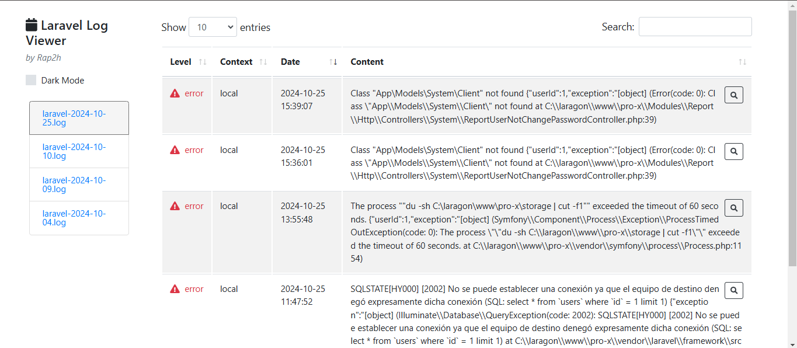

# Funcionalidades Adicionales

## Selección de Log
- A la izquierda, se muestra una lista de archivos de log organizados por fecha.

### **Ejemplo:**
- `laravel-2024-10-25.log`
- `laravel-2024-10-10.log`

---

## Filtrado
- Ajusta la cantidad de registros mostrados por página.
- Usa el campo de búsqueda para encontrar eventos específicos.

---

## Acceso Rápido
- Cada registro tiene un ícono de lupa que permite ver más detalles del evento registrado.

---

## Recomendaciones

### **Supervisa Regularmente:**  
- Revisa los logs frecuentemente para detectar problemas antes de que afecten al sistema.

### **Utiliza Filtros:**  
- Aprovecha los filtros para encontrar eventos relevantes rápidamente y gestionar incidentes de forma eficaz.

### **Realiza Mantenimiento:**  
- Corrige los errores críticos encontrados y configura alertas para prevenir futuros problemas.

---

El visor de logs es una herramienta clave para mantener la estabilidad del sistema y asegurar que los problemas se resuelvan de manera proactiva, optimizando la administración y seguridad del entorno.
