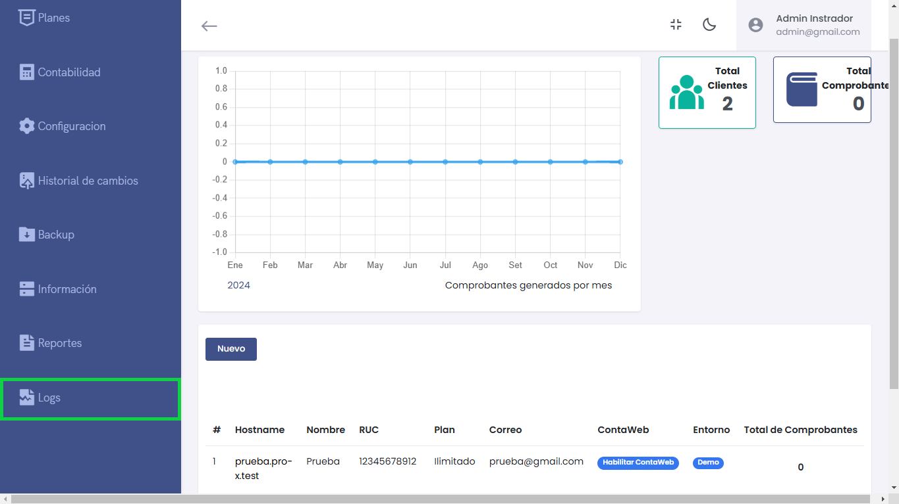
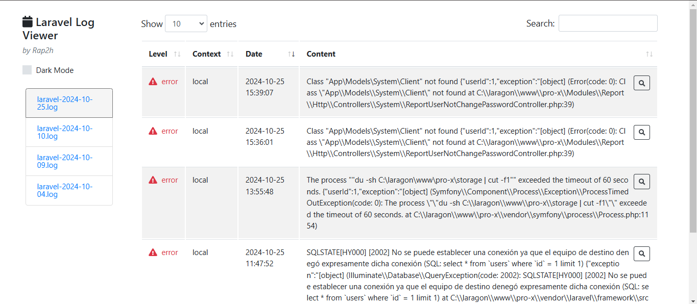

# Logs información

En esta sección se administran y visualizan los registros de errores y eventos del sistema, permitiendo a los administradores supervisar y solucionar problemas de manera eficiente.



---

## Navegación y Acceso

### Desde la sección de **Logs**
- Al hacer clic en **Logs** en el menú lateral, se redirige a la interfaz del **Laravel Log Viewer**, donde se muestra un listado detallado de los registros del sistema.

---

## Laravel Log Viewer



### Características principales:
- **Modo Oscuro:** Alterna entre tema claro y oscuro.
- **Buscar:** Filtra los registros según las palabras clave.
- **Nivel de Log:** Identifica la gravedad del log, como `error`, `warning`, o `info`.
- **Contexto:** Muestra el contexto en el que ocurrió el evento (local, producción, etc.).
- **Fecha:** Registra la fecha y hora exacta de cada evento.
- **Contenido:** Proporciona el mensaje del error o evento.

---

## Ejemplos de Logs:

### Error de Clase No Encontrada
```plaintext
Class "App\Models\System\Client" not found {"userId":1,"exception":"[object] (Error(code: 0): Class \"App\\Models\\System\\Client\" not found at C:\\laragon\\www\\pro-x\\Modules\\ReportUserNotChangePasswordController.php:39)"}

