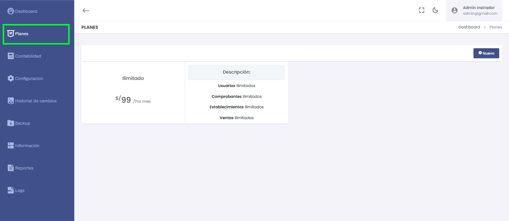
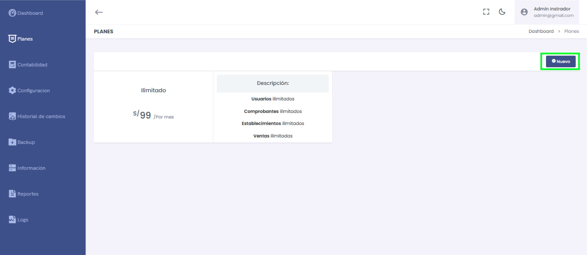

# Planes

En esta sección se gestiona la oferta de **planes disponibles** para los clientes, permitiendo configurar opciones de suscripción con características específicas según las necesidades de cada empresa.

---

## Listado de Planes

Cada plan muestra las siguientes características principales:

1. **Nombre del Plan:**  
   - Ejemplo: "Ilimitado".

2. **Precio del Plan:**  
   - Muestra el costo mensual del plan.  
   **Ejemplo:** S/ 99 por mes.

3. **Descripción:**  
   - Resumen de los beneficios asociados al plan, como:
     - **Usuarios Ilimitados:** Permite añadir una cantidad ilimitada de usuarios.
     - **Comprobantes Ilimitados:** No hay restricción en la cantidad de comprobantes emitidos.
     - **Establecimientos Ilimitados:** Se pueden registrar múltiples establecimientos sin límite.
     - **Ventas Ilimitadas:** No se establece un tope mensual para el número de ventas.

---

## Funcionalidades Disponibles

1. **Nuevo Plan:**  
   - Al seleccionar el botón **"Nuevo"**, puedes crear un plan personalizado con las características que prefieras para ofrecer a tus clientes.

   

