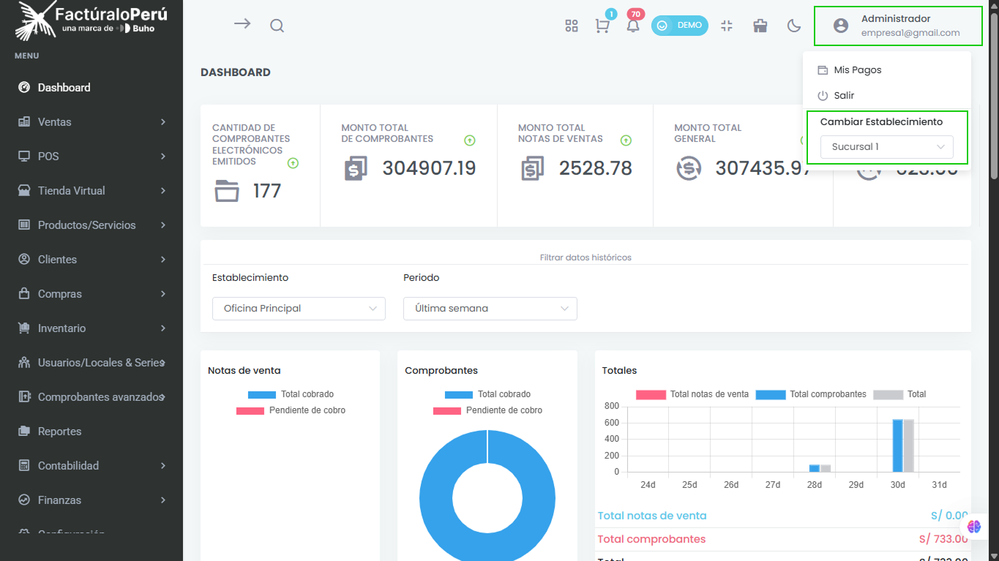
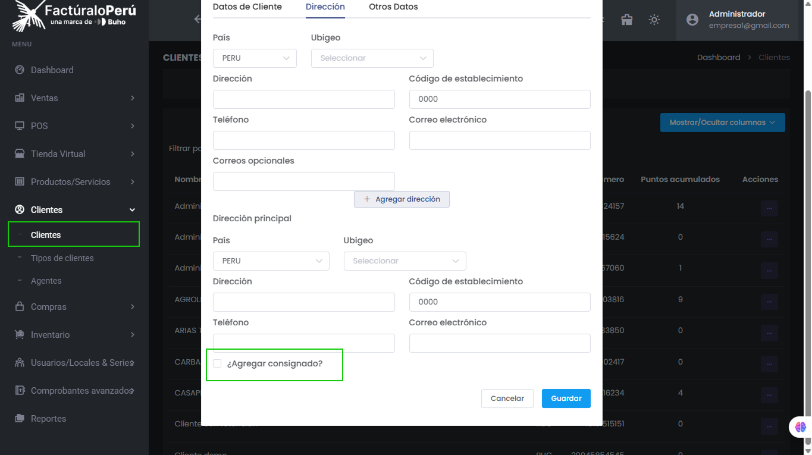
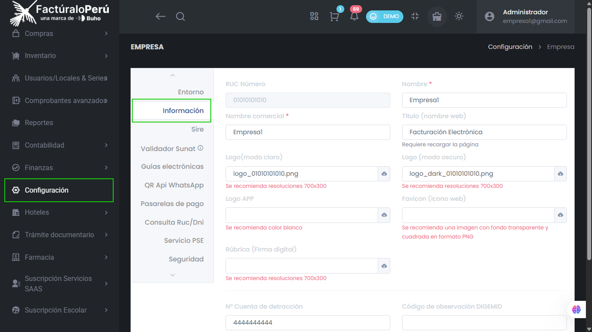

# 🚀 Novedades y Nuevas Funciones en Pro X

En esta sección te presentamos los cambios más recientes y las nuevas funcionalidades disponibles en tu facturador Pro X. Estas mejoras están diseñadas para optimizar tu experiencia y ampliar las capacidades del sistema.

---

## Cambio rápido de establecimiento

Ahora puedes cambiar de establecimiento de manera ágil desde la barra superior, ubicada al lado derecho de la pantalla. Esta función te permite alternar entre diferentes locales o sucursales sin salir de tu sesión actual.

---

## Consignados en clientes y ventas

Se ha incorporado la opción de **agregar consignados** tanto en comprobantes electrónicos como en notas de venta. Los consignados son contactos adicionales asociados a una empresa, permitiendo añadir más de una dirección y más de un contacto por cliente.

- En la pestaña **Dirección** del formulario de cliente, puedes agregar nuevas direcciones y activar la opción **¿Agregar consignado?**.
- Al activar esta opción, podrás registrar un nuevo consignado con su documento de identidad y datos de contacto.
- Los consignados registrados quedarán disponibles en una lista para futuras operaciones.

:::info
Esta función es especialmente útil para empresas que gestionan encomiendas o requieren múltiples puntos de contacto por cliente.
:::

---

## Mejoras en el Dashboard

Se ha corregido el cálculo de gastos diversos anulados en el dashboard, logrando que los reportes de compras y el balance final sean mucho más precisos.

---

## Personalización de temas y logos

El sistema ahora permite modificar el tema visual desde el ícono de la brocha en la barra superior. Puedes elegir entre modo claro y modo oscuro, y configurar dos tipos de logo (uno para cada modo) desde la sección de **Configuración > Empresa > Información**.

- También puedes personalizar el logo de la app y el favicon para una experiencia más alineada a tu marca.

---

## Mejoras en la venta rápida (POS)

- Se ha optimizado el diseño de la sección de pago en la venta rápida, mostrando claramente el tipo de unidad, el precio final (editable según permisos), y permitiendo modificar el tipo de comprobante, serie y cliente.
- Puedes añadir nuevos clientes desde el mismo flujo de venta rápida.
- Se han mejorado las opciones para ingresar montos, descuentos, agregar pagos y placas adicionales.

:::tip
La venta rápida está orientada principalmente a grifos y minimarkets, pero puedes utilizar el punto de venta tradicional para otros rubros.
:::

---

## Productos compuestos

Ahora los productos compuestos (packs o promociones) permiten incluir o excluir el IGV desde su formulario de creación o edición. Al vender un pack, el sistema descuenta automáticamente el inventario de cada producto que lo compone.

- Los productos compuestos son ideales para promociones y ventas agrupadas, facilitando el control de stock.

---

## Filtros avanzados en proveedores y reportes

- En el listado de proveedores, ahora puedes filtrar por nombre y código de barras, además del tipo y número de documento.
- En reportes e inventario, se ha añadido un filtro por stock (mayor a 0, igual a 0, menor a 0, stock mínimo y stock normal).
- El **cardex valorizado** ahora permite filtrar por periodo, fecha, establecimiento y búsqueda rápida, y es exportable a Excel.

---

## Módulo Hoteles

Se ha incorporado un nuevo módulo para la gestión hotelera, con subconfiguraciones para recepción, tarifas, ubicaciones, categorías y habitaciones. Permite administrar múltiples empresas hoteleras, visualizar habitaciones ocupadas, disponibles, en limpieza o mantenimiento, y configurar tarifas y ubicaciones.

---

## Mejoras en guías de remisión

- Ahora puedes agregar nuevas direcciones de partida o adicionales para el cliente desde la guía de remisión remitente.
- En la sección de traslados, puedes seleccionar modos de traslado para vehículos de categoría M1 o L1 y añadir el número de placa.

---

:::danger Importante
Mantente atento a futuras actualizaciones y revisa periódicamente esta sección para aprovechar al máximo las nuevas funciones. Si tienes dudas, consulta la **documentación principal de Pro X** o solicita una demo personalizada.
:::

---

¿Quieres conocer más detalles o necesitas ayuda con alguna función?  
Visita nuestras [guías de clientes](clientes), [productos](productos-servicios) o [inventarios](inventario) para información detallada y ejemplos prácticos.

---