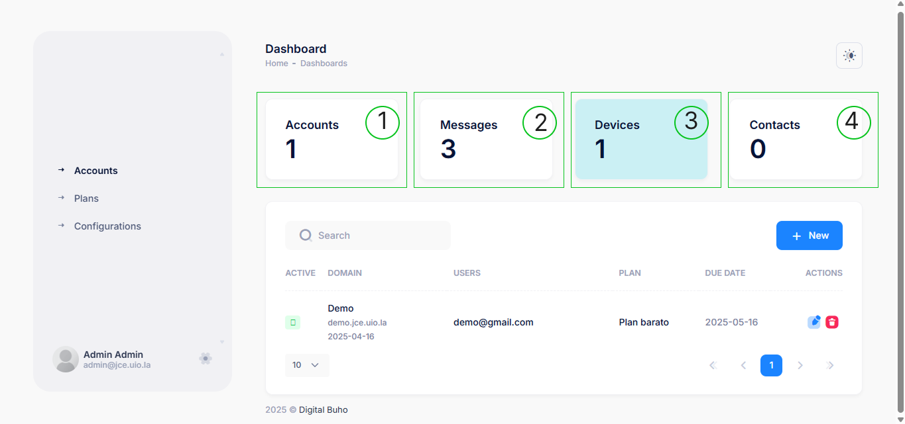

# Dashboard

Bienvenidos al menú principal de QR API donde el usuario puede monitorear el uso de sus recursos y gestionar sus operaciones de mensajería y facturación.

### Panel de control

Al ingresar al panel de control, la empresa podrá visualizar la siguiente información clave:

**1. Plan activo:** Resume los límites y características del plan asignado, incluyendo la cantidad de dispositivos, contactos y mensajes totales.

**2. Mensajes enviados y disponibles:** Indica la cantidad de mensajes usados y el límite total según el plan contratado. Estos mensajes corresponden a los envíos de facturas en PDF a través de WhatsApp.

**3. Dispositivos conectados:** Muestra cuántos dispositivos están actualmente enlazados y operativos para el envío de mensajes.

**4. Contactos añadidos:** Representa el número de clientes registrados en el sistema como destinatarios de las facturas enviadas **(opción aún no disponible)**.

:::tip
Para aprovechar al máximo la plataforma, te recomendamos explorar las secciones de **Dispositivos, Contactos y Campañas.** Desde allí podrás agregar y gestionar los **números de envío**, **registrar clientes destinatarios** y **crear campañas de mensajería masiva** para optimizar la comunicación con tus clientes.
:::
