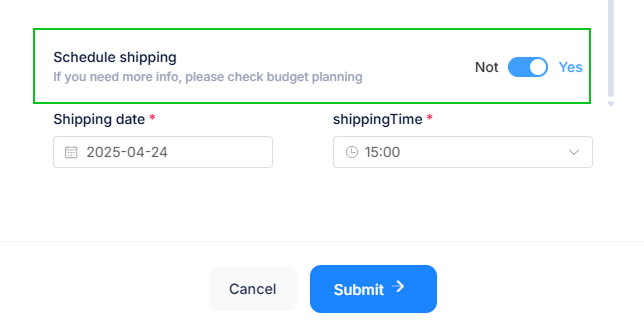

# Dashboard

El Dashboard de campañas ofrece una visión general de todas las campañas creadas en el sistema. En esta sección, los usuarios pueden visualizar información clave sobre el estado de sus campañas de mensajería masiva.

## Elementos principales del Dashboard

### Listado de campañas

El panel muestra un listado con todas las campañas creadas, clasificadas en diferentes pestañas:

* **All Campaigns:** Muestra la lista completa de campañas.
* **Pending:** Campañas que están programadas para enviarse en el futuro.
* **Completed:** Campañas que ya han sido enviadas.

### Información de cada campaña

Cada campaña en el listado incluye los siguientes datos:

* Nombre de la campaña.
* Fecha de creación.
* Dispositivo desde el cual se enviaron los mensajes.
* Cantidad de contactos a los que se envió la campaña.
* Estado de la campaña (Enviado, Programado, Borrador, etc.).
* Cantidad de mensajes enviados, recibidos y fallidos.
* Acciones disponibles: Descargar reporte, editar o reenviar la campaña.

### Acciones disponibles en el Dashboard

El usuario puede:

* Filtrar campañas según su estado o tipo.
* Exportar información en diferentes formatos.
* Crear nuevas campañas mediante el botón "Crear Campaña".

Con esta vista general, los usuarios pueden gestionar sus campañas de manera eficiente y asegurarse de que sus mensajes sean entregados correctamente.

---

## Crear Campaña 

El sistema permite crear campañas mediante la carga de un archivo Excel con la lista de contactos. A continuación, se detallan los pasos para realizarlo correctamente.

### Acceder a la sección de campañas

**1.** En el menú lateral, seleccionar **Campañas.**

**2.** Hacer clic en el botón **Crear Campaña.**

### Seleccionar el tipo de campaña

**3.** En la ventana emergente, elegir **Subir Excel.**

**4.** Se abrirá un formulario para adjuntar el archivo y configurar la campaña.

### Configurar los detalles de la campaña

* **Nombre de la campaña:** Escribir un título representativo.

* **Adjuntar archivo:** Seleccionar el archivo Excel que contiene la lista de clientes.

* **Adjuntar archivos adicionales (opcional):** Se pueden subir imágenes o documentos que se enviarán con la campaña.

### Opciones adicionales

**Programar envío:** Si se desea enviar en una fecha específica, habilitar esta opción y seleccionar la fecha y hora.

### Finalizar la campaña

Una vez configurada toda la información, hacer clic en **Submit** para guardar y enviar la campaña.

