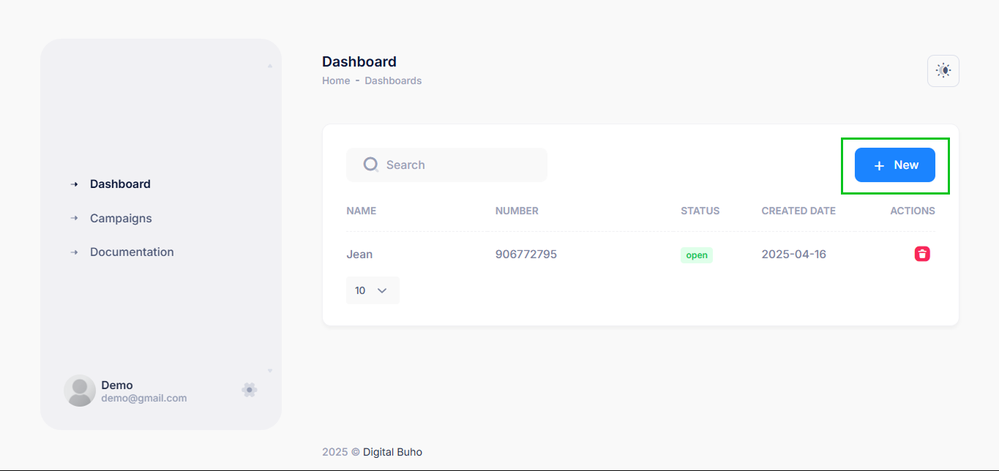
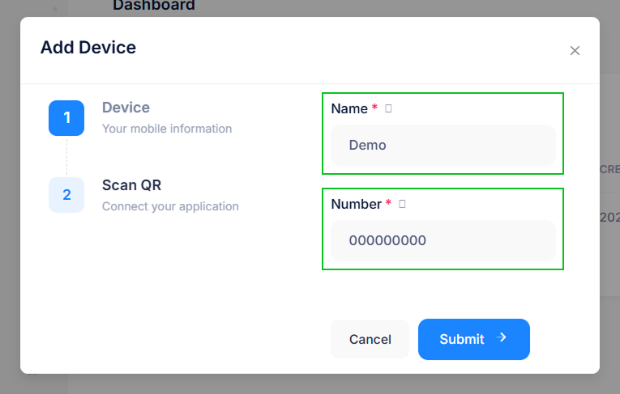
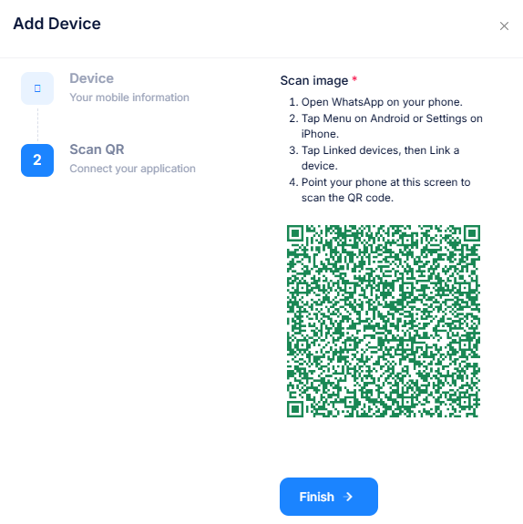
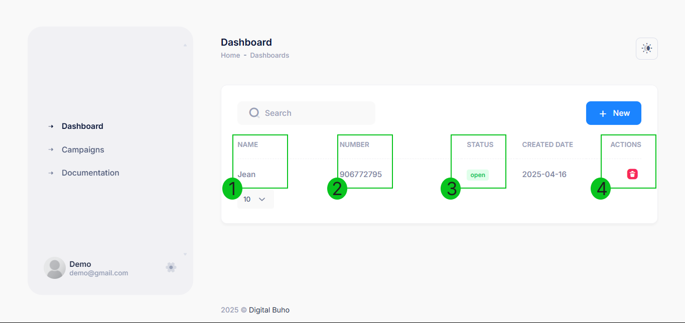
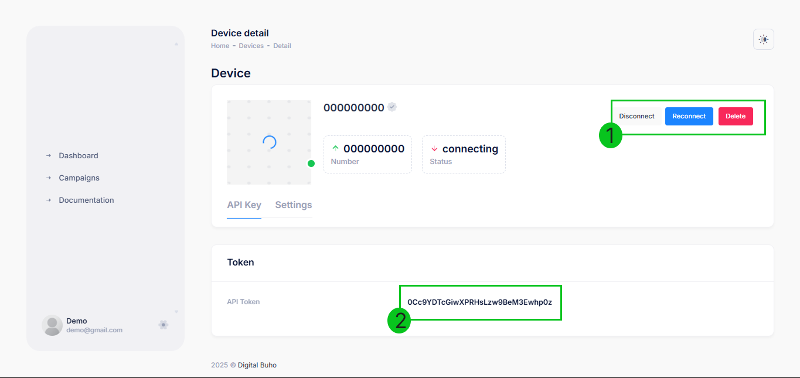
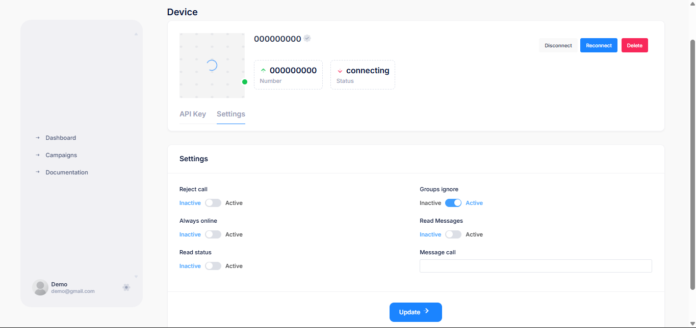

# Dispositivos

Para poder enviar los archivos PDF generados desde el sistema de facturación, es necesario vincular un dispositivo (número de WhatsApp) al sistema. En esta sección se detallan los pasos para agregar y gestionar los dispositivos.

---

### Agregar un dispositivo

Para añadir un nuevo número de WhatsApp al sistema:

**1.** Hacer clic en **Agregar dispositivo**.

**2.** Ingresar un **nombre** para identificarlo y el **número** de WhatsApp.

**3.** Seguir las instrucciones para **escanear el código QR** desde la aplicación de WhatsApp.

**4.** Confirmar la conexión.

---

### Lista de dispositivos

En la sección **Dispositivos Añadidos**, se muestra una lista de los números registrados junto con la siguiente información:

**1. Dispositivos:** Identificación del dispositivo o persona que enviará los mensajes.

**2. Número:** El número de WhatsApp vinculado.

**3. Estado:** Indica si el dispositivo está **activo** o **desconectado**.

**4. Acciones disponibles:** Editar, ver detalles o eliminar el dispositivo.

---
## Detalles del dispositivo

Al hacer clic en un número de la lista, se accede a una página con la información detallada del dispositivo. Aquí se pueden ver:

**1.** **Opciones de gestión:** Reconectar, desconectar o eliminar el dispositivo.

**2.** **Token de autenticación:** Clave necesaria para conectar el dispositivo con el sistema de facturación.

:::danger IMPORTANTE:
 **URL de integración:** Dirección que debe utilizarse para la conexión con la API del sistema, es la direccion de la **url** del sistema.
:::

---

## Configuraciones avanzadas

En la pestaña **Settings**, se pueden modificar las siguientes opciones para personalizar el comportamiento del dispositivo:

* **Rechazar llamadas:** Si está activo, el dispositivo ignorará las llamadas entrantes.
* **Siempre en línea:** Mantiene el estado del dispositivo activo para evitar desconexiones.
* **Estado de lectura:** Habilita o deshabilita la confirmación de lectura de mensajes enviados.
* **Ignorar grupos:** Permite excluir los mensajes de grupos de WhatsApp, evitando interferencias con los mensajes individuales.
* **Leer mensajes:** Activa o desactiva la lectura automática de los mensajes recibidos.
* **Mensaje de llamada:** Permite definir un mensaje automático en caso de recibir una llamada.

Estas configuraciones permiten optimizar la conexión del dispositivo con el sistema y asegurar su correcto funcionamiento en el envío de facturas y campañas de mensajes.

---

Para integrar este dispositivo con el sistema de facturación, consulta la siguiente sección **Vincular dispositivo** para más información.  

