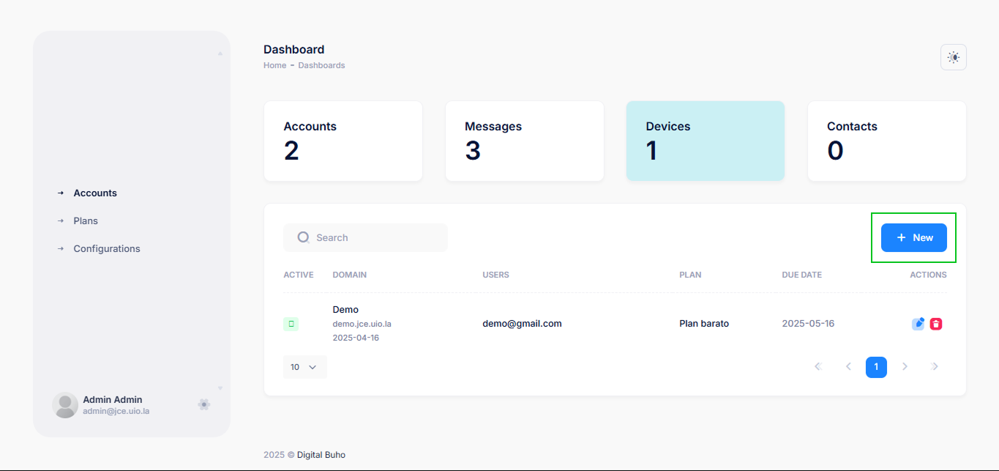
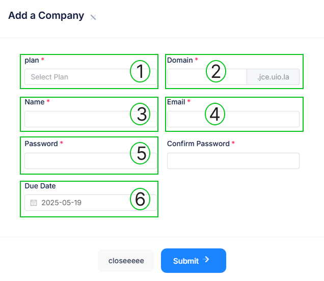

# Crear Cuenta - Cliente

Para registrar una nueva cuenta de empresa en el sistema, sigue estos pasos detallados:

### Acceder al Dashboard

   - Inicia sesión en el sistema.

### Iniciar el Proceso de Creación

   - Haz clic en el botón azul `+ New Member` ubicado en la parte superior derecha.




### Llenar el Formulario de Registro

    Se abrirá un formulario con los siguientes campos obligatorios:



   - **1. Plan:** Selecciona un plan disponible para la empresa. Si aun no a creado uno, puede verificar el siguiente enlace para obtener informacion acerca de como crear un **[plan](https://manual.uio.la/QrBuho/reseller/Planes)**.
   - **2. Dominio:** Ingresa el subdominio único de la empresa.
   - **3. Nombre:** Introduce el nombre de la empresa.
   - **4. Correo Electrónico:** Proporciona un correo electrónico válido para la cuenta administradora.
   - **5. Contraseña:** Define una contraseña segura.
   - **6. Fecha de Expiración:** Selecciona la fecha de expiración del acceso.

### Guardar la Nueva Cuenta

   - Una vez completado el formulario, haz clic en `Submit` para registrar la empresa.
   - Si decides cancelar, puedes hacer clic en `Close`.

Con estos pasos, puedes registrar empresas de manera rápida y eficiente, asegurando una correcta configuración de los accesos y permisos desde el inicio.

---

Si al crear un cliente nuevo te aparece un error o la página/sistema del cliente no carga correctamente, sigue estos pasos para solucionarlo:

1. Accede a tu servidor por SSH:
   ```bash
   ssh [usuario]@[ip]
   ```

2. Ingresa a la carpeta donde está instalado tu sistema (normalmente llamada `qrapi`).

3. Reinicia los contenedores de Docker ejecutando los siguientes comandos:
   ```bash
   docker-compose down
   docker-compose up -d
   ```

Esto detendrá y volverá a levantar los contenedores, lo que suele resolver problemas de carga o errores tras la creación de un nuevo cliente.